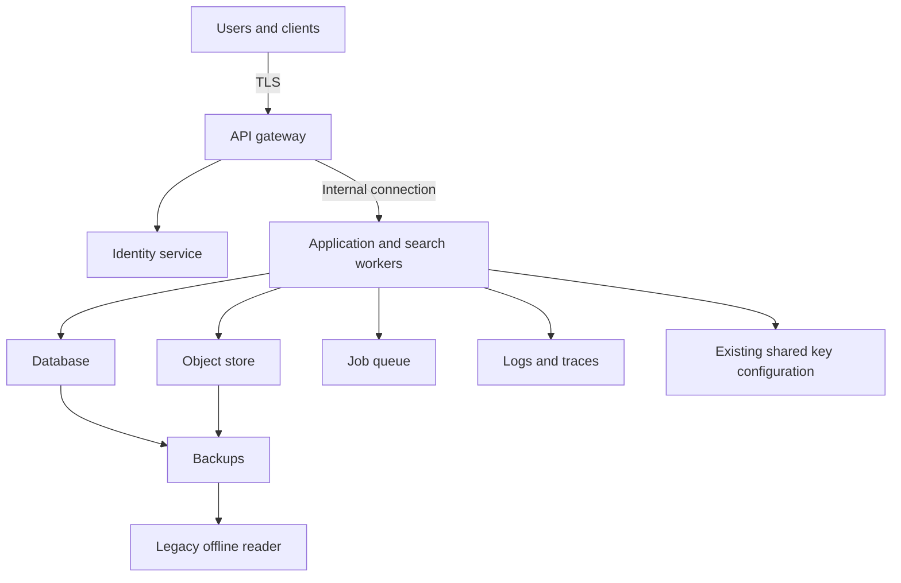

# Capstone: Design a Quantum-Resistant Secure Architecture

**135 minutes design and incident response, followed by 45 minutes of review.** [Instructor facilitation](../teach/capstone.md) · [Worksheet](worksheet.md) · [Incidents](incidents.md) · [Rubric](rubric.md) · [Worked architecture](worked-architecture.md)

## The assignment

You advise **Cedar Archive**, a fictional multi-tenant service holding highly confidential research and strategic documents. Users upload, search and share documents through a web client. A gateway terminates TLS, an identity service authenticates users, application workers process documents, and storage holds records and objects. Jobs use a queue; operational telemetry enters a separate logging system. Backups retain historical data.

Your task is to propose a defensible target architecture and migration plan, then revise it after incidents. The title states an objective, not a guarantee. Every quantum-resistance claim must name the protected mechanism, assumptions and remaining classical dependencies.

## Fixed teaching constraints

These are fictional exercise inputs, not a real organization's compliance requirements.

| Constraint | Required treatment |
| --- | --- |
| Secrecy lifetime | New high-sensitivity documents need 20 years of confidentiality |
| Retention | Primary documents retained 20 years; backups include copies from the previous 5 years |
| Availability | Target recovery time 4 hours and recovery point 24 hours; justify evidence needed to meet these |
| Processing | Authorized server-side search is required for the normal tier; a restricted tier may trade search for stronger operator exclusion |
| Tenancy | Ordinary access to one tenant must not automatically grant another tenant's plaintext |
| Administration | Infrastructure administrators should not have routine unrestricted document access; explain policy-administration escape paths |
| Legacy | One offline archive reader takes 18 months to replace; its current key formats and signature support are classical |
| Budget/rollout | Staged migration is necessary; no overnight replacement of every client or device |
| Trust | New keys, certificates, verifiers and configuration require authenticated provisioning |

## Adversary and assumptions

Assume a well-funded state actor can record traffic for years, steal storage snapshots, target suppliers and administrators, exploit an application host, and wait for future cryptanalytic capability. Do not assume it can currently break every approved primitive by brute force. Treat endpoint compromise, authorized-service misuse and future quantum cryptanalysis as distinct paths.

State whether client devices, identity service, deployment pipeline, key-service operators and recovery officers are trusted, and under which conditions. You may propose stronger controls, but must explain operational cost and what fails when an assumed-trusted party is compromised.

## Baseline to critique

This is an incomplete starting architecture, not a recommended design. Label where plaintext exists, who can obtain keys or invoke decrypt, and where old key material survives. Do not simply add padlock icons to every arrow.

## Required deliverables

1. An annotated diagram with trust boundaries, TLS termination, plaintext locations, key services, backups and recovery.
2. An inventory of at least eight assets/flows with cryptographic role, owner, exact profile or explicit decision pending, lifetime and evidence.
3. A key-lifecycle table covering DEKs, KEKs, TLS/identity keys, release signing keys and recovery material.
4. A prioritized migration plan with prerequisites, acceptance gates, minimum-policy floor, residual historical exposure and accountable owners.
5. Responses to the assigned incidents, including revised assumptions and tests.
6. A short tradeoff statement: what this design protects, what it does not, and which claims remain unproven.

Use the [worksheet](worksheet.md). Design choices may differ; credit follows coherent requirements, evidence and limitations rather than matching one product stack.

## Work sequence

| Time | Work product |
| --- | --- |
| Minutes 0–15 | Requirements, assumptions and asset inventory |
| Minutes 15–45 | Initial architecture and plaintext/key boundaries |
| Minutes 45–70 | Key lifecycle, restore and migration dependencies |
| Minutes 70–95 | First two incident injects and revised claims |
| Minutes 95–120 | Migration/retirement inject and evidence plan |
| Minutes 120–135 | Final diagram, written boundaries and handoff |
| Review 0–30 | Team presentation and adversarial questions; solo learners compare with worked reasoning |
| Review 30–45 | Apply rubric, record disagreements and write next actions |

For independent study, stop at the incident checkpoints before reading the solution. Answer aloud or in writing, then compare reasoning, not product names. Longer independent work is acceptable; the timings describe facilitated delivery.

## Completion criteria

Every confidentiality claim identifies who can still decrypt. Every recovery claim identifies tested key access and timing. Every PQ claim identifies the vulnerable dependency replaced and what remains. Every incident response distinguishes future containment from reversal of already exposed information. Use the [rubric](rubric.md), then read the [worked architecture](worked-architecture.md).
