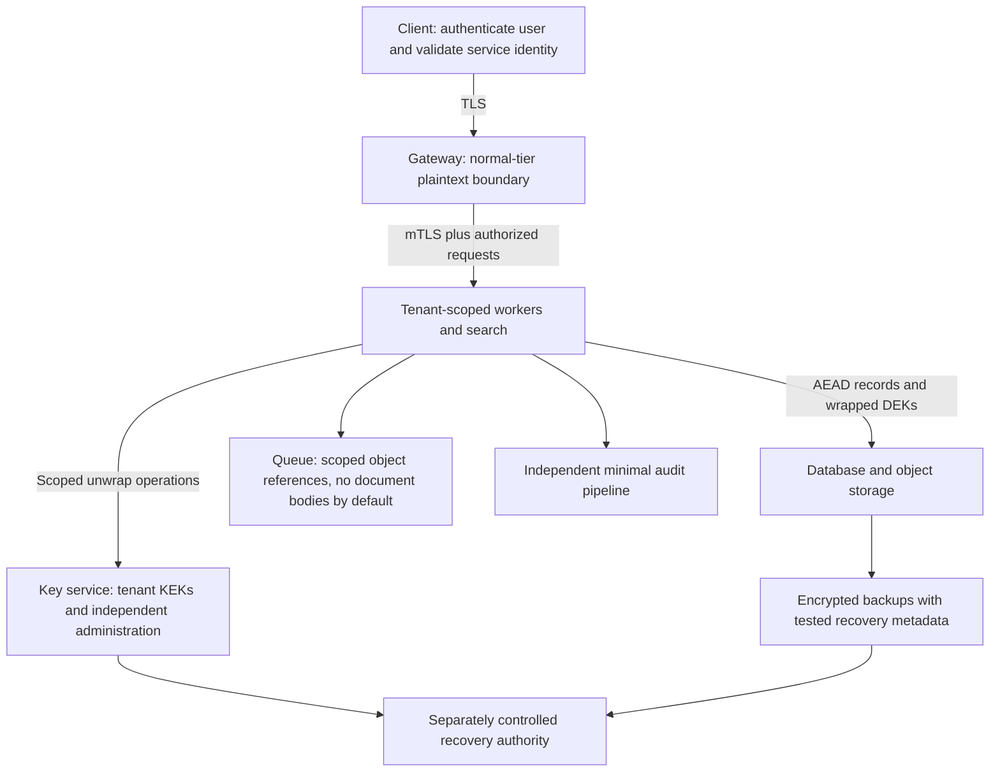
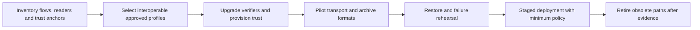

# Capstone: one worked architecture

[Brief](index.md) · [Worksheet](worksheet.md) · [Rubric](rubric.md)

Read after attempting the design. This answer accepts server-side processing for the normal tier and explicitly does not protect that tier's plaintext from a compromised authorized worker. A restricted tier can keep content keys on clients, but its search/recovery requirements must change. Neither choice is universally correct.

## Proposed boundaries

The gateway and workers remain trusted for normal-tier plaintext. TLS protects connections between the named endpoints; it does not hide content from them. Separate tenants at authorization and key-use boundaries, and test attempts to request another tenant's record/key. Search indexes inherit the sensitivity of their plaintext terms and metadata.

## Data and key design

Use AEAD records with specified tenant/object/purpose/version context and a safe nonce policy. Generate per-object DEKs where operationally appropriate and wrap them under tenant-scoped KEKs. Store approved profile and key-version identifiers, validate against a trusted registry, and bind record meaning under the format. Expected tenant identity comes from the authorized request, not only from record metadata.

Storage-only readers lack unwrap permission. Key administrators manage lifecycle but do not receive routine data-decrypt rights; changes that can grant those rights require independent authorization. This is a policy objective requiring evidence: if the same administrator controls identity, policy and application deployment alone, the separation is not achieved.

| Key or trust item | Proposed handling | Remaining concern |
| --- | --- | --- |
| DEKs | Per-object generation, authenticated wrapping and minimal plaintext lifetime | Authorized workers receive/use DEKs and may expose them when compromised |
| Tenant KEKs | Key service with scoped operations, versioned rotation and independent policy review | Old backups and authorized-use paths remain dependencies |
| TLS/workload credentials | Automated issuance/renewal with SAN/purpose validation and identity-to-role mapping | Issuance or workload compromise can enable impersonation |
| Release-signing keys | Protected signer plus independently approved release manifests | A compromised build/approval process can produce valid malicious signatures |
| Recovery authority | Separate identities, limited activation, audit and clean restore rehearsal | Broad recovery permissions can span tenant boundaries |

## Retention, restore and destruction

Define new-write and old-read windows separately. Rewrap retained DEKs for routine KEK rotation only after assessing old copies. If a DEK is exposed, rewrapping it is not remediation for its secrecy. Re-encrypt future retained copies with new keys where required while documenting that stolen history cannot be recalled.

The restore test starts from clean infrastructure, authentic key metadata and recovery credentials with current policy. Measure whether a representative restore meets the four-hour RTO and 24-hour RPO; the diagram alone does not establish either. Keep an approved route for the legacy reader until replaced or its retained data is migrated. Do not destroy the only remaining usable key merely to satisfy a rotation checklist.

## Migration sequence

Prioritize the twenty-year archive and its 18-month reader dependency. A ready gateway upgrade can reduce future transport exposure on the upgraded path, but does not complete archive key-protection, offline-reader or signing migration. Inspect actual negotiated groups and certificate/signature capabilities. Choose standardized, reviewed deployment profiles; do not deploy Session 10's teaching combiner as a protocol.

Track residual classical authentication or update dependencies explicitly. If dual signatures are used, specify whether both are required and how old clients are treated. Rollback may revert application software without permitting a forbidden cryptographic mode. An emergency historical-recovery exception requires a named owner, isolation, scope and expiry.

## Incident responses

- **Storage theft:** AEAD confidentiality may survive without usable keys, but metadata/index disclosure is real. Investigate exports and credentials, preserve evidence and assess replay/deletion separately.
- **Worker compromise:** Assume plaintext and keys accessible to that identity may be exposed. Isolate and revoke access, restore onto clean hosts, inspect tenant/key scope and reassess affected DEKs. Hardware custody alone does not prevent abuse.
- **Old backups plus old KEK:** Assess historical confidentiality from the old wrapped-DEK copies. Current rewrap is insufficient. Maintain authorized recovery while addressing exposed retained copies and residual historical loss.
- **Malicious policy administrator:** Independent control must cover the ability to grant access, not only the decrypt API. Move audit evidence outside the administrator's sole control.
- **Emergency retirement:** Stop unsafe new use, validate a replacement and preserve a constrained recovery route if approved. Do not silently revert to the vulnerable configuration.

## Claims this design does not make

It does not defeat an attacker controlling every trusted endpoint, erase adversary recordings, certify compliance, or establish a quantum arrival date. It does not promise operator exclusion for the normal server-search tier. It proposes testable boundaries and accountable migration work; unresolved profile, supplier and hardware dependencies remain explicit decisions for implementation review.
