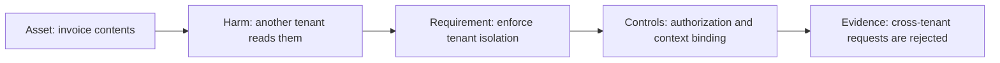
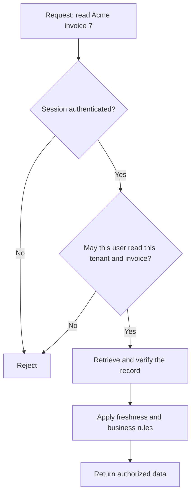
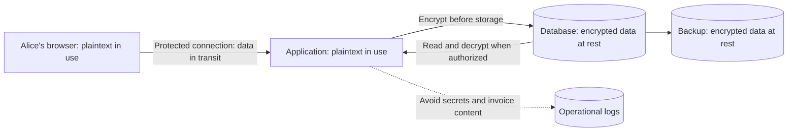
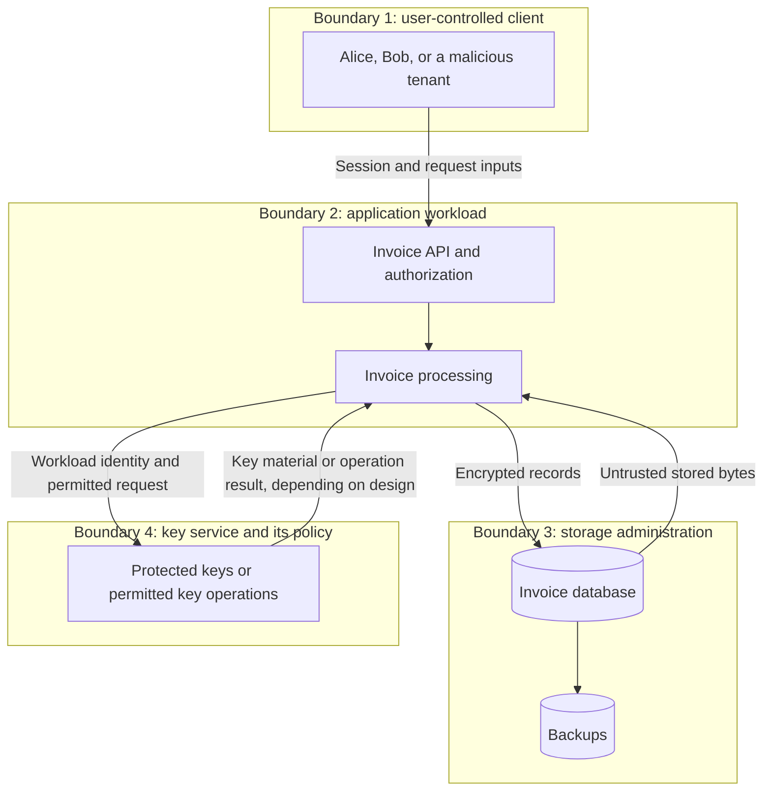
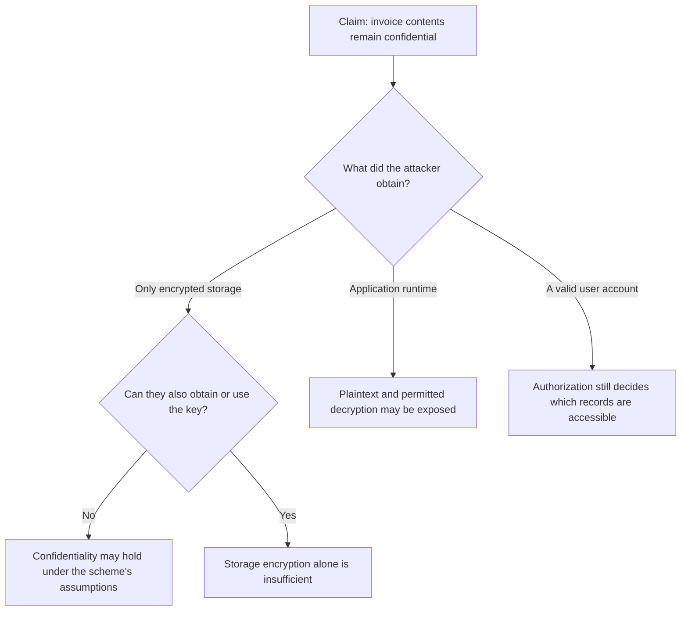
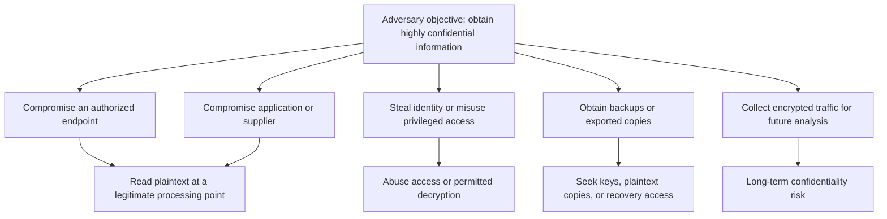
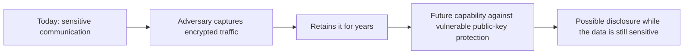

# 01. Security Requirements and Threat Models

**Self-study lesson · Day 1 · 40-minute taught session · allow 60–90 minutes independently, including the exercise.**

[Instructor teaching page](../teach/01-security-requirements.md) · [Threat-model worksheet](../resources/threat-model-worksheet.md) · [Next: AEAD](02-symmetric-aead.md)

## What you will be able to do

You will identify what needs protection, distinguish security properties, draw a system's trust boundaries, describe concrete threats, and write requirements that can be checked. You will also explain why “we encrypt everything” is not a complete security argument.

You need familiarity with a web application, a database, and a user account. No cryptographic mathematics or programming setup is required. This session is a design exercise; the Python implementation begins in Lab 1.

## 1. Begin with the requirement, not the algorithm

Your team is building an invoice service for several companies. Alice, an employee of **Acme**, submits invoices; Bob, an authorized Acme reviewer, reads them. Employees of **OtherCo** use the same service but must not see Acme's invoices. The application stores invoices, creates backups, and records operational events in logs.

Someone proposes: “Use AES-256 and HTTPS, then the system will be secure.” Those mechanisms may be useful, but the statement leaves the engineering problem undefined. Secure against whom? Which data? During which operations? What should happen when a component is compromised?

Compare these two statements:

| Vague statement | A requirement you can evaluate |
| --- | --- |
| Keep invoices secure | A user authorized only for OtherCo must not read Acme's invoice through the API, even if they know its identifier. |
| Encrypt the database | Someone who obtains the invoice database and backups, but not the protected keys or application runtime, must not recover invoice contents from those copies. |
| Prevent tampering | The application must reject an encrypted invoice whose protected content or expected tenant/record context has been modified before using its plaintext. |
| Keep the service available | For this exercise, restore invoice reads within four hours and lose no more than one hour of accepted writes after a storage failure; demonstrate this in a recovery drill. |

The time targets in the last row are **fictional business requirements**, not universal security defaults. They make the claim testable. In a real project, the business owner and engineering team agree on such targets.

**Read the diagram:** start with the harm you want to prevent. Choose controls after the requirement is clear, then decide what evidence would show that those controls work. Naming a strong algorithm skips most of this reasoning.

## 2. Name the security property precisely

Security properties overlap, but they answer different questions. A control that satisfies one property may do nothing for another.

| Property | Question it answers | Invoice example |
| --- | --- | --- |
| Confidentiality | Who can learn the information? | A stolen backup does not reveal invoice contents without the key. |
| Integrity | Has information been changed in an unauthorized way? | Altered encrypted invoice bytes are rejected before use. |
| Authentication | Which identity or credential is being verified? | The service verifies the user's session and the client verifies the server's identity. |
| Authorization | What is this authenticated actor allowed to do? | An authenticated OtherCo user is still denied access to an Acme invoice. |
| Availability | Can authorized users obtain the service when needed? | A tested recovery plan restores invoice reads after storage failure. |
| Freshness | Is this the expected current message or version? | An old but valid invoice cannot replace a newer approved version unnoticed. |
| Accountability | Can actions be investigated and attributed with appropriate evidence? | Protected audit events identify who approved a change and when. |

### Authentication is not authorization

An authenticated user can still be an attacker. A valid session proves something about the presented credential; it does not grant access to every record. Authorization must use the requested action, object, and tenant context.

**Read the diagram:** being logged in gets a request to the authorization decision, not past it. Decrypting a record successfully is not a substitute for that decision either.

### Integrity is not truth

Suppose an authorized employee submits an invoice for an incorrect amount. Cryptography may preserve exactly those bytes without establishing that the invoice is factually correct. Integrity checks protect against certain unauthorized modifications; business validation and approval processes address other kinds of error or fraud.

Similarly, **data-origin authentication** means evidence that a message was produced by someone possessing an appropriate key. It is not automatically proof of a particular human's identity. With a shared secret, every holder can generate authentic messages.

### Non-repudiation and its limits

Non-repudiation concerns evidence that can help resolve a later denial of an action. A digital signature can provide evidence that a private signing key signed particular bytes, subject to the signature scheme's assumptions. Connecting that event to a person also depends on identity binding, key custody, compromise history, timestamps, and reliable records of the transaction.

A signature alone does not prove that a person understood the document, intended the transaction, or was the only person able to use the key. A shared-key authentication tag is even less suited to proving which participant authored something: the verifier may possess the same key and be able to generate the tag. We revisit signatures in Session 5. For now, state the evidence you need instead of promising “undeniable proof” from a cryptographic primitive.

Check: an OtherCo user is logged in and connects using HTTPS. May they read Acme's invoice?

No. Authentication and protected transport do not grant authorization for a different tenant's record. The service must check access to the specific object and action.

## 3. Follow the data: at rest, in transit, and in use

An invoice changes form and location during its lifecycle. Each location creates a different exposure.

**Read the diagram:** transport encryption ends where the connection terminates. Stored encryption does not mean the application never handles plaintext. Copies such as logs, temporary files, exports, and backups need explicit consideration.

| State | What it means | Protection question |
| --- | --- | --- |
| At rest | Data saved on storage, including snapshots and backups | Who can read the stored bytes, and can they also access the decryption key? |
| In transit | Data moving between endpoints | Which endpoints are authenticated, and where does encryption terminate? |
| In use | Data being processed, often as plaintext in memory | What can a compromised application, browser, debugger, or privileged process observe? |

Disk encryption can protect a powered-off stolen disk, but usually does not prevent a running, authorized database from returning records. TLS protects traffic between its endpoints; a gateway terminating TLS can see the plaintext at that boundary. Application-level encryption can protect stored copies from a storage-only attacker, but a compromised application with decryption access may still expose their contents.

For this workshop, assume conventional application processing, not confidential-computing hardware or computation over encrypted data. A narrower claim with explicit assumptions is more useful than a broad promise that nobody can read the data anywhere.

## 4. Build a small threat model

A **threat model** is an explicit account of a system, what could go wrong, the assumptions behind your analysis, and how you will respond. It is a working engineering document, not a certificate that the system is secure.

OWASP describes a process that starts with understanding the system, identifies threats, selects responses, and checks the result. We use that structure below; see the [OWASP overview](https://owasp.org/www-community/Threat_Modeling).

### Define the vocabulary

| Term | Meaning in this lesson | Example |
| --- | --- | --- |
| Asset | Something whose loss, disclosure, misuse, or modification matters | Invoice contents, service availability, keys, and audit evidence |
| Threat actor | A person or system that may cause harm | A malicious tenant or someone who steals a backup |
| Capability | What that actor can actually do | Call the API as OtherCo, read a snapshot, or replace a database row |
| Threat | A possible harmful event or action | Read another tenant's invoice by changing its identifier |
| Vulnerability | A weakness that enables the threat | Missing per-object authorization |
| Control | A measure that reduces the risk | Check tenant and object permissions on every relevant request |
| Risk | The significance of a possible harm in context | Sensitive invoices may be exposed through an easy-to-reach endpoint |
| Residual risk | What remains after the chosen controls | A fully compromised application may still expose authorized plaintext |

Include accidental failures too: losing the only key can make perfectly encrypted backups unusable. An availability failure does not require a malicious actor.

### Step A — set scope and assumptions

We will model **submitting and retrieving one invoice**. Payment processing and compromise of the employee's own device are outside this first exercise. Excluding them does not mean they are safe; it means we must not claim this analysis covers them.

Our starting assumptions are:

- The identity service correctly verifies sessions; we will still test how the application uses the resulting identity.
- A storage-only attacker can obtain or replace stored encrypted records but cannot access application memory or protected keys.
- A malicious tenant has a valid account and can choose API inputs.
- The application and key service are not initially fully compromised. We will later change that assumption to test the boundary.

An assumption should be challenged when the deployment changes. “The network is internal” is not enough to conclude that every caller is trustworthy.

### Step B — list the assets and actors

| Asset | Harm if protection fails |
| --- | --- |
| Invoice contents and tenant association | Confidential business data leaks or a record is used for the wrong company |
| Encryption keys and key-use permissions | Many protected records become readable or forgeable |
| Sessions and approval authority | An attacker acts as another user or approves an unauthorized change |
| Backups and recovery capability | Data is lost or recovery cannot meet business needs |
| Audit events | Investigation cannot reliably reconstruct actions |

Do not collapse every attacker into one all-powerful adversary. Different capabilities imply different controls.

| Actor | Capability to analyze | Boundary of the scenario |
| --- | --- | --- |
| Network observer or modifier | Observe or interfere with traffic | Does not hold endpoint keys or control the endpoint |
| Malicious OtherCo user | Send authenticated requests with chosen identifiers | Has no Acme permissions |
| Storage thief or editor | Read a backup or replace stored invoice bytes | Cannot use protected keys or application memory |
| Compromised application | Execute application code and exercise its permissions | Can often see plaintext and request decryption |

### Step C — draw data flows and trust boundaries

A **trust boundary** is a point where identity, privilege, administrative control, or trust assumptions change. It can exist between services on the same machine or private network. A diagram box is not itself a security control.

**Read the diagram:** inspect each boundary-crossing arrow. What data is arriving? Who controls it? What identity is checked? What is validated before the receiving component acts? The key-service boundary is conceptual; later key-management sessions compare designs where keys are exported to applications with designs where operations remain inside a service.

The **attack surface** is the set of reachable interfaces and inputs through which an actor can interact with the system. Here it includes API routes, invoice identifiers, uploads, administrative interfaces, database permissions, backup access, and key-service permissions. It is broader than open network ports.

### Step D — write concrete threat statements

Use this pattern: **an actor with a stated capability can perform an action against an asset, causing a specific harm.**

“The database is insecure” is hard to act on. “An OtherCo user can change the invoice ID in an authenticated request and read an Acme invoice because the service fails to check the tenant” identifies a path to investigate and a test to run.

STRIDE is one useful prompt for looking for gaps. It does not replace scenario-specific reasoning. The categories originate in Microsoft's threat-modeling approach; see [Microsoft's STRIDE descriptions](https://learn.microsoft.com/en-us/azure/security/develop/threat-modeling-tool-threats).

| Prompt | Question for our invoice service |
| --- | --- |
| Spoofing | Could a caller impersonate a user, workload, or server? |
| Tampering | Could someone change invoice contents, context, or stored versions? |
| Repudiation | Could an action occur without reliable evidence for later investigation? |
| Information disclosure | Could an invoice or key leak through an API, backup, or log? |
| Denial of service | Could requests, deleted data, or lost keys make invoice retrieval unavailable? |
| Elevation of privilege | Could a tenant obtain reviewer, administrator, or key-service powers? |

You do not need one threat in every category for every box. Use the prompts to discover plausible paths, record why they matter, and avoid treating the checklist as proof of completeness.

### Step E — connect threats, controls, and evidence

Here is a small worked threat register. Read each row as a claim to be validated.

| Threat | Planned response | Evidence and remaining limit |
| --- | --- | --- |
| OtherCo changes the requested invoice ID to Acme's | Enforce server-side tenant and object authorization | A cross-tenant request is denied even with a valid OtherCo session. A compromised application is a different scenario. |
| A thief reads a database snapshot and backups | Encrypt invoice content and protect keys separately | Review snapshots for plaintext copies and verify the storage principal cannot obtain keys. This does not protect an endpoint that already has plaintext. |
| A storage editor changes ciphertext or moves a record into another tenant's row | Use authenticated encryption with expected tenant/record context | Mutation and substitution checks reject before use. Replay of a valid old version needs a separate control. |
| An attacker restores an old but valid invoice | Bind a version and compare it with independently trusted freshness state | A rollback scenario is rejected. The attacker must not be able to roll back that state with the record. |
| A diagnostic log records full invoice contents | Minimize and redact logging, then control log access | Inspect representative success and failure logs. Access controls do not undo data already disclosed. |
| A failure destroys the only key or the primary storage | Design key recovery and protected, tested backups | A recovery drill meets the fictional four-hour/one-hour targets. Backups without recoverable keys are insufficient. |

A passing functional test gives evidence for a particular case, not mathematical proof that every possible attack is impossible. Use review, testing, operational monitoring, and periodic reassessment together.

### Step F — prioritize and assign ownership

For this exercise, address the cross-tenant API path first: it is reachable by ordinary tenant accounts and its impact is direct disclosure. Prioritize snapshot theft according to who can reach backups and how sensitive the records are. Record an owner and a verification action for each accepted change.

Use qualitative priorities with reasons rather than inventing precise likelihood percentages. If you accept a residual risk, state who owns that decision and what would cause it to be revisited. A new export feature, new key-service permission, incident, or altered deployment can invalidate an earlier assumption.

## 5. Test the promise: what encryption does and does not protect

**Read the diagram:** the same encryption can be useful against one attacker and insufficient against another. That is why a threat model names capabilities rather than merely listing algorithms.

| Mechanism | Useful protection | What it does not establish by itself |
| --- | --- | --- |
| TLS with correct peer verification | Protected transport between its endpoints | Authorization, secrecy after termination, or trustworthy endpoint code |
| AEAD for stored records | Confidentiality and detection of unauthorized changes under correct key/nonce usage | Freshness, deletion prevention, access control, or protection after key compromise |
| Digital signatures | Verification of signed bytes against a public key | Confidentiality, factual correctness, or a complete human attribution argument |
| Password hashing | Reduces the usefulness of a stolen password verifier database | Protection for arbitrary invoice data or authorization decisions |
| Backups and recovery procedures | Recovery after some failures | Confidentiality unless backup access and key handling are also addressed |

We will implement and examine these mechanisms later. For now, describe the required property before selecting the mechanism.

## 6. Stronger adversary: a well-funded state actor

Now change the stakes. The same service stores **highly confidential strategic procurement documents**, sensitive research attachments, and identities whose disclosure could cause serious harm. Some content must remain confidential for **20 years**. These are fictional scenario requirements; “highly confidential” here describes impact, not a formal government classification or a claim of compliance with one.

Our adversary is a well-funded state actor with a sustained interest in this specific organization. Model a patient, capable adversary, not an omnipotent one. Funding and persistence do not automatically break correctly implemented modern cryptography. They justify examining more routes to keys and plaintext and allowing for repeated attempts over a long period.

### State the assumed capabilities, not just the label

For this exercise, assume the adversary can collect exposed traffic, retain stolen encrypted material, conduct targeted credential theft, seek access through suppliers or insiders, and attempt to compromise selected endpoints or services. Whether each path is feasible in an actual organization requires evidence. We are not claiming that every state actor possesses every capability.

| Capability assumed for the exercise | What changes in the model |
| --- | --- |
| Patient targeting of a small number of valuable people and systems | Analyze administrator accounts, reviewer devices, recovery procedures, and approval workflows, not just public API attacks. |
| Ability to retain intercepted or stolen data for many years | Include the confidentiality lifetime and future cryptanalytic risk, as well as today's ability to decrypt. |
| Attempts to compromise an application or authorized endpoint | Treat plaintext in memory and legitimate decryption permissions as major exposure paths. |
| Attempts to exploit suppliers, updates, or privileged insiders | Model build/release trust, administrative access, separation of duties, and independent review. |
| Ability to correlate visible metadata | Consider what document sizes, identities, timing, access patterns, and retained logs reveal even when content is encrypted. |

NIST's [risk-assessment guidance](https://csrc.nist.gov/pubs/sp/800/30/r1/final) provides a broader framework for assessing threats and residual risk. The capabilities and priorities above are assumptions for our teaching scenario, not intelligence about a particular country.

### Follow the routes to confidential information

**Read the diagram:** these are alternative paths to the objective, not steps the attacker must perform in order. Strong encryption on one arrow does not remove paths through users, services, or copied data. A new custom cipher is not the answer to a missing endpoint or key-use boundary.

### Write stronger, bounded protection requirements

| Protection requirement | Candidate controls and verification |
| --- | --- |
| A storage-only compromise must not reveal document content or expose keys in the same backup. | Use established authenticated encryption and separated key protection. Review backups, exports, configuration, and recovery access for unintended plaintext or keys. |
| Compromise of one workload must not grant decryption of every compartment's records. | Separate permissions and key scopes where the architecture permits it. Test a compromised-workload scenario against other compartments, including key-service and recovery permissions. |
| A single privileged operator must not silently grant themselves bulk decryption access. | Separate administrative duties and approval paths; protect independent audit evidence. Exercise changes to policies, credentials, and recovery procedures, not only ordinary reads. |
| Confidential documents must not appear in routine telemetry, test fixtures, or broadly accessible exports. | Minimize collection and retention, redact logs, restrict exports, and inspect representative error paths and operational copies. |
| An endpoint exposure must trigger containment and reassessment of affected data. | Protect identities and devices, detect unusual access, revoke compromised access, and rehearse response. Rotation limits some future exposure but cannot make an already stolen plaintext secret again. |
| The confidentiality design must account for the required 20-year lifetime. | Inventory public-key dependencies, capture exposure, retention, and migration lead time. Plan standards-based PQC migration where appropriate; validate protocols and implementations in later modules. |

Controls should have owners and evidence. “Uses an HSM” is not sufficient evidence that an application cannot abuse its permitted signing or decryption operations. “Uses end-to-end encryption” shifts the decryption boundary to endpoints, but does not protect plaintext on an endpoint already controlled by the adversary. Hardware protection, compartmentalization, and reduced privilege can meaningfully limit particular capabilities without eliminating every path.

### Long-term collection: harvest now, decrypt later

An adversary may keep encrypted communications today in the hope of exploiting vulnerable public-key protection in the future. The relevant question is how long the information must remain secret compared with how long migration takes and how the threat may change. This is a planning problem, not a prediction of the date a capable quantum computer will exist. NIST explains this collection risk in its [post-quantum cryptography introduction](https://www.nist.gov/cybersecurity-and-privacy/what-post-quantum-cryptography).

**Read the timeline:** capture can precede decryption capability. Classical forward secrecy helps against later compromise of long-term authentication keys, but does not by itself make recorded classical public-key exchanges quantum-resistant. PQC migration addresses particular public-key risks; it does not repair a compromised endpoint, weak authorization, or leaked keys. We examine this in [the quantum-threat session](../day-2/08-quantum-threat.md) and later migration modules, which are currently outlines.

### Do not promise invulnerability

For highly confidential data, ask what should remain protected after one component fails, and how you will detect and contain exposure. If an adversary controls every authorized plaintext endpoint, ordinary application encryption cannot keep that plaintext from them. State that limit, reconsider which systems and people need the data, and reduce unnecessary copies and access.

Check: against a state actor, is replacing AES-128 with AES-256 enough?

No. Key size is only one parameter in a complete design. Changing it does not fix stolen sessions, a compromised recipient device, broad decryption permissions, plaintext logs, unsafe nonce handling, or vulnerable public-key dependencies. Select established mechanisms appropriate to the system, then validate the surrounding assumptions and controls.

## 7. Your exercise: change one assumption

Use the [worksheet](../resources/threat-model-worksheet.md). Work independently or with a partner.

1. State the invoice service's scope and identify three assets.
2. Describe two actors with different capabilities.
3. Draw at least two trust boundaries and label the data crossing them.
4. Write three threat statements, each with a requirement, planned control, verification action, and residual limitation.
5. Change the assumption: **the application server is now fully compromised, but the key service itself is not**. Revise one earlier confidentiality claim.
6. For the highly confidential scenario, add a state-actor capability and a 20-year secrecy requirement. Identify one immediate exposure path and one long-term collection risk; give each a control, verification action, and residual limitation.

Before opening the worked answer, ask: can the attacker invoke decryption through the application's existing permissions even without exporting a key?

Worked answer to the changed assumption

A storage-only confidentiality claim does not cover full application compromise. If the application can normally request decryption, an attacker controlling it may use the same permission and observe the plaintext. Keeping the raw key inside a key service can reduce key extraction, but does not automatically prevent authorized operations from being abused. Revisit the scope of workload permissions, separation between tenants, key-use auditing, and incident response. These reduce particular risks; do not claim that they make a fully compromised process unable to read every plaintext it is authorized to process.

One complete example threat row

<strong>Actor and capability:</strong> OtherCo user with a valid session who can choose an invoice ID. <strong>Threat and harm:</strong> reads Acme's invoice through missing object authorization. <strong>Requirement:</strong> requests outside the caller's authorized tenant and object scope are rejected. <strong>Control:</strong> server-side authorization before access or decryption. <strong>Verification:</strong> submit the same Acme invoice request using Acme and OtherCo test identities and confirm the expected allow/deny outcomes without leaking contents. <strong>Residual limit:</strong> this test does not establish resistance to a fully compromised application. <strong>Owner:</strong> the API team, with review by the security owner.

## 8. Check your understanding

1. Why is “use AES-256” a control choice rather than a complete security requirement?
2. How can an authenticated user still violate confidentiality?
3. Why should a threat model distinguish a storage thief from an application attacker?
4. Does an intact, authentic old invoice prove that it is the current invoice?
5. Why must the model include logs and backups?
6. Does placing a key in a key service prevent a compromised application from requesting decryption?
7. Does a digital signature alone prove a particular person knowingly approved an invoice?
8. What must be added to a threat statement to make its response reviewable?

Answers and reasoning

<ol>
<li>It does not identify the asset, actor, harmful outcome, operating assumptions, or verification criterion.</li>
<li>A valid account may exploit missing authorization and read another tenant's data.</li>
<li>The storage thief may lack keys; the application attacker may observe plaintext or exercise decryption permissions. The same control has different limits in these scenarios.</li>
<li>No. Integrity/authenticity and freshness are distinct. A valid older version may still pass cryptographic verification.</li>
<li>They contain copies or traces of assets and may have different access policies and retention periods.</li>
<li>Not necessarily. Key extraction and permission to use a key are different capabilities.</li>
<li>No. Identity binding, key custody, compromise, transaction context, and other evidence affect that claim.</li>
<li>Add a testable requirement, response, owner, verification action, and explicit residual risk or assumption.</li>
</ol>

## 9. Handoff to authenticated encryption

Our next requirement is specific: **a storage-only attacker must not learn invoice content or silently modify its protected bytes or expected context, assuming the key remains protected and nonce rules are followed**.

In [Session 2: AEAD](02-symmetric-aead.md), we will implement that protection. Keep the other requirements visible: authorization, freshness, availability, and key management remain part of the system even after encryption works.

## References

Reviewed 21 September 2026. The invoice system, requirements, exercise targets, and worked threat register are original teaching examples.

- [OWASP threat-modeling overview](https://owasp.org/www-community/Threat_Modeling) — purpose, assumptions, responses, and validation.
- [OWASP Threat Modeling Cheat Sheet](https://cheatsheetseries.owasp.org/cheatsheets/Threat_Modeling_Cheat_Sheet.html) — system modeling and the review process.
- [Microsoft STRIDE descriptions](https://learn.microsoft.com/en-us/azure/security/develop/threat-modeling-tool-threats) — structured threat categories.
- [RFC 5116](https://www.rfc-editor.org/rfc/rfc5116) — the AEAD interface used in the next session.
- [NIST SP 800-30 Rev. 1](https://csrc.nist.gov/pubs/sp/800/30/r1/final) — risk assessment and residual-risk decisions.
