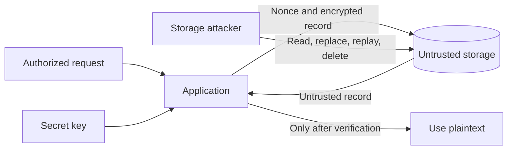
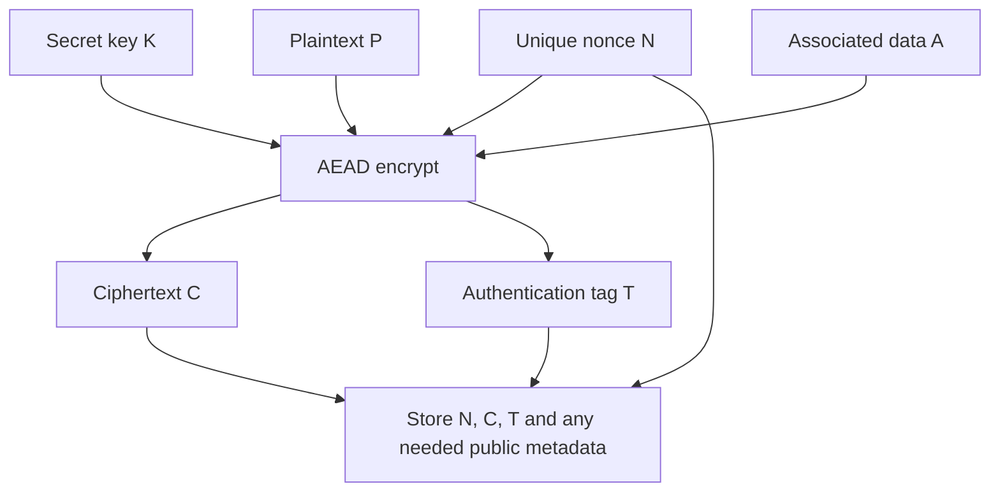
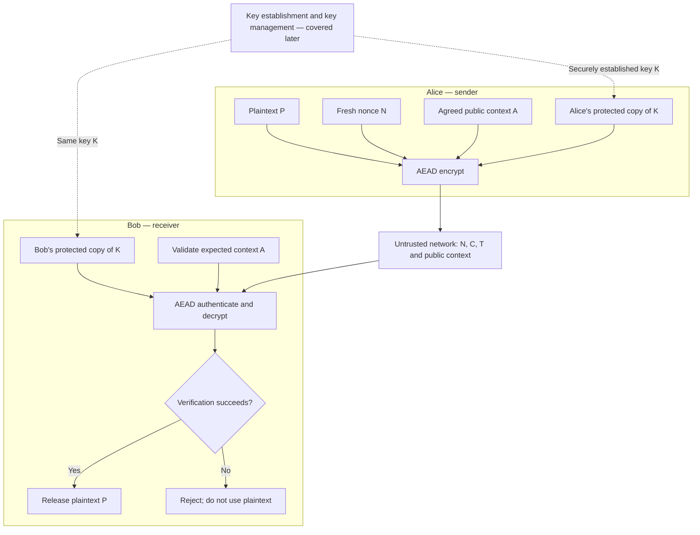
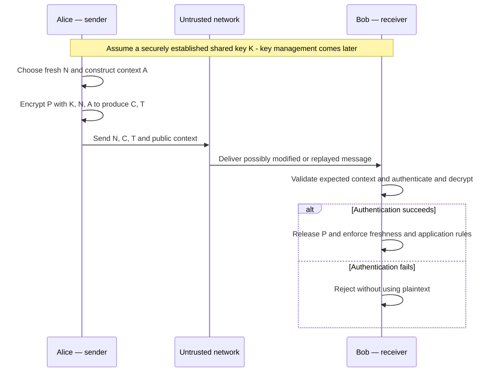
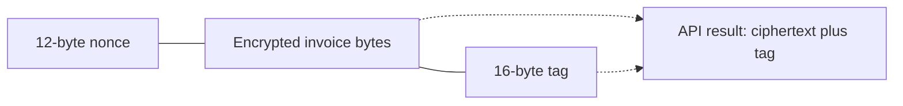
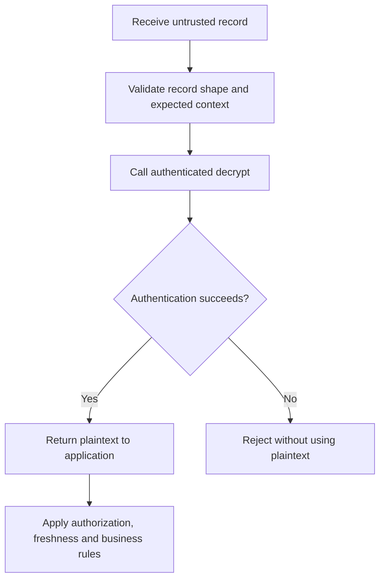
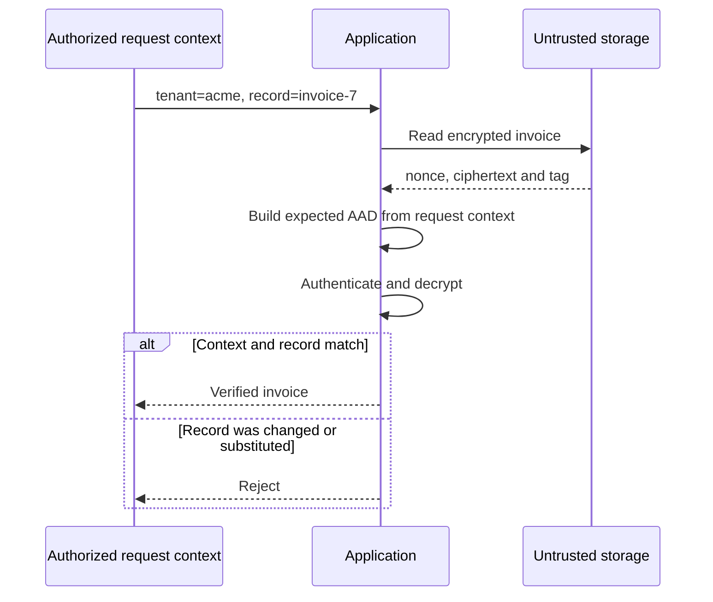
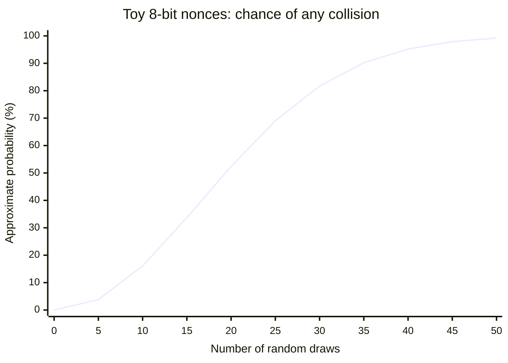
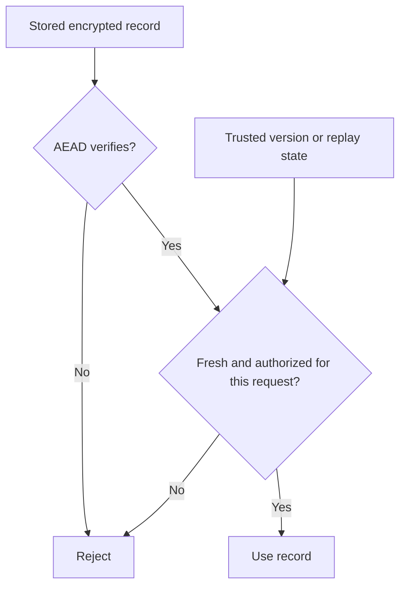

# 02. Symmetric Cryptography and AEAD

**Self-study lesson · Day 1 · 60-minute taught session · allow 75–100 minutes independently, plus the lab.**

[Instructor teaching page](../teach/02-aead.md) · [Lab 1](../labs/lab-01-aead.md) · [Choose a learning path](../getting-started/learning-paths.md)

## What you will be able to do

By the end, you should be able to explain each input to authenticated encryption, encrypt a small record with AES-GCM, reject modified records, bind ciphertext to its intended context, and explain why nonce reuse and replay are different problems.

You need basic Python functions, exceptions, and byte strings. No prior AES mathematics is needed. Read the explanations first, predict each experiment, then run the notebook. Answers are expandable so that you can check your reasoning after trying.

## 1. Start with a problem: an invoice in untrusted storage

A service stores invoices for several companies. An invoice contains `amount=125;currency=USD`. The database administrator or an attacker who steals a database snapshot should not learn the amount. An attacker able to edit rows should not silently change the amount, or move a valid invoice from one company to another.

Assume the application holds a secret key that the storage attacker cannot access. The attacker can read, replace, delete, and replay stored records. Our task is to protect the contents and detect changes before the application uses the invoice. We are not assuming a compromised application: if the attacker controls the process holding the key, this protection boundary has already been crossed.



**Read the diagram:** the key stays on the application side. The storage boundary is crossed by public metadata and encrypted bytes. Returning from storage does not make a record trustworthy.

<details>
<summary>Pause: does encryption by itself solve all of these requirements?</summary>
<p>No. Confidentiality hides content, but does not by itself establish that the content is unmodified or belongs in the requested context. Encryption also does not prevent deletion or replay of a previously valid record.</p>
</details>

## 2. From symmetric encryption to AEAD

In **symmetric cryptography**, the same secret key is used to encrypt and decrypt. Both sides that can decrypt also possess the ability to create valid encrypted messages. We will generate a random key, not choose a memorable password.

**AES** is a block cipher: with a key, it transforms fixed-size 128-bit blocks. A mode of operation specifies how to use it on messages. Saying “we use AES” leaves crucial questions unanswered. AES-GCM combines AES with a mode that supports authenticated encryption. **ChaCha20** is a stream cipher; **ChaCha20-Poly1305** combines it with an authenticator. We use established combined APIs rather than assemble encryption and authentication ourselves.

The relevant interface is **AEAD: Authenticated Encryption with Associated Data**. It protects the secrecy of plaintext and detects unauthorized modifications to the encrypted message and associated data. It accepts a key, nonce, plaintext, and optional associated data. Decryption either yields authenticated plaintext or fails. See the [AEAD interface in RFC 5116](https://www.rfc-editor.org/rfc/rfc5116#section-2).



**Read the diagram:** the key is an input, but is not part of the stored record. The nonce is public. Associated data remains unencrypted; its exact bytes must be available or reconstructed at verification time.

Why is authentication necessary? Some unauthenticated encryption schemes allow an attacker to modify encrypted bytes so that the resulting plaintext changes predictably. Others produce garbage that an application might still parse or act on. “It decrypted without an error” is not evidence of authenticity unless the API verifies an authenticator.

### The vocabulary you need

| Item | Meaning | Secret? | Our lab |
| --- | --- | --- | --- |
| Key | Random secret controlling encryption and verification | Yes | 32 bytes / 256 bits |
| Plaintext | Original application data | Usually | UTF-8 bytes of a synthetic invoice |
| Nonce / IV | Per-encryption value; GCM requires uniqueness under a key | No | 12 bytes / 96 bits |
| Ciphertext | Encrypted form of the plaintext | No | Same byte length as plaintext for GCM |
| Tag | Authenticator checked during decryption | No | 16 bytes / 128 bits |
| AAD | Additional authenticated data: visible context bound to the message | No | Tenant, record ID, purpose, format version |

One byte is eight bits: `256 / 8 = 32`. Key size, nonce size, and tag size are different parameters with different jobs. A 256-bit key does not mean a 256-bit tag.

An **IV** is an initialization vector; in this GCM lesson it is the nonce. Do not generalize GCM's IV rule to every encryption mode. A **salt** is another public value used in other constructions, such as password hashing; it is not a substitute for this nonce. We revisit salts and password-derived keys in Session 3.

### Two established AEAD choices

| Construction | Building blocks | Key / nonce / tag in the API | Engineering consideration |
| --- | --- | --- | --- |
| AES-GCM | AES plus GCM | 128/192/256-bit key; we use 96-bit nonces and 128-bit tags | Common in protocols and accelerated implementations |
| ChaCha20-Poly1305 | ChaCha20 plus Poly1305 | 256-bit key, 96-bit nonce, 128-bit tag | Useful where AES acceleration is unavailable; protocol support matters |

Use the construction supported by the established protocol or platform you are integrating. Both require correct nonce handling. Neither removes the need to protect keys. The IETF construction is specified in [RFC 8439](https://www.rfc-editor.org/rfc/rfc8439#section-2.8).

### AEAD in communication: Alice sends, Bob receives

AEAD also protects messages crossing an untrusted network. **Alice is the sender; Bob is the receiver.** For now, assume they already hold the same secret key `K`, established securely and associated with the intended peer. How they obtain and protect that key is a separate topic that we will cover later.

Alice starts with plaintext `P`, chooses a fresh nonce `N` under `K`, and constructs the agreed associated data `A`. Encryption produces ciphertext `C` and authentication tag `T`. Bob uses his copy of `K`, the received nonce, and the expected associated data to authenticate and decrypt.



**Read the diagram:** the dotted key-management paths represent a prerequisite, not sending the secret key alongside the message. Only the nonce, ciphertext, tag, and any needed public metadata cross the untrusted network in this example. A real protocol may reconstruct some of these inputs rather than transmit them explicitly.

The exchange over time looks like this:



For example, Alice might send an invoice to Bob's service. AAD could bind the message to an agreed protocol version, session, direction, and record identifier. Bob must validate that context against the session and request he expects. A received field saying `sender=Alice` does not by itself prove Alice's identity; that association depends on authenticated key establishment and the surrounding protocol. Anyone who possesses `K` can create a valid message.

If Bob sends a reply, he becomes the sender. Established protocols commonly derive separate traffic keys for the two directions and manage their nonce spaces. If both directions use one key, nonce uniqueness must hold across **both** senders; independent counters starting at zero would collide. We will study this in the secure-channel material rather than design a new communication protocol here.

**Key establishment and management — for later:** AEAD consumes a key; it does not distribute it, authenticate the peer, rotate it, or decide where it should be stored. Later modules cover:

- [Classical public-key cryptography](04-classical-public-key.md) and [Lab 2](../labs/lab-02-classical-channel.md): key agreement, key derivation, and the authentication boundary.
- [TLS 1.3](../day-2/07-tls.md): how an established communication protocol combines these mechanisms.
- [Key management](../day-3/12-key-management.md) and [protecting keys](../day-3/13-protecting-keys.md): generation, provisioning, storage, rotation, revocation, and destruction.

Those linked modules are currently course outlines. For this lesson, the assumption is simply: Alice and Bob already have the correct protected key. AEAD can detect unauthorized modifications under its usage assumptions, but does not prevent dropped messages or recognize an unchanged replay on its own.

<details>
<summary>Check: should Alice send K together with N, C, and T so Bob can decrypt?</summary>
<p>No. Anyone observing that message would then have the key. Alice and Bob need a separate secure way to establish or provision it. The nonce and tag can be public; the key must remain secret. We cover the key's establishment and lifecycle later.</p>
</details>

## 3. A complete first example

Use the [setup instructions](../getting-started/lab-setup.md), or run the equivalent cells in [Lab 1](../labs/lab-01-aead.md). This example uses the high-level `AESGCM` class in `cryptography`.

```python
import secrets
from cryptography.hazmat.primitives.ciphers.aead import AESGCM

key = AESGCM.generate_key(bit_length=256)
nonce = secrets.token_bytes(12)
plaintext = "invoice=7;amount=125;currency=USD".encode("utf-8")
aad = b"workshop-invoice:v1:tenant=acme:record=invoice-7"

aead = AESGCM(key)
ciphertext_and_tag = aead.encrypt(nonce, plaintext, aad)
recovered = aead.decrypt(nonce, ciphertext_and_tag, aad)

assert recovered == plaintext
assert len(ciphertext_and_tag) == len(plaintext) + 16
print(recovered.decode("utf-8"))
```

The printed result is `invoice=7;amount=125;currency=USD`. The encrypted bytes change between fresh runs because the example generates a new key and nonce. Do not compare encrypted output against one fixed screenshot.

`b"..."` creates a byte string. `.encode("utf-8")` converts text to bytes; `.decode("utf-8")` converts it back after successful verification. The cryptographic operation works on bytes, not on your application's interpretation of the text.

The API returns **ciphertext followed by the tag** as one byte string. Pass that complete value into `decrypt`. The nonce is separate, and must also be retained. The key must remain separately protected. The [library API documentation](https://cryptography.io/en/50.0.1/hazmat/primitives/aead/#cryptography.hazmat.primitives.ciphers.aead.AESGCM) describes this contract.



**Storage accounting:** storing a 12-byte nonce plus the returned bytes adds 28 bytes to the plaintext length, before metadata or an encoding such as Base64. Base64 makes binary data transportable as text; it adds no secrecy. GCM does not hide message length.

## 4. Decrypt means verify, then release

Before running this continuation, predict the outcome:

```python
from cryptography.exceptions import InvalidTag

modified = bytes([ciphertext_and_tag[0] ^ 1]) + ciphertext_and_tag[1:]
try:
    aead.decrypt(nonce, modified, aad)
except InvalidTag:
    print("Rejected: record could not be authenticated.")
```

`^ 1` flips the least significant bit of the first byte. The library rejects the modified record. We did not need to predict what the modified plaintext would look like: unauthenticated plaintext must never be used.



The same `InvalidTag` exception can result from a changed ciphertext, tag, nonce, key, or AAD. It does not tell you which input was wrong, nor prove that an attacker caused the failure. A storage error or wrong key selection can produce the same result.

Never handle this by trying decryption without authentication, accepting partial output, or replacing the result with “default” data. Our helper propagates the exception; a service would translate it into a controlled failure response. Authenticated empty plaintext (`b""`) is valid, so do not use an empty byte string as an error sentinel.

## 5. AAD binds data to its intended context

Suppose an attacker copies a valid encrypted invoice into another tenant's row. The ciphertext itself has not changed. If decryption uses only the key, nonce, and stored bytes, the copy may still authenticate. We need to bind it to an expected tenant and record.

Put the tenant ID, record ID, and a purpose/version label in AAD. They remain visible, but changing their authenticated values breaks verification. In the lab, the application constructs the expected AAD from the request it has already authorized.



**The important boundary:** accepting a tenant label from the same untrusted blob and passing it to `decrypt` is not enough. That might only prove that the blob is valid for the attacker's supplied label. The application must compare against the context it actually intends to use, and still enforce access control.

AAD comparison is byte-for-byte. JSON key order, spaces, casing, and text encoding can change those bytes even if two objects look equivalent to a human. Our helper uses a fixed, restricted JSON schema with sorted keys and no optional spaces. This is a teaching convention for these Python examples, not a claim to define a general interoperable wire protocol.

<details>
<summary>Check: should a secret customer diagnosis go in AAD?</summary>
<p>No. AAD is visible. Put sensitive content in the plaintext to be encrypted. An opaque record identifier may be suitable metadata, depending on what revealing that identifier exposes.</p>
</details>

## 6. Nonces: unique under the key

For AES-GCM, never repeat a nonce for a new encryption under the same key. The nonce does not need to be secret. Decryption uses the original nonce; decrypting a record twice does not violate the encryption-nonce rule.

Our short-lived lab uses `secrets.token_bytes(12)` for every encryption. Random generation makes collisions unlikely at small scale, but does not guarantee uniqueness. The library does not keep a global list of your previously used nonces.

Why does reuse matter? GCM's encryption uses a key/nonce-dependent stream. Reusing the pair repeats that stream. For overlapping portions of two plaintexts:

```text
C1 = P1 XOR stream
C2 = P2 XOR stream
C1 XOR C2 = P1 XOR P2
```

If one plaintext is known, the overlapping part of the other can be recovered. Here `C1` and `C2` refer to encrypted content, excluding their authentication tags. GCM authentication can also be undermined by reuse; changing AAD does not repair a reused key/nonce pair. This lab demonstrates the confidentiality failure without implementing a tag-forgery attack. See [RFC 5116, nonce reuse](https://www.rfc-editor.org/rfc/rfc5116#section-5.1.1).

### Why random does not mean collision-free

For `q` independent uniform choices from `2^n` nonces, the probability of at least one collision is approximately:

```text
p ≈ 1 - exp(-q × (q - 1) / (2 × 2^n))
```

The following teaching graph uses **8-bit toy nonces**, not AES-GCM nonces. Rounded percentages come from that approximation.



**Read the graph:** with only 256 possible values, a collision becomes plausible after a few dozen draws, long before all values have been used. The notebook lets you change the toy nonce size and plot the curve. For 96-bit random nonces, the approximation at `2^32` encryptions is about `2^-33`; this calculation is not a production usage recommendation. GCM's full limits involve more than collision probability, including message sizes and verification attempts.

### What changes in a real system?

| Strategy | Benefit | Failure you must address |
| --- | --- | --- |
| Random nonce | Simple; no shared counter | Collision risk aggregated across every writer using the key; enforce usage budgets |
| Counter-based allocation | Can guarantee uniqueness within a managed namespace | Durable state, concurrency, unique writer prefixes, rollback, restart, and exhaustion |
| Established protocol/library manages nonces | Application relies on a defined scheme | Follow that scheme and its key lifetime/rekey rules exactly |

Do not reset a counter while retaining the same key, use a timestamp as if it guaranteed uniqueness, or let cloned processes unknowingly share the same allocation space. Re-encrypting for a retry requires a new nonce; resending an already encrypted byte-for-byte record does not perform a new encryption, but introduces a separate replay question. NIST's [GCM specification](https://csrc.nist.gov/pubs/sp/800/38/d/final), especially Sections 8 and 9, defines IV requirements. Its revision is in progress; a proposal is not a final replacement standard.

## 7. What AEAD does not promise

Imagine the attacker restores yesterday's valid invoice. The nonce, ciphertext, tag, and context all match. Authentication succeeds. AEAD has no memory of whether this record is the newest one.



Freshness requires additional design: for example, a version bound into AAD and compared against trusted state, or sequence numbers managed by an established protocol. A timestamp included in AAD is not enough unless policy and trusted state/time validation enforce its meaning.

AEAD also does not stop deletion, traffic analysis, length leakage, or an attacker who obtains the key. It does not prove which individual sent a message when several parties share a key. Shared-key authenticity is different from a digital signature and does not provide public proof of authorship.

## 8. Check your understanding

Answer before opening the explanations.

1. Which of key, nonce, ciphertext, tag, and AAD must be secret?
2. You change `tenant=acme` to `tenant=other` during verification. What happens?
3. Encryption succeeded twice with the same key and nonce. Is the second call safe because no exception occurred?
4. A correct record decrypts twice. Has AES-GCM failed?
5. Why should a database row's tenant field not be the sole authority for expected AAD?
6. What should your function do on `InvalidTag`? How should it handle valid empty plaintext?
7. Where would you store the nonce and key for an encrypted database record?
8. Why does a longer AES key not fix nonce reuse?

<details>
<summary>Answers and reasoning</summary>
<ol>
<li>The key must be secret; plaintext is typically confidential. Nonce, ciphertext, tag, and AAD may be public. Public does not mean safe to alter.</li>
<li>Verification rejects the record because the expected AAD bytes differ.</li>
<li>No. The API does not enforce application-wide nonce uniqueness. Reuse breaks the construction's assumptions.</li>
<li>No. Authentication is not replay detection. Repeated decryption is allowed; freshness is a separate requirement.</li>
<li>The attacker may copy both the record and its label. Derive expected context from an authorized request or other trusted application state.</li>
<li>Propagate or translate the failure into a controlled rejection, without using plaintext. Return <code>b''</code> if that is the valid authenticated message.</li>
<li>The nonce belongs with the ciphertext. Protect the key separately with suitable access controls and key management. Losing the key loses access to the data; storing it alongside stolen ciphertext defeats this boundary.</li>
<li>The failure repeats the key/nonce-dependent stream. Increasing key length does not make a repeated stream different.</li>
</ol>
</details>

## 9. Apply it in Lab 1

Proceed to [Authenticated Encryption](../labs/lab-01-aead.md). You will encrypt an invoice, manipulate each input, implement a verification boundary, test tenant binding, observe replay, and reproduce a nonce-reuse failure on synthetic data.

You are ready to move on when you can explain the difference between **confidentiality**, **authenticity**, **context binding**, and **freshness**, and your decryption helper passes both success and rejection checks.

## References

Reviewed 19 September 2026. Code uses the pinned course dependency, not an unversioned API.

- [cryptography 50.0.1: AEAD APIs](https://cryptography.io/en/50.0.1/hazmat/primitives/aead/) — inputs, outputs, and exceptions.
- [RFC 5116](https://www.rfc-editor.org/rfc/rfc5116) — AEAD interface, associated data, and nonce-reuse consequences.
- [NIST SP 800-38D](https://csrc.nist.gov/pubs/sp/800/38/d/final) — GCM and nonce requirements.
- [NIST revision status](https://csrc.nist.gov/pubs/sp/800/38/d/r1/2prd) — revision discussion, not a final new standard.
- [RFC 8439](https://www.rfc-editor.org/rfc/rfc8439) — ChaCha20-Poly1305.
