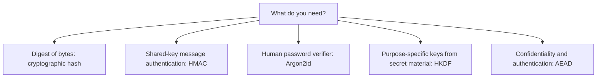
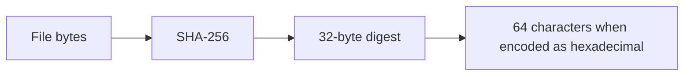
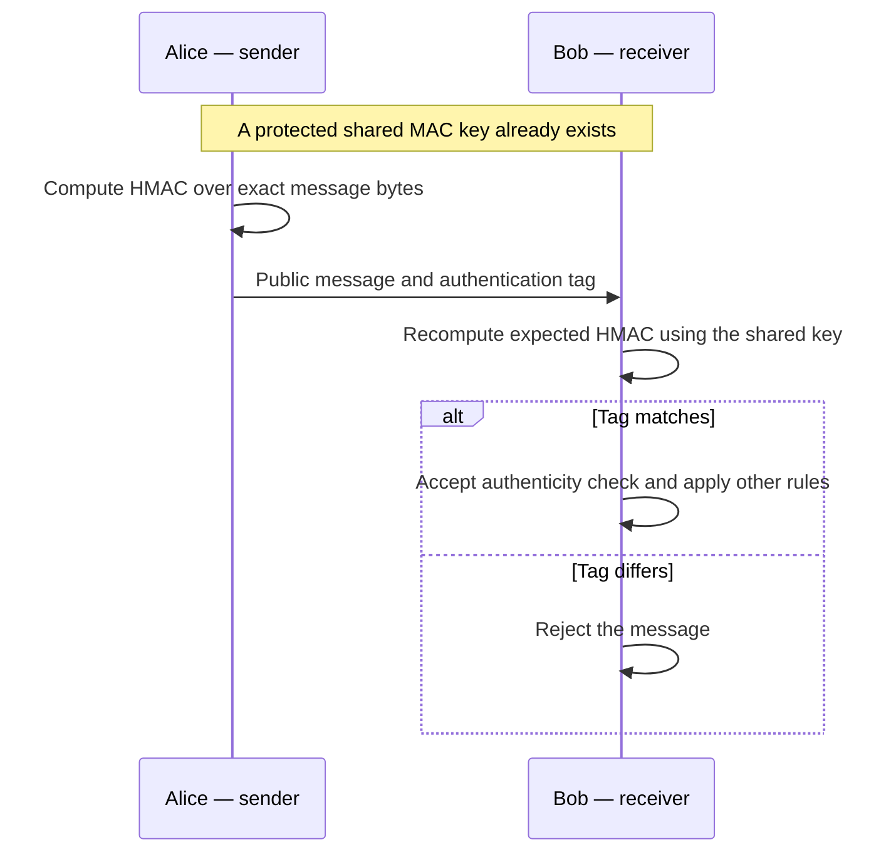
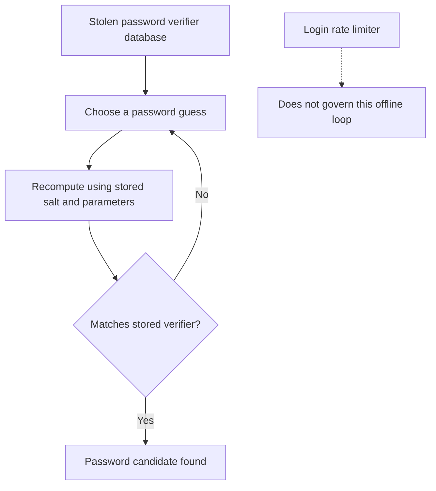
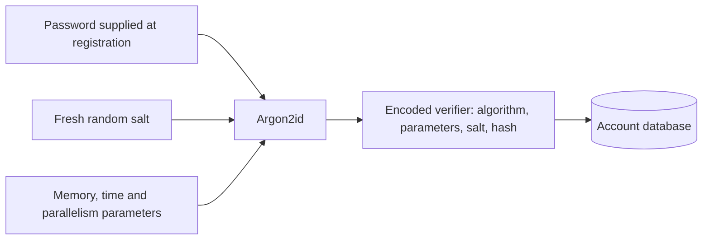
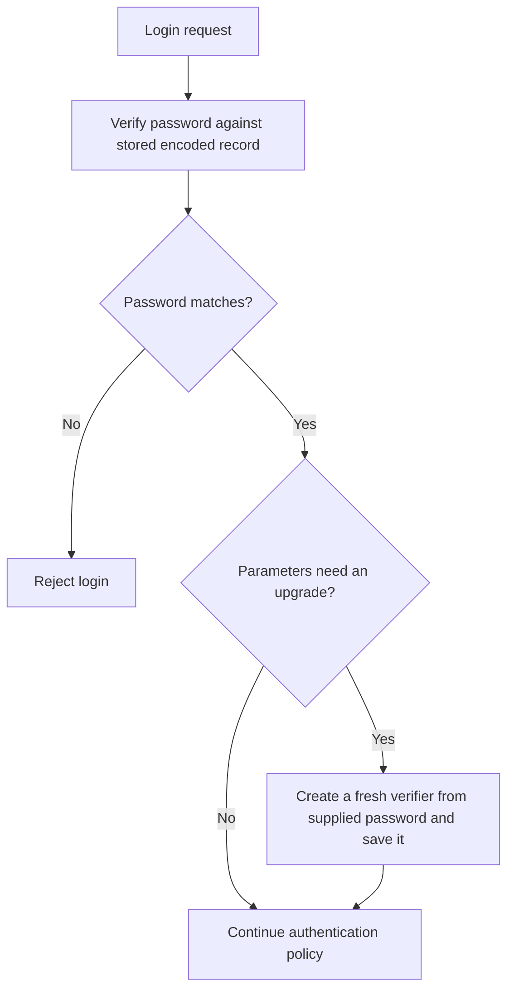
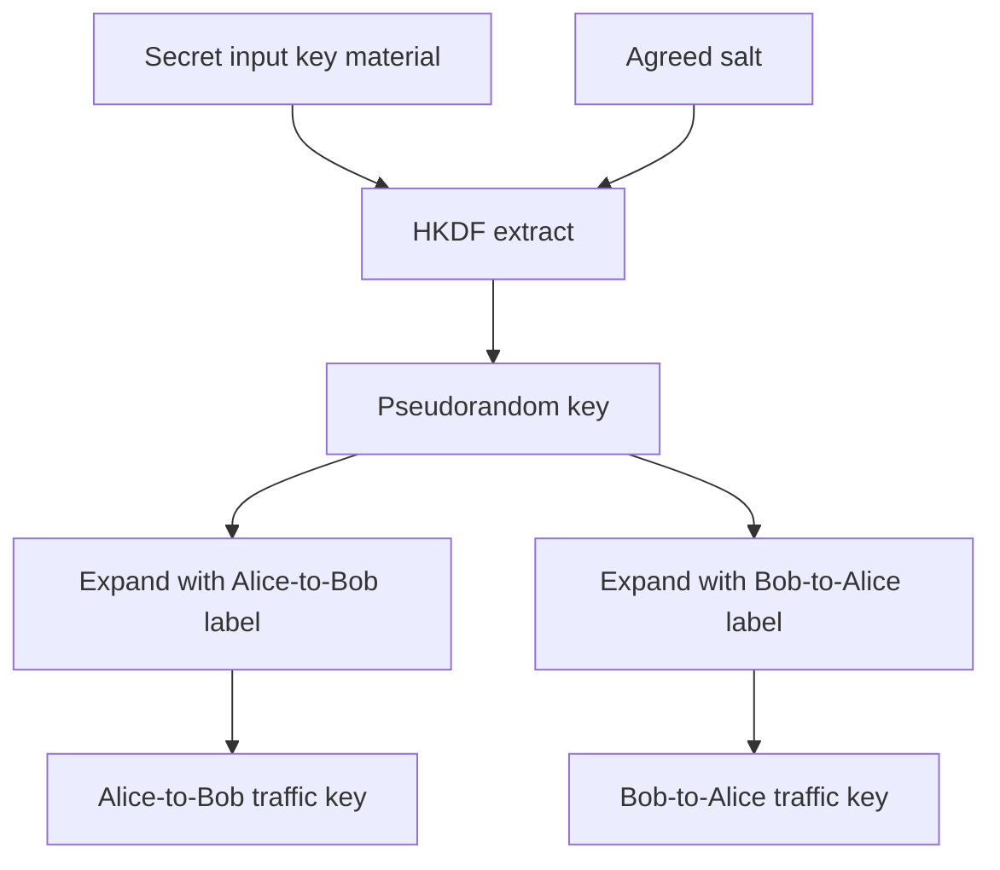

# 03. Hashes, MACs, Passwords and KDFs

**Self-study lesson · Day 1 · 60-minute taught session · allow 90–120 minutes independently with the experiments.**

[Instructor page](../teach/03-hashes-passwords-kdfs.md) · [Download notebook](../downloads/session-03-hashes-passwords-kdfs.ipynb) · [Previous: AEAD](02-symmetric-aead.md)

## What you will be able to do

You will distinguish a hash from a MAC, explain offline password guessing, store and verify a password with Argon2id, and derive purpose-specific keys with HKDF. You will also distinguish a password salt, an AEAD nonce, an HKDF salt, and an HKDF context label.

You need Python bytes, functions, and exceptions, plus the key/nonce distinction from Session 2. The invoice service remains our example. It now needs to check file contents, authenticate internal events, verify user passwords, and derive separate communication keys. These are different requirements, even though several APIs return bytes that look similar.

## 1. Choose by the job

| Requirement | Suitable mechanism in this lesson | Main limitation |
| --- | --- | --- |
| Compute a compact digest of file bytes | SHA-256 or SHA3-256 | No secret key: anyone can recompute the digest |
| Check message authenticity between holders of a secret | HMAC-SHA-256 | Does not hide content, identify a unique key holder, or prevent replay by itself |
| Store a verifier for a human password | Argon2id with a fresh salt and tuned cost | Guessable passwords remain guessable; cost raises the work per guess |
| Derive keys for different purposes from secret key material | HKDF with agreed salt and context labels | Does not create entropy or perform peer authentication |
| Hide and authenticate invoice contents | AEAD from Session 2 | Still needs correct keys, nonces, and surrounding protocol rules |



**Read the diagram:** these branches are not interchangeable. A 32-byte output is not evidence that two mechanisms provide the same protection.

### Run the examples

Download the notebook above, then use **File → Upload notebook** in [Google Colab](https://colab.research.google.com/). It installs the pinned dependencies and runs without a repository checkout. The notebook is a guided experimental companion, not an additional graded lab. Its code and prose are generated from this Markdown lesson; diagrams render on the website and their source is preserved in notebook viewers that do not render Mermaid.

For local execution, use the workshop environment from the repository root:

```powershell
.\.venv\Scripts\python -m pip install -r requirements-session03.txt
.\.venv\Scripts\python examples/session-03/demo.py
```

On macOS/Linux, use `.venv/bin/python`. All credentials and keys below are disposable teaching data. Execute the Python blocks in order, predict the result, then change one input and explain what happened.

## 2. Cryptographic hashes: a digest of exact bytes

A cryptographic hash maps an input byte string to a fixed-length digest. The same input and algorithm produce the same output. A different input should be hard to arrange to produce a particular matching digest, but collisions must exist because there are more possible inputs than fixed-length outputs.

SHA-256 belongs to the **SHA-2** family. SHA3-256 belongs to **SHA-3**, a different family with a different internal design. Both names here select a 256-bit digest. They are not interchangeable in a file format or protocol: both sides must agree on the exact algorithm and bytes. Python exposes them through [hashlib](https://docs.python.org/3/library/hashlib.html).



**Read the diagram:** hexadecimal is an encoding of the digest, not another cryptographic operation. Hashing is not encryption: there is no decryption key or inverse operation for recovering arbitrary input.

### Experiment: one edit, different digest

Predict the digest length and whether a trailing newline matters.

```python
import hashlib

document = b"invoice=7;amount=125;currency=USD"
digest = hashlib.sha256(document).digest()
assert len(digest) == 32
assert len(digest.hex()) == 64
assert hashlib.sha256(document).digest() == digest
assert hashlib.sha256(document + b"\n").digest() != digest
assert len(hashlib.sha3_256(document).digest()) == 32
assert hashlib.sha3_256(document).digest() != digest
print("PASS: hashes are deterministic; exact bytes and algorithm matter.")
```

The assertions illustrate these particular inputs, not a proof that no collision exists. A newline, Unicode encoding choice, or serialization change alters the input. Define your format before depending on two systems computing identical digests.

### Three different resistance properties

| Property | What the attacker is given | What the attacker tries to find |
| --- | --- | --- |
| Preimage resistance | A target digest | Any input that produces that digest |
| Second-preimage resistance | A particular input | A different input with the same digest |
| Collision resistance | Freedom to choose both inputs | Any two distinct inputs sharing a digest |

For an ideal 256-bit hash, generic classical work is roughly `2^256` for preimage search and `2^128` for collision search. These are conceptual estimates, not measured run times or guarantees about every application. If the input comes from a small list of likely passwords, the attacker can try that list; a 256-bit output does not make the password unpredictable.

### A digest needs a trusted reference

Suppose an attacker can replace both an invoice file and a text file containing its SHA-256 digest. They do not need a collision. They replace the invoice and compute a new digest themselves.

```python
changed_document = b"invoice=7;amount=999;currency=USD"
attacker_supplied_digest = hashlib.sha256(changed_document).digest()
assert hashlib.sha256(changed_document).digest() == attacker_supplied_digest
print("OBSERVE: a modified file agrees with the attacker's replacement digest.")
```

A trusted digest can help detect changes. An untrusted file and untrusted digest cannot establish their own authenticity. The trust may come from an authenticated distribution channel, a signature over a manifest, or another suitable mechanism. We study signatures later.

## 3. HMAC: message authentication with a shared secret

HMAC combines a secret key and a cryptographic hash in an established construction. Alice and Bob share a protected MAC key. Alice computes a tag over the message bytes; Bob computes the expected tag and compares it safely. An attacker who can edit the message but does not know the key cannot simply create a replacement tag as they could with an ordinary hash.



**Read the diagram:** the message is visible. Use AEAD when you need confidentiality too. Everyone with the shared key can generate tags, so HMAC does not establish which individual key holder authored a message. Key distribution is still a separate problem.

### Experiment: authenticate an invoice event

Use Python's [hmac module](https://docs.python.org/3/library/hmac.html). `compare_digest` avoids content-dependent short-circuit comparison; it does not make the entire surrounding application constant-time.

```python
import hmac
import secrets

mac_key = secrets.token_bytes(32)
event = b"invoice-event:v1|tenant=acme|record=invoice-7|action=approved"
tag = hmac.digest(mac_key, event, "sha256")

def verify_event(key, message, supplied_tag):
    expected = hmac.digest(key, message, "sha256")
    return hmac.compare_digest(expected, supplied_tag)

assert verify_event(mac_key, event, tag)
assert not verify_event(mac_key, event.replace(b"acme", b"other"), tag)
assert not verify_event(secrets.token_bytes(32), event, tag)
assert not verify_event(mac_key, event, tag[:-1])
print("PASS: original HMAC verifies; changed message, key, and tag are rejected.")
```

The verifier expects a bytes tag, not a hexadecimal string. Validate external input types and sizes at the application boundary. The fixed message above is a demonstration, not a general serialization or network protocol. Real protocols must define unambiguous framing and all fields that affect interpretation.

Do not invent `SHA256(key + message)` as a MAC. Hash constructions have details that make naive keyed combinations unsafe; use HMAC or the protocol's specified authenticator.

A repeated valid event will pass the same check again. If approving an invoice twice matters, the receiver needs authenticated identifiers and replay/idempotency policy with state. A timestamp field has no protective effect unless it is authenticated and its meaning is enforced. Similarly, omitting the tenant or action from authenticated bytes leaves those omitted fields outside this protection.

<details>
<summary>Check: does replacing the plain hash with HMAC hide the invoice?</summary>
<p>No. HMAC authenticates the message but does not encrypt it. For confidential invoice content use the established AEAD interface from Session 2, not a hand-built combination of encryption and hashing.</p>
</details>

## 4. Why SHA256(password) fails as password storage

A password verifier is data the server uses to check a proposed password without storing the original password. If an attacker steals those verifiers, they can often guess passwords **offline**, without going through your login endpoint. Login rate limits do not control that offline computation.

General-purpose hashes are intentionally fast. An attacker can hash guesses and compare the results. A salt prevents useful sharing of some work across accounts, but using a fast hash with a salt still leaves each guess cheap.



### Experiment: a tiny offline guess list

This example attacks only a fabricated value created in this cell. It is deliberately small and shows the mechanism, not a password-cracking benchmark.

```python
toy_password = "lab-only-password-123"
weak_verifier = hashlib.sha256(toy_password.encode("utf-8")).digest()
toy_guesses = ["wrong-first-guess", "lab-only-password-123", "another-guess"]
found = next((guess for guess in toy_guesses
              if hashlib.sha256(guess.encode("utf-8")).digest() == weak_verifier), None)
assert found == toy_password
print("OBSERVE: the fabricated password was found by hashing a small guess list.")
```

The attack succeeds because the guess was in the list, not because SHA-256 was inverted or broken. Do not “repair” it by adding a secret-looking prefix, looping a hash an arbitrary number of times, or replacing SHA-256 with SHA3-256. Use a dedicated password-hashing construction with managed parameters.

## 5. Argon2id: make each password guess expensive

Argon2id is a password-hashing construction designed to consume memory and computation. Its cost can be adjusted to your environment. This makes large guessing efforts more expensive, but does not give a weak password the unpredictability of a random key. The function and its parameters are specified in [RFC 9106](https://www.rfc-editor.org/rfc/rfc9106).

A fresh random **salt** is generated for each new verifier. It is public and stored with the verifier. Two accounts using the same password should receive different salts and therefore different stored values. A salt is not a password, key, or secret access-control mechanism.



**Read the diagram:** store the whole encoded verifier, not just the final hash bytes. The algorithm, salt, and cost parameters are needed to verify it later. Protect the database even though the salt is public: the verifier enables offline guessing.

### Experiment: create and verify an encoded password record

The [argon2-cffi high-level API](https://argon2-cffi.readthedocs.io/en/stable/howto.html) manages salts and encoded records. We explicitly choose a teaching baseline: **64 MiB** of memory, three passes, and four lanes. This is not a universal production setting. Test memory, latency, and concurrent load on your deployment; the [parameter guide](https://argon2-cffi.readthedocs.io/en/stable/parameters.html) explains the tradeoffs.

```python
from argon2 import PasswordHasher, Type
from argon2.exceptions import VerifyMismatchError

password_hasher = PasswordHasher(
    time_cost=3, memory_cost=65536, parallelism=4,
    hash_len=32, salt_len=16, type=Type.ID,
)
demo_password = "demonstration-only-not-a-real-account-password"
stored_verifier = password_hasher.hash(demo_password)
second_verifier = password_hasher.hash(demo_password)
assert stored_verifier.startswith("$argon2id$")
assert stored_verifier != second_verifier
assert password_hasher.verify(stored_verifier, demo_password)

try:
    password_hasher.verify(stored_verifier, "wrong-password")
except VerifyMismatchError:
    print("PASS: wrong password rejected.")
else:
    raise AssertionError("Wrong password unexpectedly accepted")

assert not password_hasher.check_needs_rehash(stored_verifier)
print("PASS: fresh salts produce different records; the correct password verifies.")
```

`memory_cost` is in KiB: `65536 KiB = 64 MiB`. It is the overall memory cost for a hash operation, not 64 MiB per lane. Concurrent requests multiply resource demand. A production authentication service must constrain resource use and request sizes; increasing cost without capacity planning can create availability problems.

### Verification and upgrades



**Read the diagram:** update a verifier only after successfully verifying the supplied password. Do not hash an old encoded verifier and pretend that this is the same as rehashing the password. A deployed service also needs session management, safe error handling, online throttling, and appropriate account protections. A malformed stored record or operational failure must not be mistaken for successful authentication; the sample catches only the expected mismatch so unexpected errors remain visible during development.

A **pepper** is an optional separately protected secret used by some password-storage designs. Unlike a salt, it must not be stored in the same database if separation is the intended protection. It adds lifecycle and recovery complexity and does not replace password hashing. We do not add a pepper to this example.

For the well-funded adversary from Session 1, expensive guessing is one barrier. It does not prevent stolen sessions, phishing, endpoint capture of a password, or misuse of a privileged recovery workflow. The broader threat model still applies.

## 6. HKDF: derive keys from secret key material

Now suppose Alice and Bob already have shared secret material with sufficient entropy. That might later come from X25519 or ML-KEM. They need different keys for different directions or functions. HKDF is an **extract-and-expand** construction built using HMAC; [RFC 5869](https://www.rfc-editor.org/rfc/rfc5869) defines its interface.

The extract stage takes input key material and an optional salt and produces a pseudorandom key. Expand uses that key, a context value called `info`, and an output length to produce the requested key bytes. Our library runs both stages for us.



**Read the diagram:** labels separate purposes within an agreed key schedule. Both peers must use the same input material, salt, algorithm, label, and length to derive the same key. The labels are not secrets. A label containing `Alice` does not authenticate Alice.

HKDF is deliberately efficient. **It is not a password-hardening function**, and cannot manufacture unpredictability missing from its input. A dictionary attacker can run HKDF on guesses too. Use an appropriate password-based construction when your input is a human password; do not pass it directly to this HKDF example.

### Experiment: reproducible keys with separate purposes

This demonstration generates random input material as a stand-in for a securely established secret. No network handshake occurs. Each call creates a new HKDF object because the library object is single-use.

```python
from cryptography.hazmat.primitives import hashes
from cryptography.hazmat.primitives.kdf.hkdf import HKDF

input_secret = secrets.token_bytes(32)
derivation_salt = secrets.token_bytes(32)

def derive_demo_key(secret, salt, context):
    return HKDF(algorithm=hashes.SHA256(), length=32,
                salt=salt, info=context).derive(secret)

label_ab = b"workshop:v1:alice-to-bob:aead"
label_ba = b"workshop:v1:bob-to-alice:aead"
key_ab = derive_demo_key(input_secret, derivation_salt, label_ab)
key_ba = derive_demo_key(input_secret, derivation_salt, label_ba)
assert key_ab == derive_demo_key(input_secret, derivation_salt, label_ab)
assert key_ab != key_ba
assert key_ab != derive_demo_key(input_secret, secrets.token_bytes(32), label_ab)
assert len(key_ab) == 32
print("PASS: matching HKDF inputs reproduce a key; different contexts separate outputs.")
```

Changing the salt changes the result; choosing a new salt at Bob while Alice retains the old one prevents them agreeing on the key. An HKDF salt can be public and must be managed as the protocol specifies. Unlike an AEAD nonce, it has no universal rule requiring a new value for every encryption. Our random salt is chosen once for this derivation context.

Output separation does not imply full compromise isolation. If the shared input secret is compromised, an attacker with the public derivation inputs can derive its child keys too. Compromising one session need not compromise others only if the surrounding protocol actually establishes and manages that separation.

### Connect HKDF to AEAD

```python
from cryptography.exceptions import InvalidTag
from cryptography.hazmat.primitives.ciphers.aead import AESGCM

traffic_nonce = secrets.token_bytes(12)
traffic_aad = b"workshop:v1:invoice-7:alice-to-bob"
protected = AESGCM(key_ab).encrypt(traffic_nonce, document, traffic_aad)
receiver_key = derive_demo_key(input_secret, derivation_salt, label_ab)
assert AESGCM(receiver_key).decrypt(traffic_nonce, protected, traffic_aad) == document
try:
    AESGCM(key_ba).decrypt(traffic_nonce, protected, traffic_aad)
except InvalidTag:
    print("PASS: using the opposite-direction key rejects the message.")
else:
    raise AssertionError("Wrong directional key unexpectedly accepted")
```

The HKDF salt and the AEAD nonce are separate inputs with separate roles. Deriving a key does not waive the nonce-uniqueness rule from Session 2. This is a demonstration of composing library operations, not a production secure-channel protocol; peer authentication, negotiation, replay handling, and a specified key schedule remain necessary.

## 7. Randomness and public auxiliary values

Use an operating-system-backed cryptographic random generator for secret keys and tokens. Python's [secrets module](https://docs.python.org/3/library/secrets.html) is intended for this purpose. The general `random` module is for simulations and similar tasks, not for generating secrets. A timestamp, username, or hash of a predictable value is not a random key.

```python
new_random_key = secrets.token_bytes(32)
new_public_nonce = secrets.token_bytes(12)
reset_token = secrets.token_urlsafe(32)
assert len(new_random_key) == 32
assert len(new_public_nonce) == 12
print("PASS: generated key, nonce, and token without printing their values.")
```

The token API argument is a number of random **bytes**, not output characters. Randomness alone does not make a complete reset workflow: protect token storage, scope, expiration, and single-use handling. Random nonces still require a usage strategy appropriate to the construction and scale.

| Value | Secret? | Purpose and rule |
| --- | --- | --- |
| HMAC or encryption key | Yes | Generated or derived with appropriate entropy; protected for its lifecycle |
| Argon2id salt | No | Fresh random value per newly created password verifier; stored in the encoded record |
| HKDF salt | Usually no | Input to extraction, agreed and managed by the key schedule; not a password-hardening cost |
| HKDF `info` | No | Unambiguous label/context separating purposes; must agree at both peers |
| AEAD nonce | No | Unique for new encryption under a given key, following the construction's rules |
| AEAD AAD | No | Visible context authenticated alongside ciphertext; receiver validates its expected meaning |

## 8. Guided practice and answer explanations

Complete these before opening the answers. The examples above contain the functions needed; change only synthetic inputs.

1. **Hash trust:** explain why replacing both the invoice and its digest does not require finding a collision. Name where a trusted expected digest could come from.
2. **HMAC scope:** remove the tenant from the authenticated message, then imagine changing an unauthenticated tenant field. State exactly which bytes the receiver can claim were authenticated.
3. **Password verification:** verify `second_verifier` using `demo_password`, then using a wrong password. Explain why comparing two freshly computed encoded strings is not the verification method.
4. **Key labels:** derive a 32-byte key with `info=b"workshop:v1:invoice-audit:hmac"`. Check that it differs from `key_ab`. Explain why both are still exposed if `input_secret` is stolen.

<details>
<summary>Worked answers</summary>
<ol>
<li>The attacker computes a digest of their new file; they are not matching a trusted old digest. The expected digest needs an authenticated source, such as a verified signed manifest or trusted channel.</li>
<li>HMAC covers only the exact supplied bytes. A tenant field outside them is not bound by that tag. The application also needs to validate the authenticated tenant against the request/session it expects.</li>
<li>The correct password verifies and the incorrect one raises a mismatch. Fresh salts make newly created encoded records differ. The library reads the stored salt and parameters when checking the supplied password.</li>
<li>The distinct context produces a purpose-specific output. The input secret remains a common dependency; knowledge of it and the public inputs lets an attacker derive either output.</li>
</ol>
</details>

## 9. Check your understanding

| Question | Answer to check after your attempt |
| --- | --- |
| Does a 256-bit digest prove 256 bits of password strength? | No. Guessing cost depends on the password distribution and verifier function. |
| Does HMAC hide a message or prevent replay? | Neither. It authenticates bytes for holders of a shared key; other properties need additional design. |
| Must password salts be secret? | No. They need to be generated and stored correctly with each verifier. |
| Is HKDF an alternative to Argon2id for storing passwords? | No. Efficient derivation and expensive password verification solve different problems. |
| May both peers choose unrelated HKDF salts and expect the same key? | No. Their full derivation inputs must agree. |
| Does a new HKDF context label establish a fresh authenticated session? | No. Key establishment and session authentication come from the protocol. |
| Does key separation remove the need for nonce uniqueness? | No. Each AEAD key still needs correct nonce allocation. |

You are ready to continue when you can choose the mechanism for each requirement in Section 1, explain the rejected cases in the examples, and state what remains outside each mechanism's protection.

## 10. Handoff to public-key cryptography

We have deliberately assumed that Alice and Bob already share appropriate secret material. In [Session 4](04-classical-public-key.md), we will investigate how public-key mechanisms help establish that material, then derive application keys. Public-key exchange does not automatically authenticate a peer either; we will keep that boundary explicit.

## References

Reviewed 21 September 2026. Examples use Python 3.11 and the pinned teaching dependencies; parameters must be reassessed before production use or course delivery.

- [Python hashlib](https://docs.python.org/3/library/hashlib.html) and [hmac](https://docs.python.org/3/library/hmac.html) — standard-library interfaces.
- [Python secrets](https://docs.python.org/3/library/secrets.html) — cryptographic randomness APIs.
- [argon2-cffi how-to](https://argon2-cffi.readthedocs.io/en/stable/howto.html) and [parameter selection](https://argon2-cffi.readthedocs.io/en/stable/parameters.html) — encoded password records and tuning.
- [RFC 9106](https://www.rfc-editor.org/rfc/rfc9106) — Argon2.
- [RFC 5869](https://www.rfc-editor.org/rfc/rfc5869) — HKDF extract/expand and context.
- [cryptography KDF documentation](https://cryptography.io/en/stable/hazmat/primitives/key-derivation-functions/) — library behavior, including single-use derivation objects.
