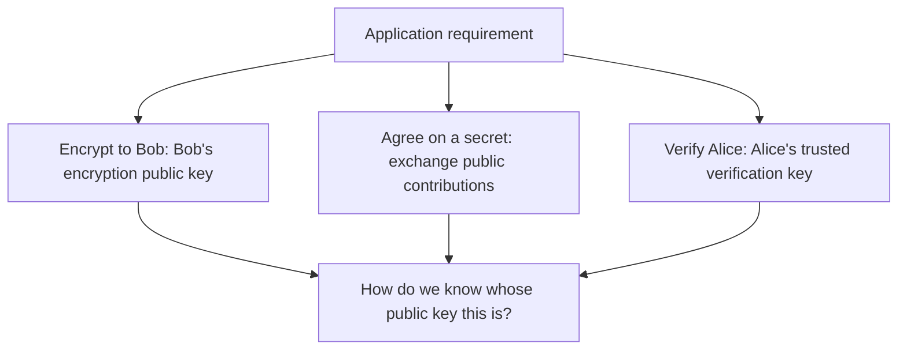
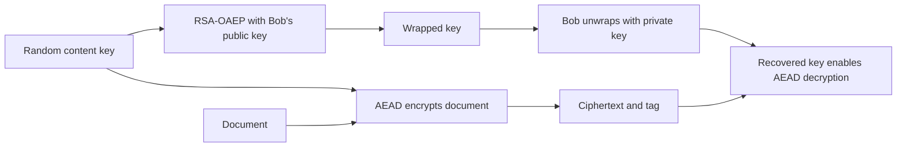
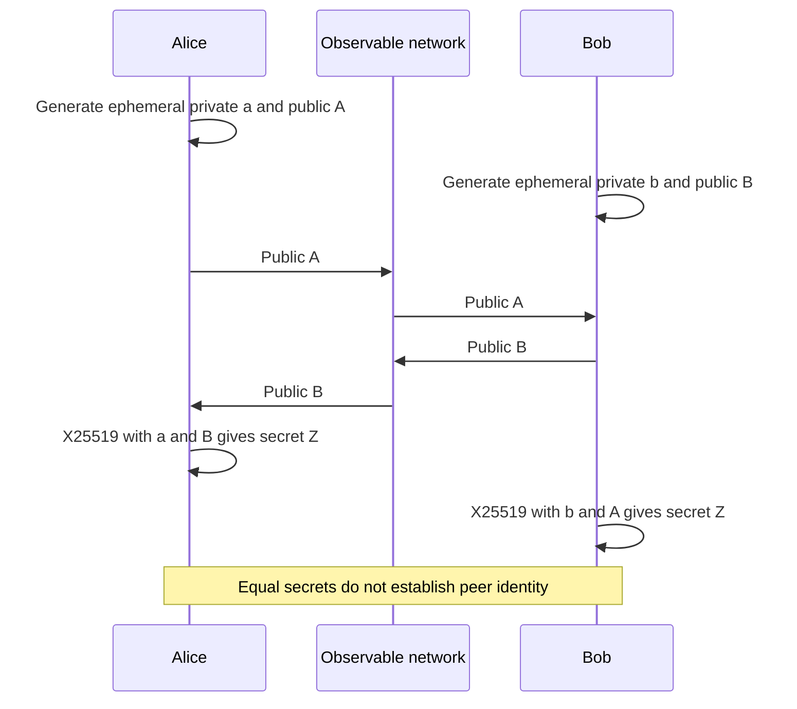
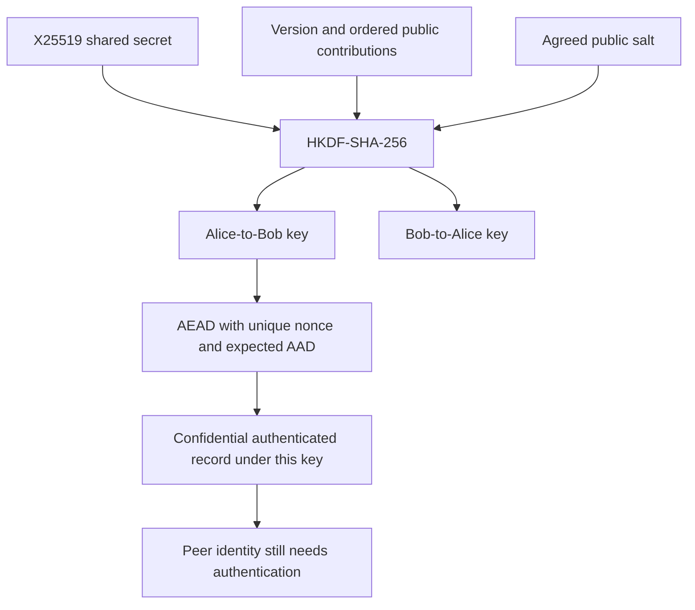
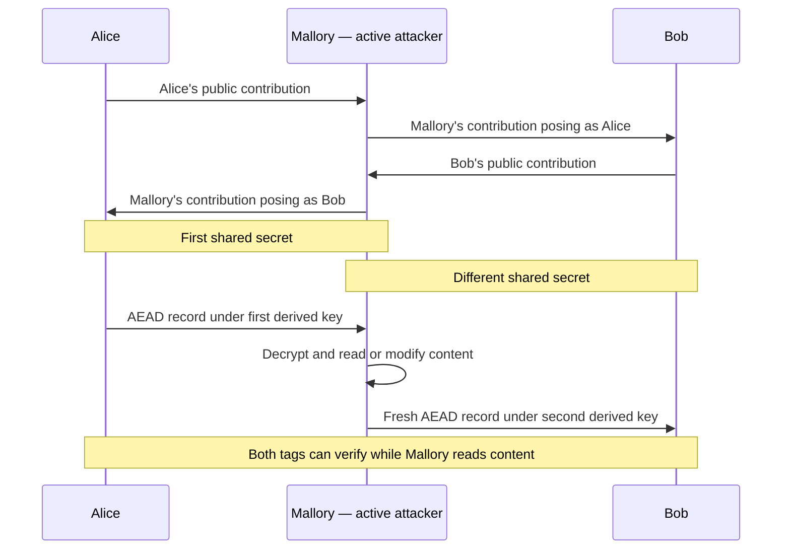
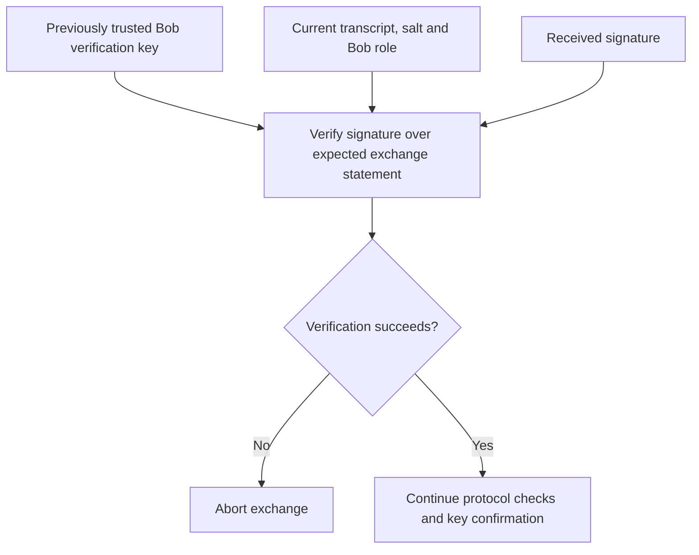
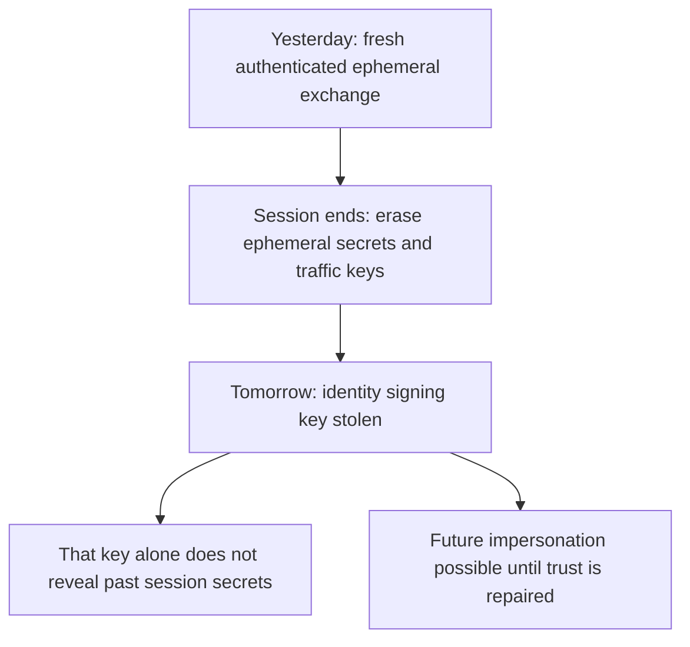

# Session 4: Classical Public-Key Cryptography

**Self-study lesson · Day 1 · 60-minute taught session · allow 90–120 minutes independently.**

[Instructor page](../teach/04-classical-public-key.md) · [Download notebook](../downloads/session-04-classical-public-key.ipynb) · [Previous: hashes and KDFs](03-hashes-passwords-kdfs.md)

## What you will be able to do

Distinguish encryption, key agreement, and signatures; compute an X25519 shared secret and derive traffic keys; explain a man-in-the-middle attack on unauthenticated key agreement; and state the assumptions behind forward secrecy.

Sessions 2 and 3 assumed Alice and Bob already shared secret material. Now we ask how they establish it across a network. Alice sends a confidential invoice to Bob. Mallory can observe, replace, delay, or replay messages. Neither endpoint is compromised initially; we revisit that assumption later.

You need Python bytes, functions, exceptions, AEAD, and HKDF. All experiments run in one process with synthetic data, without network connections. They illustrate building blocks and missing protections, not a deployable secure-channel protocol.

### Run the companion

Download the notebook and use **File → Upload notebook** in [Google Colab](https://colab.research.google.com/). Run cells in order. Setup installs the pinned dependency. Mermaid diagrams render on the website; their source remains in notebook viewers without Mermaid support. This is a Session 4 companion; Lab 2 remains a separate, forthcoming exercise.

For local execution from the repository root:

```powershell
.\.venv\Scripts\python -m pip install -r requirements-session04.txt
.\.venv\Scripts\python examples/session-04/demo.py
```

On macOS/Linux use `.venv/bin/python`. Use only disposable teaching data.

## A key pair does not answer every question

A public-key mechanism uses related public and private material. The public part may be distributed; the private part must be protected. What you can do with the pair depends on the mechanism.

| Job | Public material | Private operation | What is still missing? |
| --- | --- | --- | --- |
| Encrypt to a recipient, for example RSA-OAEP | Recipient's encryption public key | Recipient decrypts with its private key | Trust in the recipient key; sender authentication |
| Agree on a secret, for example X25519 | Each participant's public contribution | Combine own private key with peer public key | Exchange authentication, a KDF, and a full protocol |
| Sign data, for example Ed25519 | Signer's verification public key | Signer signs with its private key | Trusted key-to-identity binding and interpretation of signed data |



**Read the diagram:** distributing a public key need not be secret, but substituting it may be disastrous. Public does not mean trustworthy. Trust may come from secure provisioning, a fingerprint checked through a trusted channel, or a validated certificate system. Certificates come later.

A signature is not “encrypting with the private key.” Signing and encryption use distinct schemes and security definitions. X25519 does not sign or encrypt documents. Use separate keys for separate roles.

## RSA and elliptic curves: engineering overview

RSA uses arithmetic modulo a large composite integer. Its security is closely related to factoring difficulty, but “RSA” alone is not a safe message format. Encryption needs a scheme such as OAEP; signatures use a scheme such as PSS. Do not implement textbook modular exponentiation as encryption or signatures.

Elliptic-curve systems operate on points in a finite mathematical group. Intuitively, computing a public contribution from a private scalar is efficient, while recovering that scalar from the public contribution is intended to be infeasible for a classical attacker with appropriate parameters. We use library APIs rather than implementing point arithmetic.

**X25519** is an elliptic-curve Diffie–Hellman key-agreement function. **Ed25519** is a signature scheme. Related names and mathematics do not make their purposes or keys interchangeable. Generate each with its own API; do not reinterpret one key's bytes as another type.

Key size is not a security score comparable across families. A 3072-bit RSA modulus and a 32-byte X25519 public encoding describe different objects. Neither number means the application has that many bits of security.

### Experiment: RSA transports a short secret

RSA-OAEP handles short inputs, such as a random content-encryption key, rather than a whole document. Its maximum input is `k - 2*hLen - 2` bytes, where `k` is the modulus length in bytes and `hLen` the hash output length. For our 3072-bit modulus and SHA-256, this is `384 - 64 - 2 = 318` bytes. See [RFC 8017](https://www.rfc-editor.org/rfc/rfc8017.html).

Predict: will encrypting the same key twice produce the same ciphertext?

```python
import secrets
from cryptography.hazmat.primitives import hashes
from cryptography.hazmat.primitives.asymmetric import rsa, padding

bob_rsa = rsa.generate_private_key(public_exponent=65537, key_size=3072)
content_key = secrets.token_bytes(32)

def oaep_parameters():
    return padding.OAEP(mgf=padding.MGF1(hashes.SHA256()),
                        algorithm=hashes.SHA256(), label=None)

wrapped_key = bob_rsa.public_key().encrypt(content_key, oaep_parameters())
wrapped_again = bob_rsa.public_key().encrypt(content_key, oaep_parameters())
assert wrapped_key != wrapped_again
assert bob_rsa.decrypt(wrapped_key, oaep_parameters()) == content_key
try:
    bob_rsa.public_key().encrypt(b"x" * 319, oaep_parameters())
except ValueError:
    pass
else:
    raise AssertionError("Oversized OAEP input unexpectedly accepted")
print("PASS: RSA-OAEP transports a short key, is randomized, and rejects oversized input.")
```

The [library RSA interface](https://cryptography.io/en/stable/hazmat/primitives/asymmetric/rsa/) handles padding and arithmetic. In envelope encryption, AEAD protects the document and the public-key mechanism protects its content key. This example stops at key transport. Anyone with Bob's public key can encrypt to him: that does not authenticate Alice. The key size is a teaching parameter, not a universal deployment policy.



**Read the diagram:** public-key operations protect a small key while symmetric encryption handles bulk data. Authenticate the recipient public key before using it.

## X25519: two computations, one shared secret

Alice generates private key `a` and public contribution `A`. Bob independently generates `b` and `B`. Alice computes X25519 with `a` and `B`; Bob uses `b` and `A`. With valid corresponding inputs, both obtain the same shared secret. They transmit public contributions, not private keys or the secret.



**Read the diagram:** private computations happen at endpoints. Observing public contributions alone does not give an efficient classical way to recover the secret. Actively substituting contributions presents a different problem.

### Experiment: serialize only the public contributions

Predict which values cross the simulated network and which stay local.

```python
from cryptography.hazmat.primitives.asymmetric.x25519 import (
    X25519PrivateKey, X25519PublicKey,
)

alice_private = X25519PrivateKey.generate()
bob_private = X25519PrivateKey.generate()
alice_public = alice_private.public_key().public_bytes_raw()
bob_public = bob_private.public_key().public_bytes_raw()
assert len(alice_public) == len(bob_public) == 32
alice_secret = alice_private.exchange(X25519PublicKey.from_public_bytes(bob_public))
bob_secret = bob_private.exchange(X25519PublicKey.from_public_bytes(alice_public))
assert alice_secret == bob_secret
assert len(alice_secret) == 32
print("PASS: Alice and Bob compute the same X25519 secret from public contributions.")
```

[RFC 7748](https://datatracker.ietf.org/doc/html/rfc7748) specifies X25519; the [library interface](https://cryptography.io/en/stable/hazmat/primitives/asymmetric/x25519/) performs the computation. A 32-byte input is not automatically an acceptable handshake contribution. An all-zero contribution must not result in an accepted all-zero shared secret. This library rejects that exchange:

```python
try:
    alice_private.exchange(X25519PublicKey.from_public_bytes(b"\x00" * 32))
except ValueError:
    pass
else:
    raise AssertionError("Unusable X25519 contribution unexpectedly accepted")
print("PASS: unusable X25519 input is rejected; never substitute a fallback key.")
```

Abort on failure. Substituting a zero key after an exception creates a known encryption key. Length checks alone are insufficient, and successful exchange still says nothing about identity.

## Connect X25519 to HKDF and AEAD

Exchange output is input key material, not an application protocol. HKDF derives separate directional keys. This teaching transcript has a fixed version prefix and two fixed-length, 32-byte contributions in **Alice-then-Bob order**. Both peers must construct the same bytes.



**Read the diagram:** context binding ties outputs to specified bytes but cannot make attacker-supplied keys trustworthy. Peers must also agree on the salt and algorithms. A real protocol specifies the complete key schedule and transcript encoding.

```python
from cryptography.hazmat.primitives.kdf.hkdf import HKDF
from cryptography.hazmat.primitives.ciphers.aead import AESGCM
from cryptography.exceptions import InvalidTag

transcript = b"workshop-channel:v1|" + alice_public + bob_public
salt = secrets.token_bytes(32)

def traffic_key(secret, agreed_salt, exchange_transcript, direction):
    return HKDF(algorithm=hashes.SHA256(), length=32, salt=agreed_salt,
                info=exchange_transcript + b"|" + direction).derive(secret)

alice_send = traffic_key(alice_secret, salt, transcript, b"alice-to-bob")
bob_receive = traffic_key(bob_secret, salt, transcript, b"alice-to-bob")
bob_send = traffic_key(bob_secret, salt, transcript, b"bob-to-alice")
assert alice_send == bob_receive
assert alice_send != bob_send
invoice = b"invoice=7;amount=125;currency=USD"
nonce = secrets.token_bytes(12)
aad = b"workshop:v1|tenant=acme|invoice=7|direction=alice-to-bob"
ciphertext = AESGCM(alice_send).encrypt(nonce, invoice, aad)
assert AESGCM(bob_receive).decrypt(nonce, ciphertext, aad) == invoice
try:
    AESGCM(bob_send).decrypt(nonce, ciphertext, aad)
except InvalidTag:
    pass
else:
    raise AssertionError("Wrong-direction key unexpectedly accepted")
print("PASS: derived keys carry the invoice and reject the wrong direction.")
```

This single-record example lacks framing, replay protection, key confirmation, negotiation, and robust nonce allocation. Replaying a ciphertext can still pass AEAD verification. Each direction needs its own correct nonce strategy. For production communication, use a reviewed protocol implementation, such as an appropriately configured TLS stack.

## The missing protection: who is Bob?

Mallory replaces Bob's contribution with her own. Alice computes a secret with Mallory while calling it “the Bob secret.” Mallory separately exchanges with Bob while posing as Alice. Both honest parties may see successful decryption without sharing a direct secret with one another.



**Read the diagram:** Mallory becomes the cryptographic endpoint of two exchanges. She does not break X25519, HKDF, or AEAD. Public contributions were never authenticated.

### Experiment: substitution entirely in memory

Predict whether Bob's AEAD check will notice Mallory changing the invoice amount.

```python
mallory_for_alice = X25519PrivateKey.generate()
mallory_for_bob = X25519PrivateKey.generate()
m_public_a = mallory_for_alice.public_key().public_bytes_raw()
m_public_b = mallory_for_bob.public_key().public_bytes_raw()
alice_view = b"workshop-channel:v1|" + alice_public + m_public_a
bob_view = b"workshop-channel:v1|" + m_public_b + bob_public
alice_to_m = alice_private.exchange(mallory_for_alice.public_key())
m_to_alice = mallory_for_alice.exchange(alice_private.public_key())
bob_to_m = bob_private.exchange(mallory_for_bob.public_key())
m_to_bob = mallory_for_bob.exchange(bob_private.public_key())
assert alice_to_m == m_to_alice
assert bob_to_m == m_to_bob
assert alice_to_m != bob_to_m

alice_fooled_key = traffic_key(alice_to_m, salt, alice_view, b"alice-to-bob")
mallory_read_key = traffic_key(m_to_alice, salt, alice_view, b"alice-to-bob")
bob_fooled_key = traffic_key(bob_to_m, salt, bob_view, b"alice-to-bob")
mallory_write_key = traffic_key(m_to_bob, salt, bob_view, b"alice-to-bob")
nonce_a, nonce_b = secrets.token_bytes(12), secrets.token_bytes(12)
alice_record = AESGCM(alice_fooled_key).encrypt(nonce_a, invoice, aad)
stolen = AESGCM(mallory_read_key).decrypt(nonce_a, alice_record, aad)
changed = stolen.replace(b"amount=125", b"amount=999")
relay_record = AESGCM(mallory_write_key).encrypt(nonce_b, changed, aad)
assert AESGCM(bob_fooled_key).decrypt(nonce_b, relay_record, aad) == changed
assert changed != invoice
print("PASS: simulated substitution lets Mallory read and alter data without breaking AEAD.")
```

We reuse earlier endpoint objects to make the contrast inspectable. A new real handshake must use fresh ephemeral private keys. PASS means the **attack demonstration behaved as predicted**, not that the channel is secure.

<details>
<summary>Why did including the transcript in HKDF not stop Mallory?</summary>
<p>Alice and Mallory agree on one transcript; Bob and Mallory agree on another. Mallory knows the corresponding secret for each. Binding a key to a transcript does not authenticate the origins of its contents.</p>
</details>

## Ed25519 preview: authenticate with a trusted key

A signature lets a verifier check data using a public verification key without sharing the private signing key. Unlike HMAC, holding the verification key does not grant signing authority. Ed25519 neither encrypts nor performs X25519 exchange. Session 5 develops signatures further.

Assume Alice already obtained **Bob's correct Ed25519 verification key through trusted provisioning**. Bob signs a role-specific statement containing the ordered transcript and salt. Alice verifies the statement she expects for her current exchange before accepting application data.



**Read the diagram:** the trust anchor enters separately. Accepting a replacement verification key from the same unauthenticated message lets Mallory sign her own substitution.

```python
from cryptography.hazmat.primitives.asymmetric.ed25519 import Ed25519PrivateKey
from cryptography.exceptions import InvalidSignature

bob_identity = Ed25519PrivateKey.generate()
trusted_bob_verification_key = bob_identity.public_key()  # Simulated trusted provisioning.
statement = b"workshop-demo:bob-authentication:v1|" + transcript + salt
signature = bob_identity.sign(statement)
trusted_bob_verification_key.verify(signature, statement)  # Success returns None.
substituted_statement = b"workshop-demo:bob-authentication:v1|" + alice_view + salt
mallory_identity = Ed25519PrivateKey.generate()
for candidate_signature, candidate_statement in [
    (signature, substituted_statement),
    (mallory_identity.sign(statement), statement),
]:
    try:
        trusted_bob_verification_key.verify(candidate_signature, candidate_statement)
    except InvalidSignature:
        pass
    else:
        raise AssertionError("Invalid authentication statement unexpectedly accepted")
print("PASS: trusted signature verifies; substituted transcript and impostor signer fail.")
```

The [Ed25519 interface](https://cryptography.io/en/stable/hazmat/primitives/asymmetric/ed25519/) documents exception behavior; [RFC 8032](https://www.rfc-editor.org/rfc/rfc8032.html) specifies the scheme. These checks demonstrate one authenticated statement, not a complete handshake security proof. Bob has not authenticated Alice, and the signature alone does not confirm matching traffic keys. Certificate validation, authorization, freshness, and key confirmation remain protocol work.

Authentication also does not grant permission. An employee's valid signature does not authorize invoice approval unless that employee has the required rights.

## Forward secrecy: yesterday's traffic and tomorrow's theft

**Forward secrecy** concerns an attacker recording traffic and later stealing a long-term authentication key. In a correctly designed authenticated ephemeral Diffie–Hellman protocol, that theft alone should not reveal earlier session keys, provided ephemeral secrets and traffic keys were erased and the underlying mathematics remains secure.

An **ephemeral** private key is generated for an exchange and not retained for future exchanges. A **long-term identity key** authenticates across exchanges. Different purposes and lifetimes are central here. Changing HKDF labels while retaining a long-lived exchange private key does not create forward secrecy.



**Read the diagram:** the promise concerns past sessions under stated assumptions, not future safety after compromise. It does not protect stored plaintext or logged traffic keys.

| Recorded session and later event | What should you conclude? |
| --- | --- |
| Fresh authenticated ephemeral X25519; only the signing key is later stolen | Past confidentiality can survive if ephemeral/traffic secrets were erased and the protocol and mathematics remain sound |
| OAEP encrypted a content key to a retained RSA key; that private key is later stolen | Recorded wrapped keys can be decrypted, exposing their content keys |
| A static X25519 private key is later stolen | Recorded peer contributions can enable recovery of earlier shared secrets |
| Endpoint compromised during the session | Plaintext and keys may be read directly; forward secrecy does not prevent this |
| A future quantum computer can solve the classical exchange problem | Classical forward secrecy does not protect recorded X25519 exchanges against that capability |

### Experiment: fresh exchanges versus retained decryption keys

```python
next_alice = X25519PrivateKey.generate()
next_bob = X25519PrivateKey.generate()
next_secret = next_alice.exchange(next_bob.public_key())
assert next_secret == next_bob.exchange(next_alice.public_key())
assert next_secret != alice_secret
# A retained RSA private key still decrypts yesterday's recorded key transport.
assert bob_rsa.decrypt(wrapped_key, oaep_parameters()) == content_key
print("PASS: fresh exchange changes the secret; retained RSA key decrypts recorded transport.")
```

This illustrates fresh material and retained-key consequences; it does **not** prove erasure or forward secrecy. The notebook deliberately retains variables for inspection. Python `del` does not guarantee secure erasure of every copy. Real systems must manage libraries, memory, backups, dumps, logs, and key lifetimes.

TLS 1.3 illustrates a specified integration of authentication and key establishment. Forward-secrecy properties depend on the mode; do not generalize to every PSK or early-data use from a version label. We revisit this in the TLS session. See [RFC 8446](https://www.rfc-editor.org/rfc/rfc8446).

### Return to the powerful state actor

For highly confidential data needing twenty years of secrecy, ask both **who can attack today** and **what a recorder could do later**. A well-funded actor may target key provisioning, certificate issuance, endpoints, software updates, administrators, or retained secrets instead of curve arithmetic. Forward secrecy addresses one later-compromise scenario; it does not replace those controls.

RSA, X25519, and Ed25519 have quantum-vulnerable mathematical foundations. Do not infer twenty-year confidentiality from this demonstration. Later sessions distinguish harvest-now-decrypt-later exposure, post-quantum key establishment, signatures, and migration. No arrival date for a capable quantum computer is assumed.

## Guided practice

Predict, change only synthetic inputs, and explain what happens.

1. Reverse Alice's and Bob's public contributions in Bob's transcript only. Derive his receive key again and attempt decryption. What failed?
2. Use the correct key but change the tenant in AAD. Does AEAD accept it? Does this test identity authentication?
3. Explain why Mallory's signature fails under the already trusted Bob key. What if Alice accepts Mallory's replacement verification key?
4. Compare later theft of Bob's identity signing key with theft of his retained RSA decryption key. Which recorded values become useful?

<details>
<summary>Hints</summary>
<ol>
<li>HKDF consumes exact bytes. Keep the secret and salt unchanged to isolate the transcript change.</li>
<li>Use the original ciphertext and nonce. Expect InvalidTag when AAD changes.</li>
<li>A signature is checked relative to a particular public key, not a display name.</li>
<li>Ask which private operation reconstructs an earlier content key.</li>
</ol>
</details>

<details>
<summary>Worked explanations</summary>
<ol>
<li>Reversed contributions change HKDF info, producing a different key and AEAD rejection. This is disagreement on context, not proof of a broken primitive.</li>
<li>Changed AAD is rejected. This checks record context under the selected key; it does not establish who supplied that key.</li>
<li>Mallory lacks Bob's signing key. Her signature fails under Bob's public key. Replacing the trust anchor with Mallory's key allows verification to succeed while the identity claim is false.</li>
<li>The signing key alone does not reconstruct erased ephemeral secrets. A retained RSA private key decrypts recorded OAEP key transports. Endpoint compromise or retained traffic keys can defeat the first case independently.</li>
</ol>
</details>

## Check your understanding and continue

| Question | Answer to check after attempting it |
| --- | --- |
| Does successful X25519 identify Bob? | No. Authenticate the exchange using trusted identity information. |
| Can Ed25519 encrypt the invoice? | No. It signs; use suitable key establishment and AEAD for confidentiality. |
| What happens if exchange or verification fails? | Abort; never substitute known keys or accept unverified application data. |
| Why did Mallory's AEAD tags verify? | She knew valid keys on both legs and generated fresh tags. |
| Does a signed transcript complete the protocol? | No. Trust, roles, authorization, freshness, confirmation, framing, and lifecycle still need specified behavior. |
| Does forward secrecy mean quantum resistance? | No. These address different threat assumptions. |

You are ready when you can draw honest and substituted exchanges, locate the private keys, and explain what each successful check establishes.

Next: [Lab 2](../labs/lab-02-classical-channel.md), which remains a scaffold, and the completed [Session 5: Digital Signatures](05-digital-signatures.md). Both session notebooks are runnable independently.

## References

Reviewed 21 September 2026. Examples use Python 3.11 and `cryptography==50.0.1`.

- [RFC 7748](https://datatracker.ietf.org/doc/html/rfc7748) — X25519.
- [RFC 8017](https://www.rfc-editor.org/rfc/rfc8017.html) — RSA schemes.
- [RFC 8032](https://www.rfc-editor.org/rfc/rfc8032.html) — EdDSA.
- [RFC 8446](https://www.rfc-editor.org/rfc/rfc8446) — TLS 1.3.
- Library interfaces: [X25519](https://cryptography.io/en/stable/hazmat/primitives/asymmetric/x25519/), [RSA](https://cryptography.io/en/stable/hazmat/primitives/asymmetric/rsa/), [Ed25519](https://cryptography.io/en/stable/hazmat/primitives/asymmetric/ed25519/).
