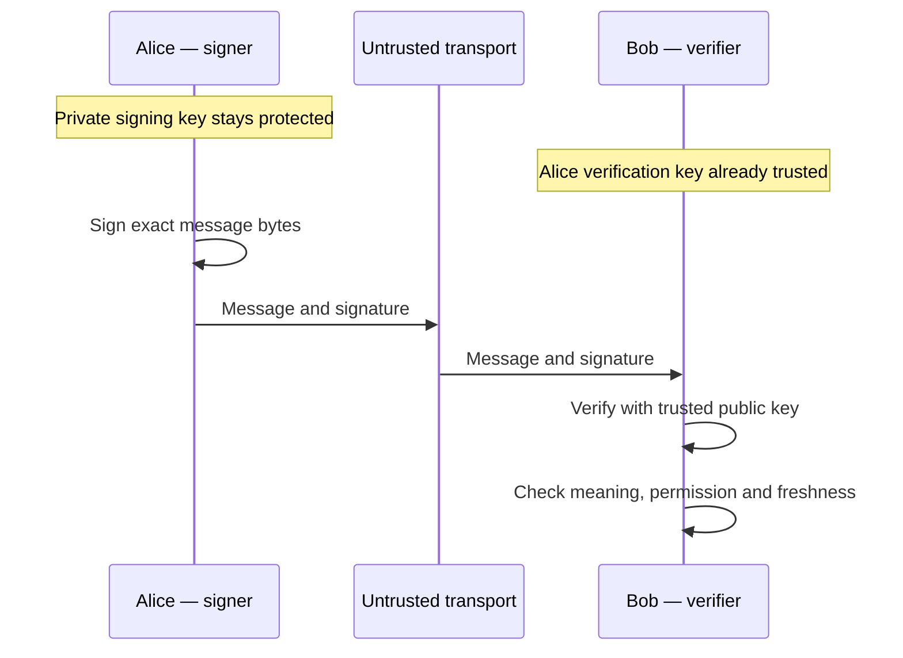
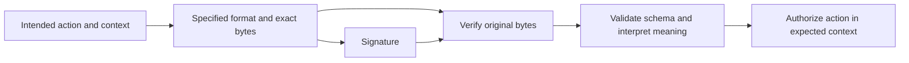
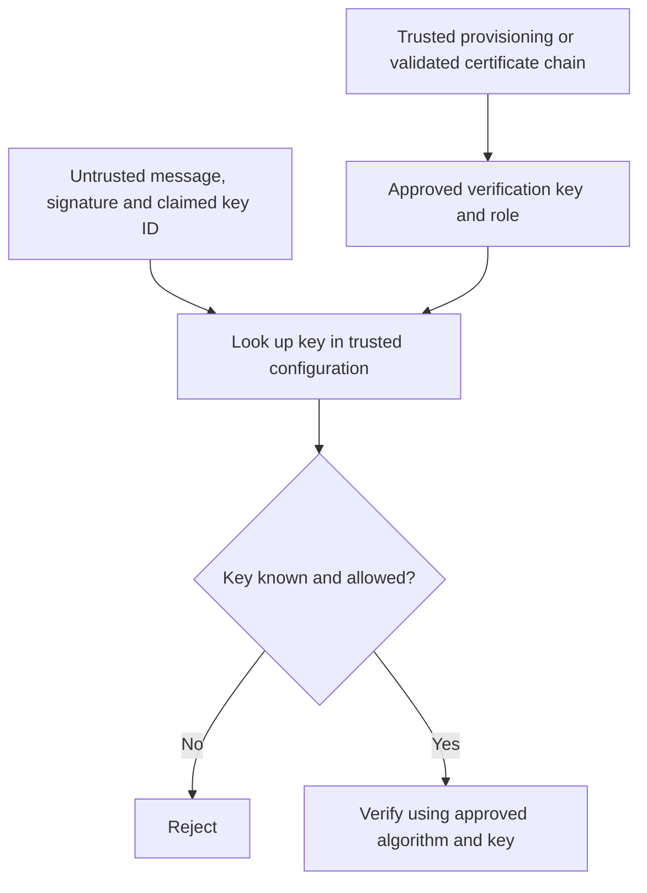
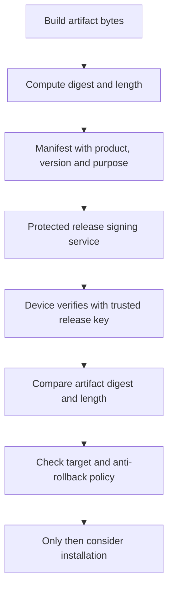
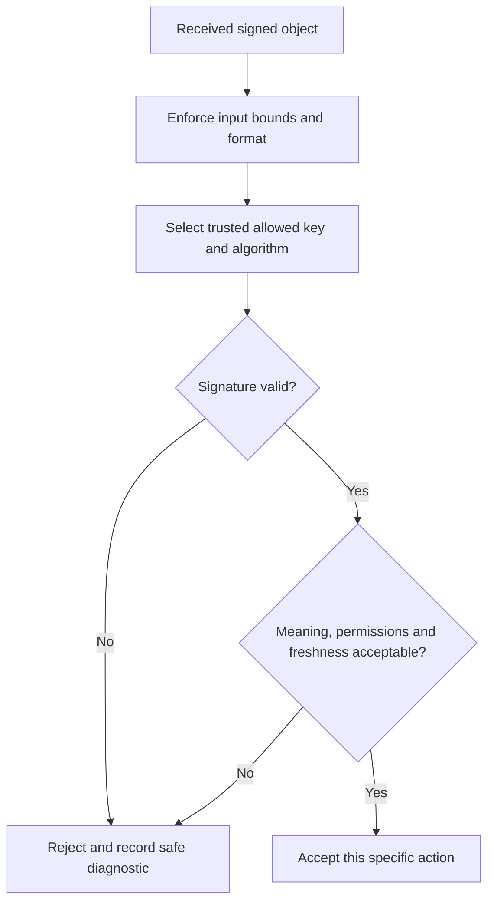
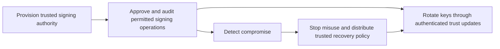

# Session 5: Digital Signatures

**Self-study lesson · Day 1 · 45-minute taught session · allow 75–100 minutes independently.**

[Instructor guide](../teach/05-digital-signatures.md) · [Download notebook](../downloads/session-05-digital-signatures.ipynb) · [Previous: public-key cryptography](04-classical-public-key.md)

## Learning outcomes and setup

You will sign and verify exact bytes, diagnose verification failures, distinguish a valid signature from a trusted and authorized action, and explain how signed update metadata protects an artifact. You will compare Ed25519, ECDSA, and RSA-PSS without treating their APIs as interchangeable.

Sessions 3 and 4 supply the prerequisites: hashes, HMAC, public/private keys, and trust in public keys. Our examples use an invoice approval and a fabricated firmware release. All keys are disposable, all data is synthetic, and nothing is installed or sent over a network.

Upload the notebook through **File → Upload notebook** in [Colab](https://colab.research.google.com/) and run cells in order. It installs the pinned dependency. The website renders Mermaid; notebook viewers that lack Mermaid retain the diagram source. Locally, from the repository root:

```powershell
.\.venv\Scripts\python -m pip install -r requirements-session05.txt
.\.venv\Scripts\python examples/session-05/demo.py
```

Use `.venv/bin/python` on macOS/Linux. These examples are instructional components, not a document-signing product or an updater ready for deployment.

## What a signature establishes

A signer uses a private signing key to generate a signature over message bytes. A verifier uses the corresponding public key, those bytes, and the signature to check the mathematical relationship. Under the scheme's security assumptions and with the private key protected, an attacker without signing authority should not be able to produce a valid signature for a new message.

The application must still establish whose public key it trusts, what the signed bytes mean, and whether the action is allowed. A valid signature does not establish that the contents are true or harmless.

| Mechanism | Who can produce the authenticator? | Who can check it? | What it does not provide by itself |
| --- | --- | --- | --- |
| HMAC | Anyone holding the shared secret | Holders of that secret | Public verification or attribution to one particular secret holder |
| Digital signature | Holder of the private signing key | Holders of the authentic public verification key | Confidentiality, freshness, authorization, or proof of human intent |
| AEAD | Holders of the symmetric key | Holders of that key | Publicly verifiable signatures or independent identity trust |



**Read the diagram:** the message remains visible. Add suitable encryption when confidentiality is required. Signing is not “encryption with the private key.” Verification checks a signature; it does not decrypt the message.

Signatures can support accountability, but cryptographic verification alone does not prove that a particular human knowingly approved something. Shared signing services, stolen keys, compromised endpoints, and misleading displays all affect that claim. Avoid treating “non-repudiation” as an automatic property of a Python API.

## Ed25519: sign and verify exact bytes

Ed25519 is the signature scheme introduced in Session 4. The ordinary Ed25519 API signs message bytes directly and handles its internal hashing. Do not manually hash a message first unless the specified format requires signing that digest. Signing a digest with ordinary Ed25519 is not the same scheme as Ed25519ph. See [RFC 8032](https://www.rfc-editor.org/rfc/rfc8032.html).

Predict the result: does successful verification return `True`?

```python
from cryptography.hazmat.primitives.asymmetric.ed25519 import Ed25519PrivateKey
from cryptography.exceptions import InvalidSignature

alice_signer = Ed25519PrivateKey.generate()
trusted_alice = alice_signer.public_key()  # Simulated trusted provisioning.
approval = b"invoice-approval:v1|tenant=acme|invoice=7|amount=125|currency=USD"
signature = alice_signer.sign(approval)
assert len(signature) == 64
assert trusted_alice.verify(signature, approval) is None
print("PASS: Ed25519 verifies the original approval; success returns None.")
```

The [library interface](https://cryptography.io/en/stable/hazmat/primitives/asymmetric/ed25519/) raises `InvalidSignature` for a failed signature check. Do not write `if public_key.verify(...): accept()` expecting a Boolean. A wrapper can explicitly turn this exception into a decision:

```python
def valid_signature(public_key, message, supplied_signature):
    try:
        public_key.verify(supplied_signature, message)
    except InvalidSignature:
        return False
    return True

other_signer = Ed25519PrivateKey.generate()
changed_signature = bytes([signature[0] ^ 1]) + signature[1:]
assert valid_signature(trusted_alice, approval, signature)
assert not valid_signature(trusted_alice, approval + b"\n", signature)
assert not valid_signature(trusted_alice, approval, changed_signature)
assert not valid_signature(other_signer.public_key(), approval, signature)
assert not valid_signature(trusted_alice, approval, signature[:-1])
print("PASS: changed bytes, signature, verification key, and truncated signature fail.")
```

These inputs are already typed as bytes. Validate untrusted input types, encodings, and size limits at the application boundary. Unexpected parsing or operational errors must not become successful verification. The wrapper catches only the expected signature failure; other exceptions remain visible to the caller.

## Bytes, meaning, and signing scope

A signature covers bytes, not an abstract idea such as “this JSON object” or “the page the user saw.” Equivalent-looking documents can have different encodings, whitespace, field order, or Unicode representation. A signing format must define exactly what is covered.

```python
import json

record = {"tenant": "acme", "invoice": 7, "action": "approve"}
compact = json.dumps(record, sort_keys=True, separators=(",", ":")).encode("utf-8")
pretty = json.dumps(record, sort_keys=True, indent=2).encode("utf-8")
assert json.loads(compact) == json.loads(pretty)
assert compact != pretty
compact_signature = alice_signer.sign(compact)
assert valid_signature(trusted_alice, compact, compact_signature)
assert not valid_signature(trusted_alice, pretty, compact_signature)
print("PASS: equivalent JSON objects can have different signed bytes.")
```

Sorting keys is a useful convention for this restricted example, not a universal JSON canonicalization solution. A cross-language format needs rules for numbers, strings, duplicate fields, encoding, and schema. Verify the original transmitted bytes, then interpret them under a specified format; do not casually reserialize untrusted data before verification.



**Read the diagram:** the verifier must authenticate the bytes it actually uses. If the tenant, operation, recipient, or version is outside the signed region, changing it may not invalidate the signature. Document workflows must also ensure the displayed content corresponds to the signed content; signing one representation while displaying another can mislead the user.

Use an explicit purpose and version in signed statements. Otherwise bytes approved as a quotation or test artifact could be reinterpreted in another workflow. Prefixes help separate purposes only when verifiers enforce the expected format.

## Trust is not carried by an arbitrary public key

Suppose a download contains a message, signature, and a public key labeled “Alice.” Anyone can generate all three. Verification proves a relationship to that supplied key, not the label.

```python
mallory = Ed25519PrivateKey.generate()
forged_claim = b"invoice-approval:v1|tenant=acme|invoice=7|amount=999|currency=USD"
mallory_signature = mallory.sign(forged_claim)
assert valid_signature(mallory.public_key(), forged_claim, mallory_signature)
assert not valid_signature(trusted_alice, forged_claim, mallory_signature)
print("PASS: attacker-supplied key accepts its own signature but fails under trusted Alice key.")
```



**Read the diagram:** a key ID is a lookup hint, not authority to download and trust any key. A fingerprint is useful only when the expected fingerprint arrived through a trusted path. A certificate also needs validation: chain, identity, intended use, and applicable status policy. Session 6 develops PKI.

Keep the algorithm and allowed key types under trusted policy. Do not let an unauthenticated algorithm label trigger permissive fallbacks when verification fails.

## Software and firmware: sign a manifest, check the artifact

A signed manifest can bind an artifact digest to a product, version, length, and purpose. Verifying the manifest alone is insufficient: the downloaded artifact must match it, and installation policy must allow that target and version.



**Read the diagram:** a signature authenticates the approved release metadata. It does not scan for vulnerabilities or establish that the build system was uncompromised. Here we only make an acceptance decision; no firmware is installed.

```python
import hashlib

release_signer = Ed25519PrivateKey.generate()
trusted_release = release_signer.public_key()
artifact = b"synthetic firmware image for workshop only"
manifest = {
    "purpose": "firmware-release:v1", "product": "training-device",
    "version": 8, "length": len(artifact),
    "sha256": hashlib.sha256(artifact).hexdigest(),
}
manifest_bytes = json.dumps(manifest, sort_keys=True, separators=(",", ":")).encode("utf-8")
manifest_signature = release_signer.sign(manifest_bytes)
assert valid_signature(trusted_release, manifest_bytes, manifest_signature)
assert hashlib.sha256(artifact).hexdigest() == manifest["sha256"]
assert hashlib.sha256(artifact + b"changed").hexdigest() != manifest["sha256"]
print("PASS: signed manifest binds the digest; modified artifact fails the digest check.")
```

Now combine verification with a small, explicit acceptance policy. The code permits only the five expected fields, rejects duplicate JSON fields, checks their types, and uses a locally supplied minimum version. This policy remains a teaching simplification.

```python
def unique_fields(pairs):
    result = {}
    for key, value in pairs:
        if key in result:
            raise ValueError("Duplicate manifest field")
        result[key] = value
    return result

def accept_release(data, sig, payload, expected_product, minimum_version):
    if len(data) > 4096 or not valid_signature(trusted_release, data, sig):
        return False
    try:
        item = json.loads(data, object_pairs_hook=unique_fields)
    except (ValueError, UnicodeDecodeError):
        return False
    if type(item) is not dict or set(item) != {"purpose", "product", "version", "length", "sha256"}:
        return False
    if type(item["version"]) is not int or type(item["length"]) is not int:
        return False
    return (
        item["purpose"] == "firmware-release:v1"
        and item["product"] == expected_product
        and item["version"] >= minimum_version
        and item["length"] == len(payload)
        and item["sha256"] == hashlib.sha256(payload).hexdigest()
    )

assert accept_release(manifest_bytes, manifest_signature, artifact, "training-device", 8)
assert not accept_release(manifest_bytes, manifest_signature, artifact + b"!", "training-device", 8)
assert not accept_release(manifest_bytes, manifest_signature, artifact, "other-device", 8)
assert not accept_release(manifest_bytes, manifest_signature, artifact, "training-device", 9)
assert not accept_release(manifest_bytes, mallory.sign(manifest_bytes), artifact, "training-device", 8)
# Authentic bytes need not form a valid manifest.
bad_schema = b'{"version":true}'
assert not accept_release(bad_schema, release_signer.sign(bad_schema), artifact, "training-device", 8)
for invalid_manifest in [dict(manifest, version=True), dict(manifest, purpose="invoice-approval:v1")]:
    invalid_bytes = json.dumps(invalid_manifest).encode("utf-8")
    assert not accept_release(invalid_bytes, release_signer.sign(invalid_bytes), artifact, "training-device", 8)
duplicate_field = manifest_bytes[:-1] + b',"version":8}'
assert not accept_release(duplicate_field, release_signer.sign(duplicate_field), artifact, "training-device", 8)
print("PASS: release policy rejects tampering, wrong product, rollback, impostor, and bad schema.")
```

An old, authentic release retains a valid signature. The rejection at minimum version 9 is a **policy rejection**, not a cryptographic failure. A deployed system must store rollback state securely and update it consistently with installation; taking the minimum from the same untrusted download defeats the check. Our code permits reinstalling the same version and does not implement atomic installation, recovery, expiry, or durable state.

Likewise, signing an invoice approval does not prevent replay. A receiver may need a signed transaction identifier, expected recipient, expiry rules, and durable duplicate detection. A signed timestamp is only a claim by the signer unless a separate trusted time mechanism establishes more.

## Ed25519, ECDSA, and RSA-PSS

| Scheme | Teaching profile | Important engineering detail |
| --- | --- | --- |
| Ed25519 | Ordinary Ed25519 over message bytes | Internal hashing and deterministic signing; use the specified variant, not ad hoc prehashing |
| ECDSA | P-256 with SHA-256 | Per-signature secret generation is critical; repeated or biased secret values can expose the key |
| RSA-PSS | 3072-bit RSA, SHA-256, MGF1-SHA-256, 32-byte salt | Padding, hash, and salt-length conventions must match the verifying protocol |

ECDSA implementations may use secure random generation or a specified deterministic construction. Let the library manage this; the internal ECDSA secret is not the public AEAD nonce from Session 2. Do not implement either scheme's arithmetic yourself. These profiles illustrate APIs, not a universal algorithm-selection policy.

```python
from cryptography.hazmat.primitives import hashes
from cryptography.hazmat.primitives.asymmetric import ec, rsa, padding

ecdsa_signer = ec.generate_private_key(ec.SECP256R1())
ecdsa_signature = ecdsa_signer.sign(approval, ec.ECDSA(hashes.SHA256()))
ecdsa_signer.public_key().verify(ecdsa_signature, approval, ec.ECDSA(hashes.SHA256()))
rsa_signer = rsa.generate_private_key(public_exponent=65537, key_size=3072)
pss = padding.PSS(mgf=padding.MGF1(hashes.SHA256()), salt_length=32)
rsa_signature = rsa_signer.sign(approval, pss, hashes.SHA256())
rsa_signer.public_key().verify(rsa_signature, approval, pss, hashes.SHA256())
for verify_changed in [
    lambda: ecdsa_signer.public_key().verify(ecdsa_signature, approval + b"!", ec.ECDSA(hashes.SHA256())),
    lambda: rsa_signer.public_key().verify(rsa_signature, approval + b"!", pss, hashes.SHA256()),
]:
    try:
        verify_changed()
    except InvalidSignature:
        pass
    else:
        raise AssertionError("Changed message unexpectedly accepted")
print("PASS: ECDSA and RSA-PSS verify original bytes and reject changed messages.")
```

These are new signing keys, separate from Session 4's encryption and agreement keys. The [ECDSA](https://cryptography.io/en/stable/hazmat/primitives/asymmetric/ec/) and [RSA](https://cryptography.io/en/stable/hazmat/primitives/asymmetric/rsa/) documentation describes their APIs. ECDSA signatures here use the library's DER encoding; other protocols may require a different encoding. Do not infer authenticity from signature length or compare two signatures for equality instead of verifying them.

## Failure handling and protecting signing authority



**Read the diagram:** failed verification never falls through to execution or installation. Malformed objects, unknown keys, unsupported algorithms, and unavailable trust checks also need defined rejection behavior. Separate internal diagnostics from user messages, and avoid logging sensitive documents or keys.

For the well-funded state actor in Session 1, stealing a signing key is only one route. Compromising the build pipeline or gaining permission to call a signing service can produce correctly signed malicious releases. Hardware key protection can prevent key export while still allowing misuse through an authorized signing interface. Release review, restricted signing access, separation of duties, trusted build provenance, monitoring, and recovery planning address those surrounding risks.



**Read the diagram:** replacing a key is a trust update, not merely generating bytes. Devices that cannot receive a trustworthy recovery update may remain exposed. A compromised key also complicates judging old signatures; long-term archival validation needs a designed evidence and timestamp policy.

Ed25519, ECDSA, and RSA-PSS are classical signatures, not post-quantum schemes. A long-term authenticity requirement needs its own migration plan. Encryption's harvest-now-decrypt-later problem and future signature forgery are related quantum concerns but have different operational consequences; later sessions cover both.

## Practice, hints, and worked answers

Before revealing answers, write the expected outcome and the reason.

1. Add a newline to a signed invoice. Does it still verify? How could a format support alternate display layouts without altering its signed representation?
2. Verify Mallory's message with the key attached to it, then with trusted Alice. Explain both outcomes without saying the signature algorithm broke.
3. Raise the minimum firmware version from 8 to 9. Which check rejects the authentic release, and where must that minimum originate?
4. Have the trusted release signer sign a manifest naming another product. Is its signature valid? Should this device install it?
5. Replay a valid approval twice. What application state would prevent a duplicate action?

<details>
<summary>Hints</summary>
<p>Separate four questions: are the bytes unchanged, is the key trusted, is the action permitted here, and is this action fresh? The signature answers only part of that sequence.</p>
</details>

<details>
<summary>Worked answers</summary>
<ol>
<li>The newline changes signed bytes and verification fails. A specified signed representation can be rendered in multiple ways, provided the display faithfully represents the authenticated content; arbitrary reserialization is not a solution.</li>
<li>Mallory's signature is valid under her key, but that does not bind it to Alice. Trusted Alice's key rejects it.</li>
<li>The local version policy rejects it while cryptographic verification still succeeds. The minimum must come from protected device state or another trusted policy source.</li>
<li>The signature may be fully valid, but the signed product differs from the expected device and must be rejected.</li>
<li>Verification alone accepts both. Authenticate a unique transaction ID and intended context, then enforce duplicate detection with durable state appropriate to the application.</li>
</ol>
</details>

## Exit check and next steps

| Question | Expected answer |
| --- | --- |
| Does signing hide the message? | No; use suitable encryption for confidentiality. |
| Is a key delivered alongside a signature automatically trusted? | No; trust must come from outside that untrusted bundle. |
| Does valid mean authorized, current, or safe? | None of these automatically; each requires additional checks. |
| Does verification identify the exact human who acted? | It checks the key relationship; identity, intent, and control of the signing process require evidence. |
| Why check both signed manifest and artifact digest? | A valid manifest does not prove that the downloaded artifact matches it. |

You are ready when you can distinguish a signature failure from a policy rejection and trace the trust source for every verification key. Continue to the completed [Session 6: PKI](../day-2/06-pki-certificates.md). [Lab 3: Perfect Algorithm, Broken System](../labs/lab-03-crypto-failures.md) remains a scaffold.

## References

Reviewed 22 September 2026. Python examples use `cryptography==50.0.1`.

- [RFC 8032](https://www.rfc-editor.org/rfc/rfc8032.html) — EdDSA variants.
- [Ed25519 API](https://cryptography.io/en/stable/hazmat/primitives/asymmetric/ed25519/), [ECDSA API](https://cryptography.io/en/stable/hazmat/primitives/asymmetric/ec/), and [RSA-PSS API](https://cryptography.io/en/stable/hazmat/primitives/asymmetric/rsa/).
