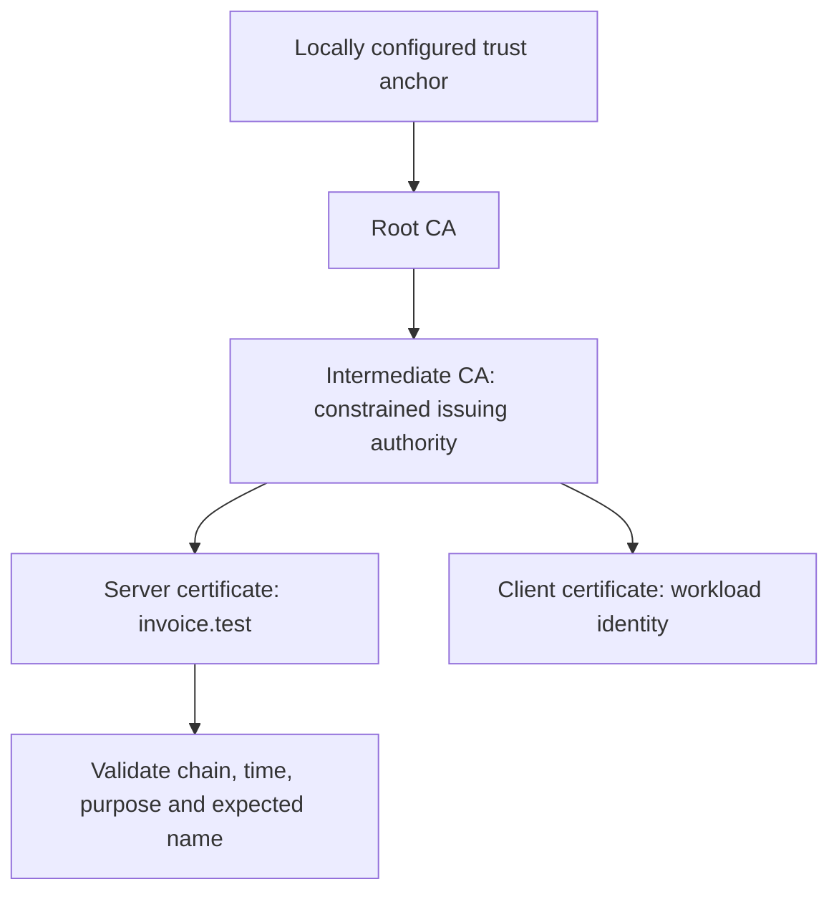
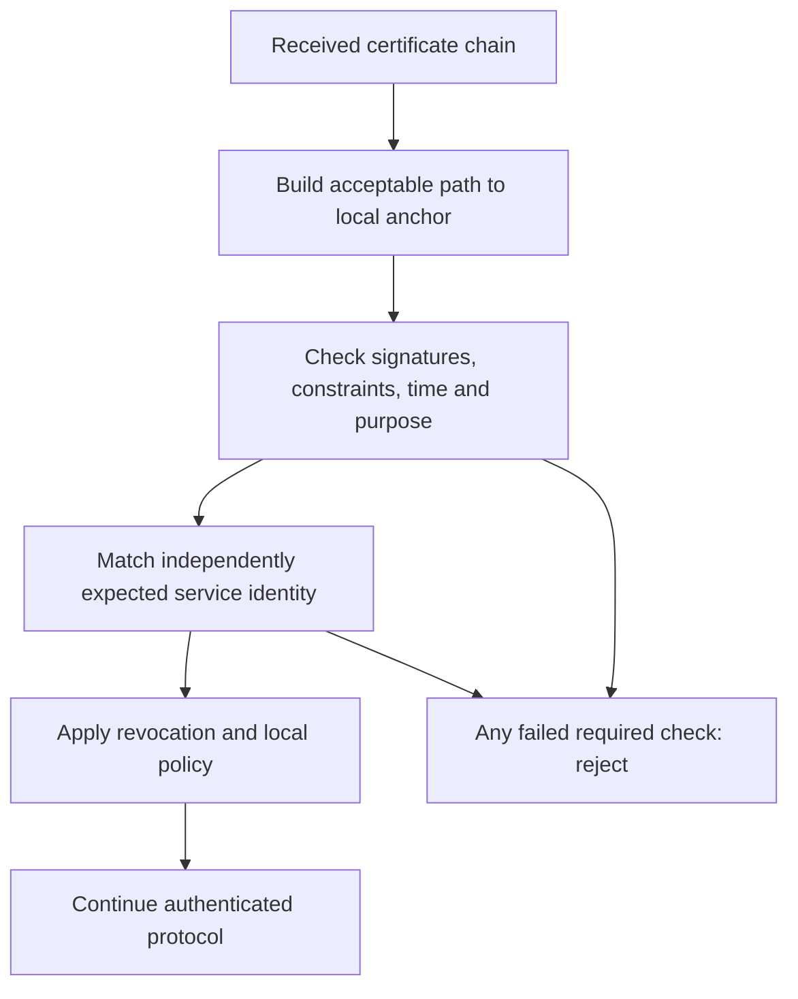

# Session 6: PKI and Certificates

**60 minutes taught · 90–120 minutes independently.** [Instructor](../teach/06-pki-certificates.md) · [Notebook](../downloads/session-06-pki-certificates.ipynb)

## Outcomes and preparation

You will trace a certificate path to a locally trusted root, distinguish signature verification from service identity validation, and explain why a valid client certificate does not grant unrestricted access. Review Session 5's distinction between trusted keys and arbitrary supplied keys.

Use the [Day 2 setup](../getting-started/day-2-setup.md). The notebook embeds the shared teaching helpers; local demonstrations also include them. The snippets below run in order after those helpers. All certificates and keys are generated for this run and are unrelated to real identities.

<!-- day2:helpers -->

## Certificates bind claims to keys

An X.509 certificate contains a public key, identity claims, validity interval, issuer, serial number, extensions, and the issuer's signature. The CA signs the certificate body. That signature protects the body from undetected change; it does not independently prove that the CA was entitled to assert the identity.

A relying party starts with local trust anchors and policy. A root is trusted because it was provisioned as trusted, not because it is self-signed. An attacker can generate a perfectly valid self-signed certificate. An intermediate allows a root to delegate issuing authority without using the root key for routine issuance.



Read from the trust anchor down: a server sends enough intermediate certificates to help path building. Sending a root does not make the peer trust that root. Real environments can offer multiple possible paths and policies; our helper creates one simple hierarchy.

| Field or extension | Question it helps answer | Common mistake |
| --- | --- | --- |
| SAN | Does this certificate cover the expected DNS/IP identity? | Treating a matching display name as sufficient |
| Basic Constraints | May this key act as a CA, and with what path limit? | Accepting an ordinary leaf as an issuer |
| Key Usage / Extended Key Usage | Is this key/certificate usable for the required operation and purpose? | Using a server-only certificate as a client identity |
| Validity interval | Is validation time inside the permitted period? | Disabling time checks to fix clock or renewal failures |
| Issuer and signature | Which issuing key signed this body? | Trusting the issuer's text name without validating the path |

## Inspect before trusting

```python
keys, certs = make_pki()
leaf = certs['server']
names = leaf.extensions.get_extension_for_class(x509.SubjectAlternativeName).value
assert names.get_values_for_type(x509.DNSName) == ['invoice.test']
assert not leaf.extensions.get_extension_for_class(x509.BasicConstraints).value.ca
assert certs['intermediate'].extensions.get_extension_for_class(x509.BasicConstraints).value.path_length == 0
print('PASS: inspected SAN, leaf constraints and intermediate path limit')
```

Inspection is not validation. Parsing an attacker-controlled certificate succeeds for many untrusted certificates. Do not implement a validator by merely comparing issuer strings or checking one signature. Use a maintained path validator with a defined trust store and application policy.

## Validation is a sequence of decisions



The expected hostname comes from the service the application intended to contact, not from whatever name the certificate happens to contain. DNS SANs and IP SANs are different identity types. Our `.test` name is an isolated teaching identity, not a public service.

The helper uses Python's TLS verifier for a real handshake over memory buffers. Predict which cases fail without weakening verification:

```python
assert tls_trial()['version'] == 'TLSv1.3'
for settings in [dict(hostname='other.test'), dict(trust_root=False),
                 dict(expired=True), dict(include_intermediate=False)]:
    expect_rejection(lambda settings=settings: tls_trial(**settings), ssl.SSLError)
print('PASS: trusted chain succeeds; wrong name, missing trust, expiry and missing intermediate fail')
```

Missing intermediates fail in this isolated setup because no cache or issuer-fetching service supplies them. In another client, cached intermediates can hide a deployment problem. Test clean clients as well as existing installations.

## Client certificates and revocation

Mutual TLS authenticates both ends according to certificate policy. Server verification of a client's certificate does not usually involve checking that client's DNS hostname. The server instead maps the authenticated identity to application roles and permissions. A valid certificate for service A must not authorize all service B operations.

```python
assert tls_trial(mtls=True)['client_authenticated']
expect_rejection(lambda: tls_trial(mtls=True, send_client=False), ssl.SSLError)
expect_rejection(lambda: tls_trial(mtls=True, client_wrong_eku=True), ssl.SSLError)
print('PASS: mTLS requires an acceptable client certificate')
```

CRLs publish revocation information; OCSP supplies certificate-status responses. Deployment must define status freshness, availability, and behavior when information is unavailable. Short validity reduces exposure duration but does not make compromise disappear immediately. Our helper does **not** perform online revocation checking: a successful lab handshake must not be described as a full revocation assessment.

For the state actor, issuance systems, trust-store administration, renewal credentials and root/intermediate private keys are valuable targets. Protect who may issue which identities, constrain delegation, monitor issuance, and rehearse replacement. Installing another root expands trust and is a security decision, not a debugging fix.

## Practice and answers

1. Why does sending the root in the server chain not fix an unknown-root error?
2. A certificate is in date and signed by a trusted CA but names another service. Accept it?
3. Why is a server-auth certificate insufficient for our client-auth requirement?
4. What additional evidence is needed to claim a certificate is not revoked?

<details><summary>Worked answers</summary>
<ol><li>The peer must already trust an appropriate anchor through local policy; a received root cannot grant itself trust.</li><li>No. Path validity and intended service identity are separate checks.</li><li>Purpose constraints matter even when a signature and chain are valid.</li><li>A defined revocation policy and sufficiently fresh, trustworthy status evidence; this demo has neither online OCSP nor CRL evaluation.</li></ol>
</details>

Ready to continue: explain an unknown issuer, wrong SAN, expired certificate and unauthorized client as different failures. Next: [TLS](07-tls.md) and [Lab 4](../labs/lab-04-mini-pki.md).

## Sources and scope

Reviewed 22 September 2026: [RFC 5280](https://www.rfc-editor.org/rfc/rfc5280), [Python ssl](https://docs.python.org/3/library/ssl.html). The notebook creates temporary private PEM files for the TLS API and removes the directory afterward; filesystem removal is not a secure-erasure guarantee.
