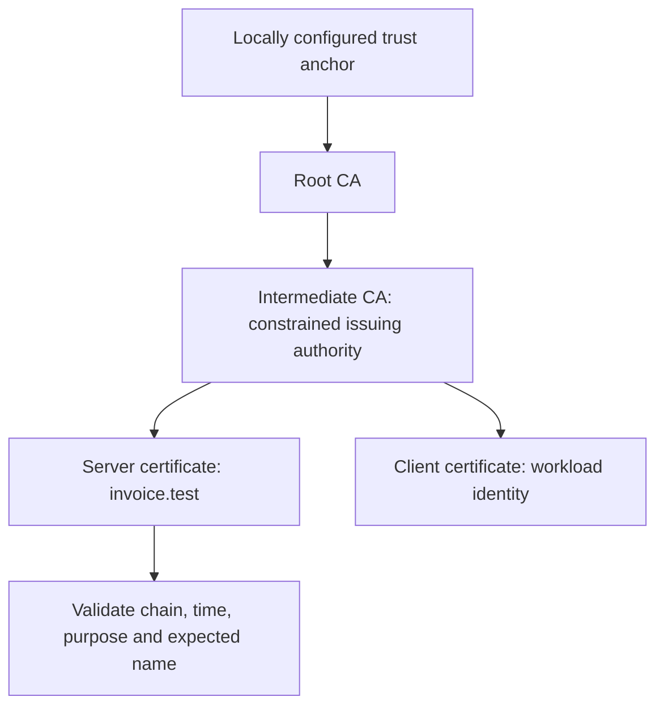
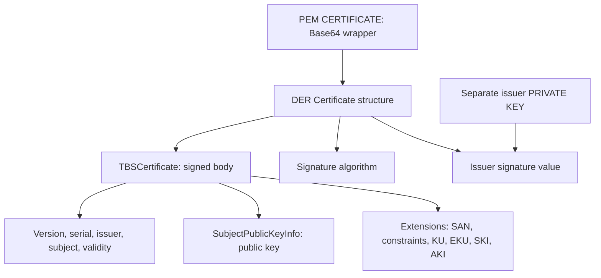
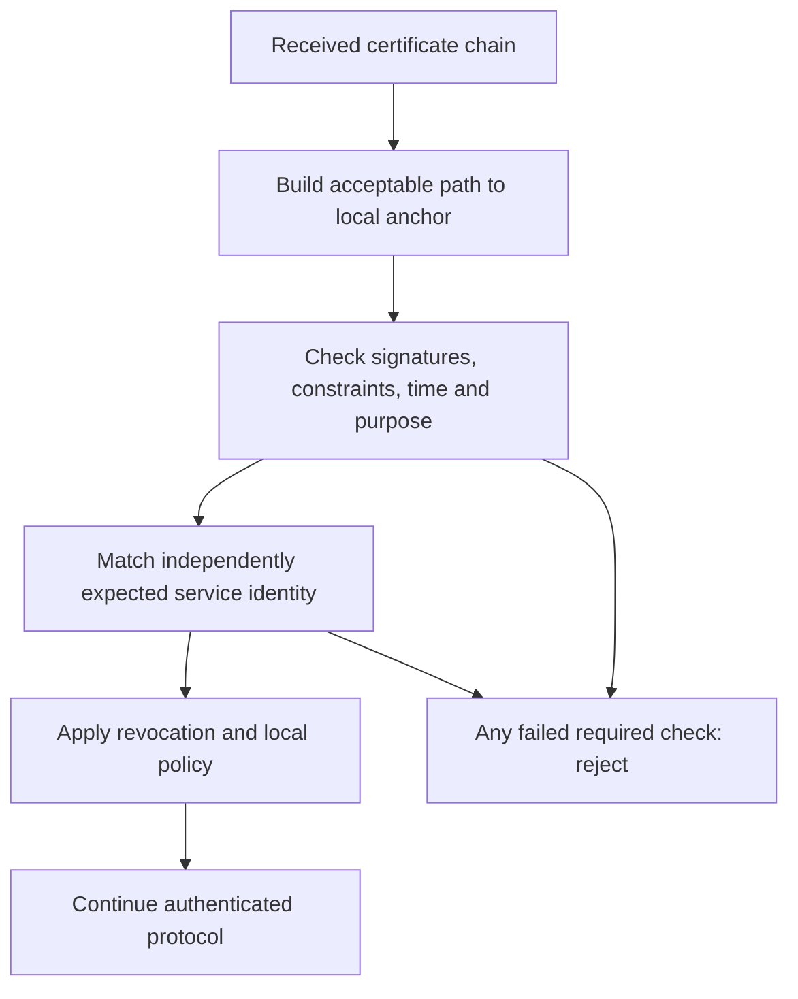
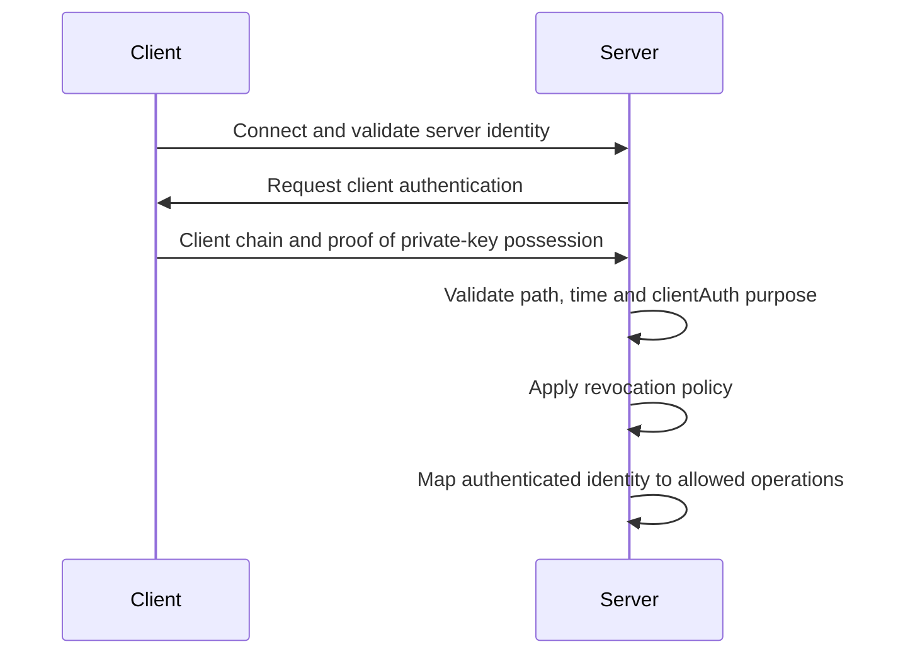

# Session 6: PKI and Certificates

**60 minutes taught · 90–120 minutes independently.** [Instructor](../teach/06-pki-certificates.md) · [Notebook](../downloads/session-06-pki-certificates.ipynb)

## Outcomes and preparation

You will trace a certificate path to a locally trusted root, distinguish signature verification from service identity validation, and explain why a valid client certificate does not grant unrestricted access. Review Session 5's distinction between trusted keys and arbitrary supplied keys.

Use the [Day 2 setup](../getting-started/day-2-setup.md). The notebook embeds the shared teaching helpers; local demonstrations also include them. The snippets below run in order after those helpers. All certificates and keys are generated for this run and are unrelated to real identities.

<!-- day2:helpers -->

## Certificates bind claims to keys

An X.509 certificate contains a public key, identity claims, validity interval, issuer, serial number, extensions, and the issuer's signature. The CA signs the certificate body. That signature protects the body from undetected change; it does not independently prove that the CA was entitled to assert the identity.

A relying party starts with local trust anchors and policy. A root is trusted because it was provisioned as trusted, not because it is self-signed. An attacker can generate a perfectly valid self-signed certificate. An intermediate allows a root to delegate issuing authority without using the root key for routine issuance.


```mermaid
flowchart TD
    T["Locally configured trust anchor"] --> R["Root CA"]
    R --> I["Intermediate CA: constrained issuing authority"]
    I --> S["Server certificate: invoice.test"]
    I --> C["Client certificate: workload identity"]
    S --> V["Validate chain, time, purpose and expected name"]
```

Read from the trust anchor down: a server sends enough intermediate certificates to help path building. Sending a root does not make the peer trust that root. Real environments can offer multiple possible paths and policies; our helper creates one simple hierarchy.

| Field or extension | Question it helps answer | Common mistake |
| --- | --- | --- |
| SAN | Does this certificate cover the expected DNS/IP identity? | Treating a matching display name as sufficient |
| Basic Constraints | May this key act as a CA, and with what path limit? | Accepting an ordinary leaf as an issuer |
| Key Usage / Extended Key Usage | Is this key/certificate usable for the required operation and purpose? | Using a server-only certificate as a client identity |
| Validity interval | Is validation time inside the permitted period? | Disabling time checks to fix clock or renewal failures |
| Issuer and signature | Which issuing key signed this body? | Trusting the issuer's text name without validating the path |

## Inspect before trusting

```python
keys, certs = make_pki()
leaf = certs['server']
names = leaf.extensions.get_extension_for_class(x509.SubjectAlternativeName).value
assert names.get_values_for_type(x509.DNSName) == ['invoice.test']
assert not leaf.extensions.get_extension_for_class(x509.BasicConstraints).value.ca
assert certs['intermediate'].extensions.get_extension_for_class(x509.BasicConstraints).value.path_length == 0
print('PASS: inspected SAN, leaf constraints and intermediate path limit')
```

Inspection is not validation. Parsing an attacker-controlled certificate succeeds for many untrusted certificates. Do not implement a validator by merely comparing issuer strings or checking one signature. Use a maintained path validator with a defined trust store and application policy.

## Validation is a sequence of decisions
 
### Print and decode the certificate blocks

Use these controls in the notebook to choose **root**, **intermediate**, **server**, or **client**. Click **Print PEM and fields**. The certificate and public key are printable by default; check **Print disposable private key** when explaining key ownership. These are fresh classroom keys, never production credentials. Clear notebook outputs before sharing a saved copy.

```python
inspector_controls = inspection_panel(keys, certs)
```

Without widgets, this call prints the same material, including the disposable private key:

```python
print_material(keys, certs, role='server', show_private=True)
```

Change `role` to `'client'`, `'intermediate'` or `'root'`. Ask which private key signs each certificate and which public key verifies it. The private key is **not inside the certificate**. PEM is Base64-encoded DER with a label; it is encoding, not encryption. The fields are nested binary structures, so a line of Base64 does not correspond to one human-readable field.


```mermaid
flowchart TD
    P["PEM CERTIFICATE: Base64 wrapper"] --> D["DER Certificate structure"]
    D --> T["TBSCertificate: signed body"]
    D --> A["Signature algorithm"]
    D --> S["Issuer signature value"]
    T --> I["Version, serial, issuer, subject, validity"]
    T --> K["SubjectPublicKeyInfo: public key"]
    T --> E["Extensions: SAN, constraints, KU, EKU, SKI, AKI"]
    X["Separate issuer PRIVATE KEY"] --> S
```

| Printed block / field | Explain using the output | Learner question |
| --- | --- | --- |
| `BEGIN CERTIFICATE` | Public key plus signed claims; the issuer signature protects TBSCertificate | Is a readable certificate automatically trusted? No. |
| `BEGIN PUBLIC KEY` | SubjectPublicKeyInfo only; no identity binding or issuer signature | Does this match the public key inside the certificate? |
| `BEGIN PRIVATE KEY` | Unencrypted PKCS#8 disposable key; enables signing as that key owner | Would publishing a real leaf private key allow impersonation? |
| SAN versus Subject | `invoice.test` is the server DNS SAN; the CN is a display name in this example | Which value is compared with the expected server name? |
| SKI / AKI | Subject Key Identifier identifies a key; Authority Key Identifier points toward the issuer key | Does a matching identifier replace signature verification? No. |
| KU / EKU | CA keys have keyCertSign/cRLSign; leaves use digitalSignature and serverAuth or clientAuth | Why must a server-only leaf fail client authentication? |
| Critical extension | A validator must understand and process it, or reject | Is ignoring an unknown critical extension acceptable? No. |

```python
public_bytes = lambda key: key.public_bytes(serialization.Encoding.DER,
                                           serialization.PublicFormat.SubjectPublicKeyInfo)
for role in keys:
    assert public_bytes(keys[role].public_key()) == public_bytes(certs[role].public_key())
    parsed = x509.load_pem_x509_certificate(certs[role].public_bytes(serialization.Encoding.PEM))
    assert parsed.serial_number == certs[role].serial_number
print('PASS: each printed key matches its certificate; PEM round trips preserve the serial')
```

### Reveal validation one check at a time

```python
validation_controls = walkthrough_panel(keys, certs)
```

Choose **server / valid**, predict the next result, then press **Next check** repeatedly. Change one scenario and repeat. Changing either dropdown resets the trace, so results never silently belong to the previous selection. **Show all checks** reveals the complete table; **Print current CRL** shows the exact revocation evidence used for that trace.

The checks evaluate real certificate signatures and signed CRLs, but the ordering is a **teaching visualization of a fixed chain**, not a trace from OpenSSL or a general RFC 5280 implementation. Only exact DNS SAN matches, one P-256 intermediate and direct leaf CRLs are supported. It omits general path building, wildcard/IP rules, name/policy constraints, arbitrary critical extensions, intermediate revocation and online fetching. Do not use it to validate external certificates. The real TLS examples below remain the separate maintained-verifier demonstration.

| Scenario | First expected failure | Explain the distinction |
| --- | --- | --- |
| unknown-root / missing-intermediate | Local trust anchor / Path available | Trust provisioning differs from chain delivery |
| altered-signed-body | Issuer signatures | This modifies the bytes being verified, not a parsed certificate field |
| expired | Validity time | The simulated clock advances beyond leaf expiry |
| wrong-purpose | Key use and EKU | Another correctly signed leaf is not valid for this role |
| wrong-identity | Expected identity | Correct CA and purpose do not establish the intended peer |
| revoked / stale-crl / missing-crl / forged-crl | Leaf revocation | Revoked, unknown and invalid evidence are distinct reasons to deny |
| authorization-denied | Application permission | An authenticated identity is not automatically authorized |

Rows after a failed required check display **SKIP**, rather than a misleading success. The application permission row models a separate allow-list; it is not part of X.509 path validation. A trusted root is a locally configured input; its self-signature does not create trust.

For a widget-free walkthrough, change the two arguments and inspect each row:

```python
trace, current_crl = validation_trace(keys, certs, role='server', scenario='revoked')
for step, status, evidence in trace:
    print(f'{step}: {status}\n  {evidence}')
show_crl(current_crl)
assert next(row[0] for row in trace if row[1] == 'FAIL') == 'Leaf revocation'
print('PASS: revoked leaf stops before application permission')
```

### Compare with a real TLS verifier


```mermaid
flowchart TD
    C["Received certificate chain"] --> P["Build acceptable path to local anchor"]
    P --> T["Check signatures, constraints, time and purpose"]
    T --> N["Match independently expected service identity"]
    N --> R["Apply revocation and local policy"]
    R --> A["Continue authenticated protocol"]
    T --> F["Any failed required check: reject"]
    N --> F
```

The expected hostname comes from the service the application intended to contact, not from whatever name the certificate happens to contain. DNS SANs and IP SANs are different identity types. Our `.test` name is an isolated teaching identity, not a public service.

The helper uses Python's TLS verifier for a real handshake over memory buffers. Predict which cases fail without weakening verification:

```python
assert tls_trial()['version'] == 'TLSv1.3'
for settings in [dict(hostname='other.test'), dict(trust_root=False),
                 dict(expired=True), dict(include_intermediate=False)]:
    expect_rejection(lambda settings=settings: tls_trial(**settings), ssl.SSLError)
print('PASS: trusted chain succeeds; wrong name, missing trust, expiry and missing intermediate fail')
```

Missing intermediates fail in this isolated setup because no cache or issuer-fetching service supplies them. In another client, cached intermediates can hide a deployment problem. Test clean clients as well as existing installations.

## Client certificates and revocation

Mutual TLS authenticates both ends according to certificate policy. Server verification of a client's certificate does not usually involve checking that client's DNS hostname. The server instead maps the authenticated identity to application roles and permissions. A valid certificate for service A must not authorize all service B operations.

```python
assert tls_trial(mtls=True)['client_authenticated']
expect_rejection(lambda: tls_trial(mtls=True, send_client=False), ssl.SSLError)
expect_rejection(lambda: tls_trial(mtls=True, client_wrong_eku=True), ssl.SSLError)
print('PASS: mTLS requires an acceptable client certificate')
```

CRLs publish revocation information; OCSP supplies certificate-status responses. Deployment must define status freshness, availability, and behavior when information is unavailable. Short validity reduces exposure duration but does not make compromise disappear immediately. The real TLS helper does **not** perform revocation checking. The interactive walkthrough separately verifies a locally generated signed leaf CRL; neither example contacts an OCSP responder or downloads a CRL.

### Reverse the verifier: client certificates

In the panel choose **client**. Now the server is the relying party. Try **valid**, **missing-client**, **wrong-purpose**, **wrong-identity**, and **authorization-denied**. A missing client certificate is relevant only in client mode. The client SAN is mapped by our application to `client.test`; this is not automatic TLS hostname checking of clients. `client.test` is a simple teaching identifier, not a recommended universal workload-identity scheme.


```mermaid
sequenceDiagram
    participant C as Client
    participant S as Server
    C->>S: Connect and validate server identity
    S->>C: Request client authentication
    C->>S: Client chain and proof of private-key possession
    S->>S: Validate path, time and clientAuth purpose
    S->>S: Apply revocation policy
    S->>S: Map authenticated identity to allowed operations
```

The certificate alone does not prove possession of its private key. The real mTLS handshake performs that proof; our inspection panel only displays certificate data. Revocation policy in this diagram is an architectural requirement, not a claim that `tls_trial` enables CRL checking.

### Inspect and challenge revocation evidence

```python
client_crl = make_teaching_crl(keys, certs, serial=certs['client'].serial_number)
show_crl(client_crl)
assert not crl_decision(client_crl, certs['client'], certs['intermediate'])[0]
assert crl_decision(client_crl, certs['server'], certs['intermediate'])[0]
print('PASS: revoking the client serial does not revoke a different server serial from the same issuer')
```

Match the printed CRL serial to the client certificate's serial. Revocation is issuer-scoped: a serial from another issuer is not interchangeable. The CRL is signed by the intermediate's key and carries `thisUpdate`, `nextUpdate`, a CRL number and a key-compromise reason for the listed entry. Printing or parsing it alone does not authenticate it.

| Evidence | Classroom decision | What it establishes |
| --- | --- | --- |
| Fresh issuer-signed CRL without the leaf serial | Continue | No listing in this evidence, not a guarantee of immediate compromise detection |
| Fresh issuer-signed CRL containing the leaf serial | Reject as revoked | Issuer has listed this certificate |
| Stale, future-dated, or missing CRL | Reject as unknown under hard-fail policy | No acceptable current status evidence |
| CRL with an invalid signature | Reject | Status claims cannot be trusted |

Compare **server / revoked** with **client / revoked**. Then try **stale-crl**, **missing-crl** and **forged-crl** for both. Our hard-fail policy trades availability for required status evidence. A soft-fail policy would continue under some unavailable-status conditions, which an attacker may exploit; it must not relabel unknown as good. No OCSP, delta/indirect CRLs, intermediate revocation or freshness cache is implemented here.

```python
for role in ('server', 'client'):
    rows, _ = validation_trace(keys, certs, role, 'valid')
    assert all(row[1] == 'PASS' for row in rows)
    for case in ('revoked', 'stale-crl', 'missing-crl', 'forged-crl'):
        rows, _ = validation_trace(keys, certs, role, case)
        assert next(row[0] for row in rows if row[1] == 'FAIL') == 'Leaf revocation'
        assert rows[-1][1] == 'SKIP'
print('PASS: server and client CRL scenarios distinguish valid, revoked and unusable evidence')
```

For the state actor, issuance systems, trust-store administration, renewal credentials and root/intermediate private keys are valuable targets. Protect who may issue which identities, constrain delegation, monitor issuance, and rehearse replacement. Installing another root expands trust and is a security decision, not a debugging fix.

## Practice and answers

1. Why does sending the root in the server chain not fix an unknown-root error?
2. A certificate is in date and signed by a trusted CA but names another service. Accept it?
3. Why is a server-auth certificate insufficient for our client-auth requirement?
4. What additional evidence is needed to claim a certificate is not revoked?

<details><summary>Worked answers</summary>
<ol><li>The peer must already trust an appropriate anchor through local policy; a received root cannot grant itself trust.</li><li>No. Path validity and intended service identity are separate checks.</li><li>Purpose constraints matter even when a signature and chain are valid.</li><li>A defined revocation policy and sufficiently fresh, trustworthy status evidence. The walkthrough checks a local signed leaf CRL; the TLS helper does not enable revocation checking and neither example implements online OCSP.</li></ol>
</details>

Ready to continue: explain an unknown issuer, wrong SAN, expired certificate and unauthorized client as different failures. Next: [TLS](07-tls.md) and [Lab 4](../labs/lab-04-mini-pki.md).

## Sources and scope

Reviewed 22 September 2026: [RFC 5280](https://www.rfc-editor.org/rfc/rfc5280), [Python ssl](https://docs.python.org/3/library/ssl.html). The notebook creates temporary private PEM files for the TLS API and removes the directory afterward; filesystem removal is not a secure-erasure guarantee.
