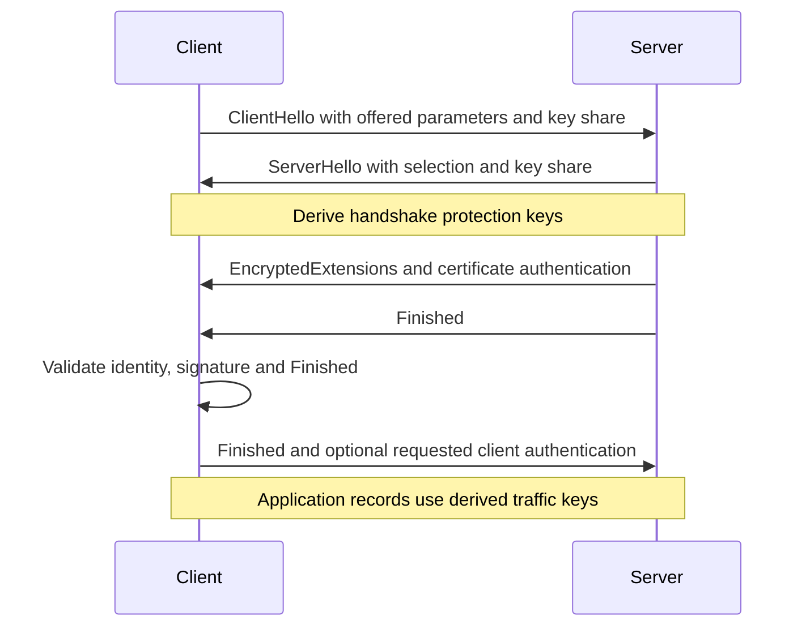
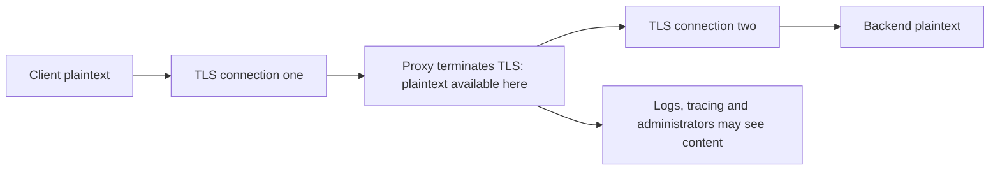
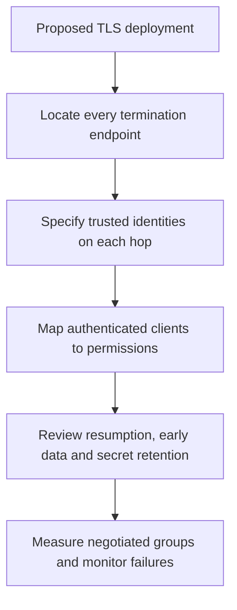

# Session 7: TLS 1.3

**45 minutes taught · 75–90 minutes independently.** [Instructor](../teach/07-tls.md) · [Notebook](../downloads/session-07-tls.ipynb)

## Outcomes and setup

Explain how TLS combines certificate authentication, transcript authentication, key establishment and record protection. Identify where plaintext exists when a connection terminates. Distinguish server-authenticated TLS, mTLS and application authorization. Complete Session 6 and use the [Day 2 setup](../getting-started/day-2-setup.md); helpers are embedded in the notebook and demo.

<!-- day2:helpers -->

## The protocol puts the pieces together

TLS is a specified protocol, not simply AES applied to a socket. In a typical full certificate-based TLS 1.3 handshake, peers exchange public key-establishment contributions, authenticate the handshake, and derive keys. CertificateVerify proves control of the signing key over specified handshake context; Finished authenticates the transcript using derived key material. A certificate alone does not prove the current peer possesses its private key.



This is a conceptual full-handshake sequence, not a packet parser. In mTLS, the requested client Certificate and CertificateVerify precede the client's Finished. Resumption and early data change the flow. Follow the protocol rather than copying this sketch into a new handshake implementation.

TLS 1.3 cipher-suite names identify record protection and a hash. The selected key-establishment group and signature scheme are separate. Seeing `TLS_AES_256_GCM_SHA384` does not prove ML-KEM was used, nor identify the certificate's signature algorithm.

## Observe a real in-memory handshake

```python
result = tls_trial()
assert result['version'] == 'TLSv1.3'
assert result['application_bytes'] > 0
assert not result['client_authenticated']
print(result)
print('PASS: TLS 1.3 carried application bytes with server authentication')
```

The helper connects two real SSL objects through MemoryBIO buffers. It does not simulate the cryptographic TLS implementation, open a listening port, or contact an internet server. It creates a trusted test CA in the client context only. Python's `ssl` backend can differ from the backend bundled with `cryptography`; supporting ML-KEM in one does not establish PQ support in the other.

## Where confidentiality ends



Read the two connections separately. Re-encryption protects the proxy-to-backend path; it does not hide content from the proxy. A security requirement for end-to-end confidentiality must identify the actual endpoints and who may inspect plaintext. TLS also does not hide all traffic metadata or protect application data after decryption.

| Requirement | TLS contribution | Remaining application work |
| --- | --- | --- |
| Prevent network modification | Authenticated records within the connection | Validate data and actions after decryption |
| Identify intended server | Validated certificate and handshake authentication | Supply correct expected identity and trust policy |
| Identify client workload | mTLS when configured and validated | Map identity to authorized operations |
| Keep records confidential for decades | Protect current transport under chosen assumptions | Assess retained ciphertext, endpoint storage and PQ migration |

## Failures are security results

```python
expect_rejection(lambda: tls_trial(hostname='attacker.test'), ssl.SSLError)
expect_rejection(lambda: tls_trial(trust_root=False), ssl.SSLError)
assert tls_trial(mtls=True)['client_authenticated']
expect_rejection(lambda: tls_trial(mtls=True, send_client=False), ssl.SSLError)
print('PASS: name, trust and required client authentication are enforced')
```

Do not fix these failures by disabling hostname or certificate verification. Fix issuance, chain delivery, expected identity or trust configuration. Missing client authentication must not silently fall back to anonymous privileges.

## Forward secrecy, resumption and early data

Fresh ephemeral DH in an authenticated handshake can protect past traffic against later theft of a long-term authentication key, assuming ephemeral and traffic secrets were erased. This is not a promise against endpoint compromise or a future solver of the classical key-exchange problem.

Resumption uses PSKs derived from earlier sessions; its security properties depend on how the PSK and any new exchange are combined. TLS 1.3 0-RTT early data has replay risks and weaker forward-secrecy properties than normal application data. It should not be treated as ordinary replay-protected delivery of payments, approvals or other non-idempotent operations. Our examples intentionally use full handshakes and no early data.



For a powerful adversary, protecting the private key alone is insufficient if a load balancer, debug logger or deployment administrator can access plaintext. Draw those boundaries before selecting a cipher suite. Use [Lab 4](../labs/lab-04-mini-pki.md) to make successful and failed trust decisions observable.

## Practice and answers

1. Does a TLS AES-256 cipher name establish post-quantum key exchange?
2. A proxy decrypts then re-encrypts. Is content hidden from that proxy?
3. Does a valid mTLS certificate authorize deleting all invoices?
4. Why should an invoice-approval request not be assumed replay-safe in 0-RTT?

<details><summary>Worked answers</summary>
<ol><li>No. Inspect the negotiated group and authentication mechanisms separately.</li><li>No. It is an endpoint of both connections.</li><li>No. The authenticated identity needs application authorization.</li><li>Early data can be replayed; the application needs an appropriate policy and duplicate handling.</li></ol>
</details>

## Sources

Reviewed 22 September 2026: [RFC 8446](https://www.rfc-editor.org/rfc/rfc8446) and [Python SSLObject/MemoryBIO](https://docs.python.org/3/library/ssl.html). This session does not claim that its TLS connection negotiates PQ or hybrid groups.
