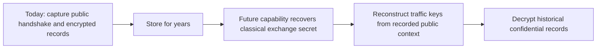
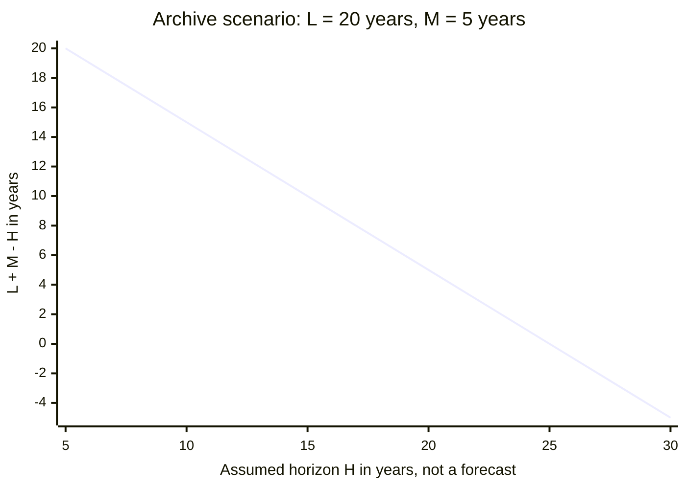
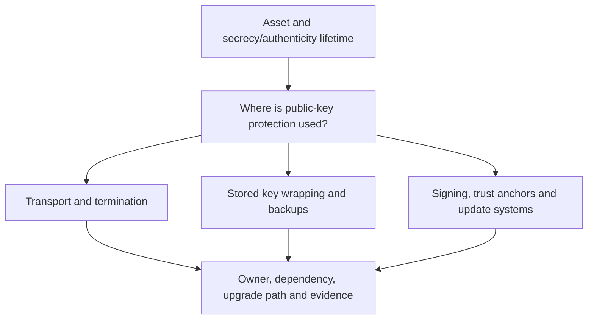

# Session 8: The Quantum Threat

**60 minutes taught · 90 minutes independently.** [Instructor](../teach/08-quantum-threat.md) · [Notebook](../downloads/session-08-quantum-threat.ipynb)

## Outcomes and preparation

Distinguish the threats to public-key mechanisms from those to symmetric primitives. Explain harvest-now-decrypt-later (HNDL), and prioritize a migration using data lifetime and migration lead time without inventing a quantum-computer arrival date. Use the [Day 2 setup](../getting-started/day-2-setup.md). This notebook is a planning model, not a quantum simulator or a cryptanalytic benchmark.

## Which assumptions change?

Shor's algorithm gives a quantum approach to factoring and discrete logarithms. A sufficiently capable, fault-tolerant quantum computer could therefore undermine RSA and the elliptic-curve mechanisms used earlier. Today's existence of small experimental quantum machines is not evidence that they can break deployed key sizes. Logical error correction, scale, time and engineering resources matter.

Grover's algorithm offers a generic quadratic improvement in unstructured search in the ideal query model. It is not a statement that an attacker gets a free, practical halving of every system's security. Circuit cost, parallelism, time limits and target structure affect real attacks. AES and hashes do not simply disappear; suitable parameters and sound protocols remain important. Larger RSA keys are not a post-quantum replacement for RSA's vulnerable mathematical structure.

| Mechanism | Quantum concern | Engineering consequence |
| --- | --- | --- |
| RSA, X25519, ECDSA, Ed25519 | Factoring or discrete-log assumptions | Plan replacement of affected key establishment and signatures |
| AES | Generic key search improvement in an ideal quantum model | Retain symmetric encryption with an appropriate strength and usage policy |
| Hashes / HKDF | Different quantum query effects and construction assumptions | Review parameters and construction, not just output length |
| Password verifiers | Low-entropy guesses remain a problem today | PQ migration does not repair weak passwords or credential theft |

## Harvest now, decrypt later



The attacker need not compromise today's endpoints if the later cryptanalysis reconstructs the recorded exchange secret. Classical forward secrecy protects against a different event: later theft of a long-term key under classical assumptions. It does not make classical DH immune to Shor's algorithm.

Changing algorithms later does not remove an adversary's earlier recording. Retention of highly confidential state, research, diplomatic or personal data can make action useful before the future capability exists. PQC runs on ordinary computers; it is not quantum key distribution and does not require a quantum network.

## A planning inequality, not a forecast

Let `L` be the remaining secrecy lifetime in years, `M` the years required to migrate, and `H` an assumed planning horizon until a relevant adversary capability. If `L + M > H`, waiting is inconsistent with that scenario's secrecy objective. This heuristic exposes assumptions; it is not a probability model or proof of safety when the inequality is false.

```python
assets = [
    {'name': 'highly confidential archive', 'L': 20, 'M': 5},
    {'name': 'research dataset', 'L': 10, 'M': 3},
    {'name': 'short-lived telemetry', 'L': 1, 'M': 2},
]
def planning_gap(lifetime, migration, horizon):
    if min(lifetime, migration, horizon) < 0:
        raise ValueError('Use nonnegative years')
    return lifetime + migration - horizon
for asset in assets:
    gaps = {h: planning_gap(asset['L'], asset['M'], h) for h in (5, 10, 20)}
    print(asset['name'], gaps)
assert planning_gap(20, 5, 10) == 15
assert planning_gap(1, 2, 10) < 0
print('PASS: scenario arithmetic uses explicit hypothetical horizons, not arrival predictions')
```

Positive values indicate a gap in the chosen scenario. Negative values do not address endpoint compromise, existing collection, cost of failure, or uncertainty in the assumptions.

```python
import matplotlib.pyplot as plt
horizons = [5, 10, 15, 20, 25, 30]
fig, ax = plt.subplots(figsize=(8, 4))
for asset in assets:
    ax.plot(horizons, [planning_gap(asset['L'], asset['M'], h) for h in horizons],
            marker='o', label=asset['name'])
ax.axhline(0, color='black', linewidth=1)
ax.set(xlabel='Assumed capability horizon from now (years)',
       ylabel='L + M - H (years)', title='Hypothetical planning scenarios — not a forecast')
ax.legend(fontsize=8)
fig.tight_layout()
plt.show()
print('PASS: plotted sensitivity to explicitly assumed horizons')
```

Change `L` and `M` to observe which decisions are robust across assumptions. Do not label the x-axis “the year quantum computers arrive.”



This static view shows one scenario from the notebook. Crossing zero changes this heuristic's result, not a guarantee about the archive's safety.

## Inventory the dependency, not only the algorithm



Record what protects the data-encryption key, who can change it, and whether old wrapped keys or transcripts remain recoverable. Rewrapping stored data helps only under an analyzed architecture and cannot undo copies already captured. Signature migration has different consequences: future forgery, trust-anchor replacement and long-term verification evidence rather than merely decrypting recordings.

For a state actor, also model insider access, supplier compromise, coercion of operators and endpoint capture. Post-quantum algorithms address a mathematical threat; they do not eliminate those paths.

## Exercise and worked decision

An archive must remain confidential for 25 years. Its TLS gateway can be upgraded in one year, but its backup key-wrapping system and offline readers require six years. Make separate inventory entries, owners and milestones. Do not describe the whole archive as migrated after replacing the gateway.

<details><summary>Worked reasoning and exit answers</summary>
<p>The slow backup/reader dependency governs one major exposure path. Assess recordings and stored wrapped keys separately, test interoperability, and plan trust changes. No single forecast is required to see long-lived exposure. AES-256 records protected by a recoverable classical exchange are still exposed through the recovered traffic key; classical forward secrecy does not change that conclusion. A short-lived asset may be lower priority for confidentiality but still require long-lived signature validation or upgrade capability.</p>
</details>

Ready to continue: explain why “we use AES-256” and “we have forward secrecy” do not complete an HNDL assessment. Next: [ML-KEM](09-ml-kem.md).

## Sources

Reviewed 22 September 2026: [NIST PQC FAQs](https://csrc.nist.gov/projects/post-quantum-cryptography/faqs). Scenario values are invented teaching inputs, not estimates endorsed by NIST.
