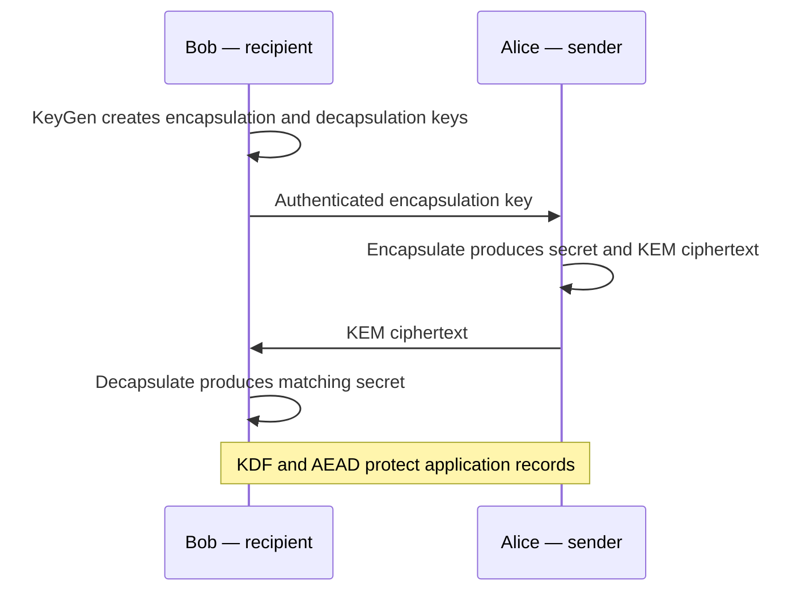
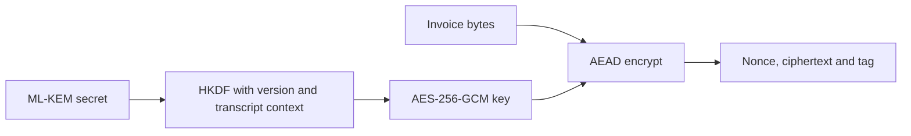

# Session 9: Post-Quantum Key Establishment

**45 minutes taught · 75–100 minutes independently.** [Instructor](../teach/09-ml-kem.md) · [Notebook](../downloads/session-09-ml-kem.ipynb)

## Outcomes and setup

Explain KeyGen, Encapsulate and Decapsulate; distinguish a KEM ciphertext from an encrypted application message; derive an AEAD key from the established secret; and observe the difference between malformed input and implicit rejection. Use the [Day 2 setup](../getting-started/day-2-setup.md). This is real ML-KEM-768 through the pinned library, not a placeholder or a Kyber-labelled substitute.

<!-- day2:helpers -->

## A KEM establishes secret material

Bob generates an encapsulation key (public) and decapsulation key (private). Alice uses Bob's public key to generate both a shared secret and a KEM ciphertext. She sends the ciphertext, not the secret. Bob decapsulates to recover the corresponding secret. Alice does not choose an invoice as input to encapsulation: use a KDF and AEAD for that invoice.



“Authenticated” is an assumption supplied by a surrounding protocol. The KEM does not identify Bob or Alice. Anyone holding Bob's public key can encapsulate to it. Replacing that public key recreates the identity problem from Session 4.

ML-KEM is standardized in FIPS 203 and based on module-lattice assumptions. “Post-quantum” means designed to resist known quantum attacks under its assumptions, not mathematically guaranteed safe forever. The parameter names are identifiers, not bit counts of symmetric security. We use ML-KEM-768 for one concrete teaching profile.

```python
from cryptography.hazmat.primitives.asymmetric.mlkem import MLKEM768PrivateKey, MLKEM768PublicKey
bob_kem = MLKEM768PrivateKey.generate()
public_bytes = bob_kem.public_key().public_bytes_raw()
alice_secret, kem_ciphertext = MLKEM768PublicKey.from_public_bytes(public_bytes).encapsulate()
bob_secret = bob_kem.decapsulate(kem_ciphertext)
assert alice_secret == bob_secret
assert (len(public_bytes), len(kem_ciphertext), len(alice_secret)) == (1184, 1088, 32)
print('PASS: ML-KEM-768 establishes the same secret; measured public key/ciphertext/secret = 1184/1088/32 bytes')
```

The library returns `(shared_secret, ciphertext)` in that order. Do not assume another library uses the same order. Its raw private serialization is a seed representation, not the expanded private-key size from every standards table. We measure public wire material and avoid exporting private keys.

## From secret to record protection



The KEM ciphertext is part of key establishment; the AEAD ciphertext contains protected application data. Mixing up these two objects causes implementation errors. This teaching transcript has a fixed prefix and fixed-length public key/ciphertext fields. Production protocols must define their own exact serialization, roles, authentication, confirmation and replay rules.

```python
import secrets
from cryptography.hazmat.primitives.ciphers.aead import AESGCM
from cryptography.exceptions import InvalidTag
transcript = b'ML-KEM-768:workshop:v1|' + public_bytes + kem_ciphertext
send_key = derive_day2(alice_secret, transcript)
receive_key = derive_day2(bob_secret, transcript)
nonce = secrets.token_bytes(12)
aad = b'invoice:v1|tenant=acme|id=7'
record = AESGCM(send_key).encrypt(nonce, b'confidential teaching invoice', aad)
assert AESGCM(receive_key).decrypt(nonce, record, aad) == b'confidential teaching invoice'
expect_rejection(lambda: AESGCM(receive_key).decrypt(nonce, record, aad + b'!'), InvalidTag)
print('PASS: KDF and AEAD round trip; altered context rejected')
```

## Implicit rejection is not successful authentication

A wrong-length KEM ciphertext is rejected as malformed. A correctly sized but invalid ciphertext can cause ML-KEM decapsulation to return a pseudorandom fallback secret rather than a visible validity flag. This implicit rejection is intentional. The receiver must not interpret “returned 32 bytes” as “Alice authenticated successfully.”

```python
expect_rejection(lambda: bob_kem.decapsulate(kem_ciphertext[:-1]), ValueError)
changed_ct = bytes([kem_ciphertext[0] ^ 1]) + kem_ciphertext[1:]
changed_secret = bob_kem.decapsulate(changed_ct)
assert len(changed_secret) == 32 and changed_secret != alice_secret
changed_key = derive_day2(changed_secret, transcript)
expect_rejection(lambda: AESGCM(changed_key).decrypt(nonce, record, aad), InvalidTag)
other_bob = MLKEM768PrivateKey.generate()
assert other_bob.decapsulate(kem_ciphertext) != alice_secret
print('PASS: truncated KEM input rejects; same-length corruption/wrong recipient cannot recover the record key')
```

We hold transcript bytes fixed in this negative case to isolate the secret change. Real peers also bind their received ciphertext into context. Do not expose detailed decapsulation validity oracles or release unauthenticated plaintext. Follow the protocol's failure behavior.

## What deployment adds

| Issue | Required reasoning |
| --- | --- |
| Identity | Authenticate the encapsulation key and peer roles through a specified protocol |
| Forward secrecy | A retained decapsulation key can recover secrets from recorded KEM ciphertexts; analyze ephemeral use and erasure |
| Size | Account for keys, ciphertexts, certificates, framing and transport limits |
| Performance | Measure key generation, encapsulation and decapsulation on actual targets, with distributions |
| Assurance | Standardized algorithm does not imply a FIPS-validated installation or whole-system compliance |

The public key and ciphertext total 2272 bytes in our isolated exchange, excluding identity credentials and protocol framing. A successful microbenchmark on a desktop says little about embedded memory, network fragmentation or overload resistance. A state actor may target weak key provisioning or endpoints even if ML-KEM's mathematics remains secure.

## Practice and answers

Predict what happens for a different recipient, modified AAD, and replay of the same intact record. Explain which result comes from KEM, AEAD or application policy.

<details><summary>Worked answers</summary>
<p>A different private key does not recover Alice's secret. Changed AAD causes AEAD failure. Replaying an intact record may still verify because this example has no replay state. KEM establishes material, AEAD checks a record under a key, and the application must enforce freshness. A static KEM key does not automatically provide forward secrecy.</p>
</details>

Continue to [Lab 5](../labs/lab-05-pqc-channel.md).

## Sources

Reviewed 22 September 2026: [FIPS 203 and errata notices](https://csrc.nist.gov/pubs/fips/203/final), [cryptography ML-KEM API](https://cryptography.io/en/stable/hazmat/primitives/asymmetric/mlkem/). Review current errata before delivery; no runtime fallback to a classical or fake KEM is permitted.
