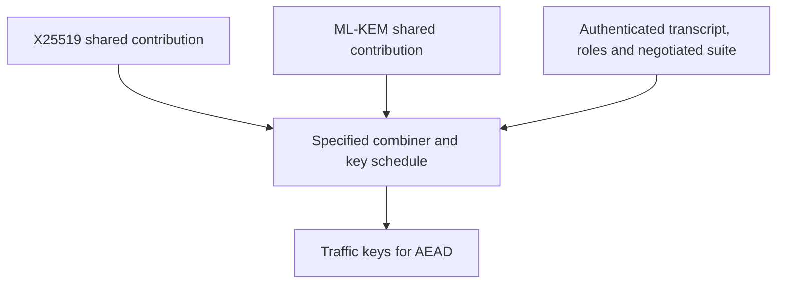
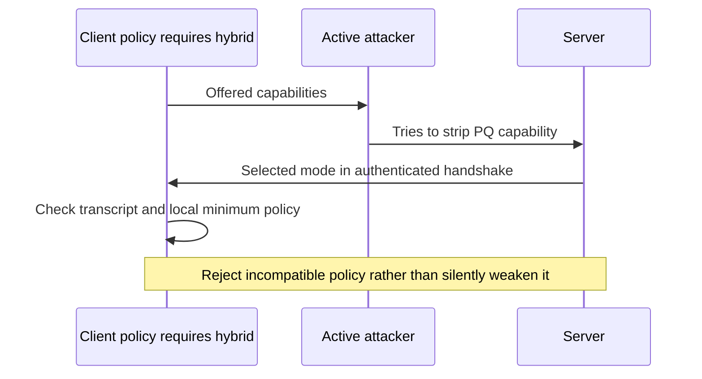

# Session 10: Hybrid Key Establishment

**45 minutes taught · 75–90 minutes independently.** [Instructor](../teach/10-hybrid-key-establishment.md) · [Notebook](../downloads/session-10-hybrid-key-establishment.ipynb)

## Outcomes and setup

Explain why a transition may combine classical and PQ contributions; demonstrate that context and both input secrets affect a teaching KDF; and identify downgrade and interoperability risks. Complete Sessions 4 and 9. Use the [Day 2 setup](../getting-started/day-2-setup.md).

<!-- day2:helpers -->

## Why combine mechanisms?

A migration must balance exposure to quantum cryptanalysis with implementation and ecosystem uncertainty. A carefully designed hybrid construction aims to retain useful security if one component's assumptions fail. That aim depends on the specific combiner, protocol, authentication and security model. “Two algorithms” is not a proof of “at least one always protects us.”



Read all three inputs. If the attacker can choose a classical-only mode without an authenticated policy decision, the intended combined protection may disappear. If authentication remains classically vulnerable, PQ key establishment alone does not make every active-attack property post-quantum.

## Experiment: explicit inputs and domain separation

The code below is a **teaching combiner, not a standardized TLS group or deployable handshake**. It joins two fixed 32-byte secrets before HKDF and binds a transcript. This illustrates dependencies, not a general robust-combiner proof. Deploy a specified, reviewed protocol profile instead of adopting this example's labels or encoding.

```python
from cryptography.hazmat.primitives.asymmetric.x25519 import X25519PrivateKey
from cryptography.hazmat.primitives.asymmetric.mlkem import MLKEM768PrivateKey
alice_x, bob_x = X25519PrivateKey.generate(), X25519PrivateKey.generate()
zx_a = alice_x.exchange(bob_x.public_key())
zx_b = bob_x.exchange(alice_x.public_key())
bob_pq = MLKEM768PrivateKey.generate()
zp_a, ct = bob_pq.public_key().encapsulate()
zp_b = bob_pq.decapsulate(ct)
suite = b'TEACHING-ONLY:X25519+ML-KEM-768:v1'
transcript = (suite + alice_x.public_key().public_bytes_raw()
              + bob_x.public_key().public_bytes_raw()
              + bob_pq.public_key().public_bytes_raw() + ct)
def teaching_combiner(classical, pq, context):
    if len(classical) != 32 or len(pq) != 32:
        raise ValueError('Both fixed-length contributions are required')
    return derive_day2(classical + pq, context)
key_a = teaching_combiner(zx_a, zp_a, transcript)
key_b = teaching_combiner(zx_b, zp_b, transcript)
assert key_a == key_b
assert key_a != teaching_combiner(zx_a, bytes(32), transcript)
assert key_a != teaching_combiner(bytes(32), zp_a, transcript)
assert key_a != teaching_combiner(zx_a, zp_a, transcript + b'changed')
expect_rejection(lambda: teaching_combiner(zx_a, b'', transcript), ValueError)
print('PASS: teaching combination depends on both secrets and exact context')
```

Changing one input and observing different output is only a functional check. Replacing an input with zeros here models a sensitivity experiment, not a production fallback or a proof of resistance to an adaptive attacker.

## Downgrade is a policy and transcript problem



The receiver needs both an authenticated account of negotiation and an independent minimum policy. A list of permitted names in Python does not authenticate negotiation; it only illustrates local policy after authentication.

```python
def require_hybrid(selected, authenticated, required=True):
    if not authenticated:
        raise ValueError('Unauthenticated negotiation')
    if required and selected != 'approved-hybrid-profile':
        raise ValueError('Local minimum policy not met')
    return selected
assert require_hybrid('approved-hybrid-profile', True) == 'approved-hybrid-profile'
expect_rejection(lambda: require_hybrid('classical-only', True), ValueError)
expect_rejection(lambda: require_hybrid('approved-hybrid-profile', False), ValueError)
print('PASS: minimum policy rejects downgrade and unauthenticated selection')
```

## Engineer the migration

| Decision | Evidence to collect |
| --- | --- |
| Exact profile and version | Agreed specification, code points, parameters and implementation versions |
| Authentication | Which signatures and trust chains authenticate the exchange? |
| Interoperability | Client/server matrix, proxies, middleboxes, certificate tooling and failure behavior |
| Resource use | Full handshake bytes, latency distributions, memory and failure-load behavior |
| Rollout | Inventory owners, negotiated-mode telemetry, staged deployment and documented minimum policy |

Do not advertise a service as hybrid because a library exposes both primitives. Observe what the actual connection negotiated. Separate negotiation failures from ordinary network errors. A rollback plan must say who can approve reduced protection and for which data; automatic fallback on attacker-induced errors is dangerous.

A classical-only certificate path and a hybrid KEM address different assumptions. During transition, document which protection applies to passive recordings, active impersonation, and future software updates. A powerful state actor can exploit a forgotten fallback, a legacy intermediary or an unauthorized endpoint regardless of the combiner.

## Practice and answers

An archive client requires hybrid protection, but a legacy proxy only accepts classical key exchange. Propose a delivery decision without silently relaxing the archive policy. Then explain why two separately encrypted copies of a secret are not automatically a robust combiner.

<details><summary>Worked answers</summary>
<p>Identify the incompatible termination hop, upgrade or replace it, and fail the required-protection connection until the approved profile works. If an exception is necessary, it is an explicit data-owner risk decision, not an automatic crypto fallback. Combining mechanisms requires analysis of what an attacker learns from each component and how the final secret is derived; two ciphertexts can expose the secret if either independently reveals it.</p>
</details>

Exit check: explain the difference between demonstrating that two inputs affect a KDF and proving a protocol remains secure when one component fails. Continue to [PQ signatures](11-ml-dsa.md).

## Sources and limits

Reviewed 22 September 2026: [FIPS 203](https://csrc.nist.gov/pubs/fips/203/final), [TLS 1.3](https://www.rfc-editor.org/rfc/rfc8446), [HKDF RFC 5869](https://www.rfc-editor.org/rfc/rfc5869). No current IETF hybrid deployment profile is implemented or claimed by this notebook.
