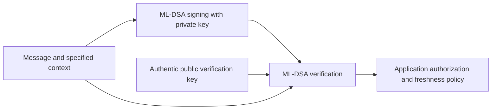
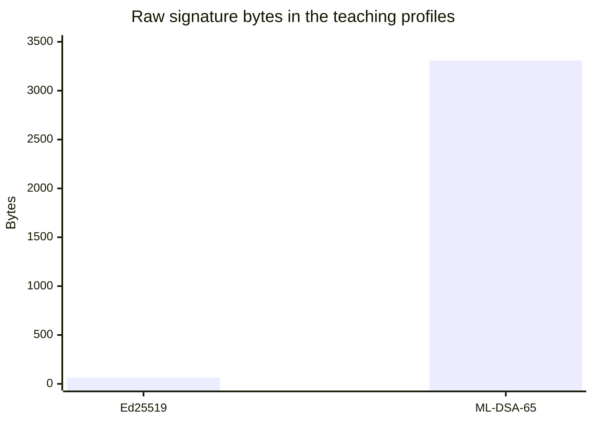
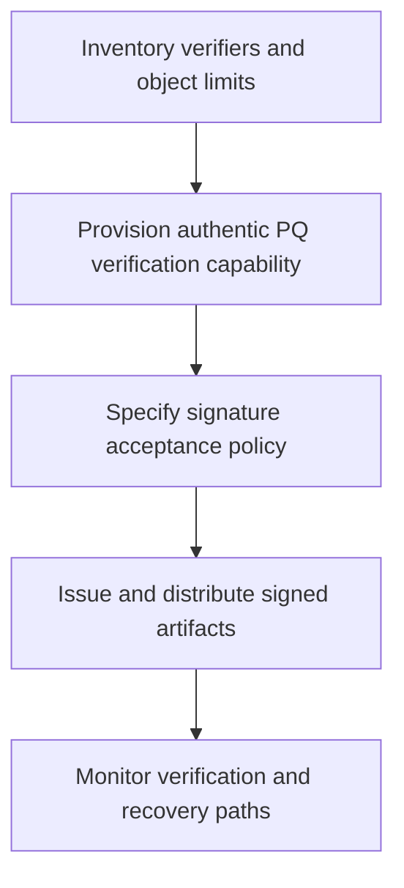

# Session 11: Post-Quantum Digital Signatures

**45 minutes taught · 75–100 minutes independently.** [Instructor](../teach/11-ml-dsa.md) · [Notebook](../downloads/session-11-ml-dsa.ipynb)

## Outcomes and setup

Generate and verify ML-DSA signatures, reject altered messages/contexts/keys, measure public signature material, and explain the trust changes required for signed updates and certificates. Complete Session 5 and use the [Day 2 setup](../getting-started/day-2-setup.md). The examples use ML-DSA-65 from the pinned library.

<!-- day2:helpers -->

## What changes and what stays

ML-DSA is a module-lattice signature family standardized in FIPS 204. It replaces a signature primitive; it does not encrypt data or establish a KEM secret. A valid signature remains relative to a trusted public key and exact signed content. Authorization, freshness, release policy and key custody still matter.



Read the final arrow carefully: post-quantum verification does not turn a wrong-product update into an acceptable release. It also cannot prove that an uncompromised human approved a message if the signing service was misused.

```python
from cryptography.hazmat.primitives.asymmetric.mldsa import MLDSA65PrivateKey
from cryptography.exceptions import InvalidSignature
signer = MLDSA65PrivateKey.generate()
public = signer.public_key()
message = b'release:v1|product=training-device|version=9|digest=synthetic'
context = b'workshop-release'
signature = signer.sign(message, context)
public.verify(signature, message, context)
assert (len(public.public_bytes_raw()), len(signature)) == (1952, 3309)
print('PASS: ML-DSA-65 signature verifies; public key/signature = 1952/3309 bytes')
```

This API takes an optional context; both sides must agree on it. Use the protocol's context, variant and encoding. Do not substitute a manually prehashed message or the library's lower-level message-representative API without a specification requiring that operation.

```python
other = MLDSA65PrivateKey.generate()
for operation in [
    lambda: public.verify(signature, message + b'!', context),
    lambda: public.verify(signature, message, b'other-purpose'),
    lambda: other.public_key().verify(signature, message, context),
    lambda: public.verify(signature[:-1], message, context),
]:
    expect_rejection(operation, InvalidSignature)
print('PASS: altered message, context, key and truncated signature are rejected')
```

## Measure the deployment impact

```python
from cryptography.hazmat.primitives.asymmetric.ed25519 import Ed25519PrivateKey
import matplotlib.pyplot as plt
ed = Ed25519PrivateKey.generate()
sizes = [len(ed.sign(message)), len(signature)]
fig, ax = plt.subplots(figsize=(6, 3))
ax.bar(['Ed25519', 'ML-DSA-65'], sizes)
ax.set(ylabel='Signature bytes', title='Measured raw signature lengths — not equal-security benchmarking')
fig.tight_layout()
plt.show()
assert sizes == [64, 3309]
print('PASS: compared serialized signature lengths without claiming equal security or runtime')
```

This graph does not compare throughput, verification time or equivalent security categories. Certificate chains contain more than one signature plus public keys, names and extensions. Measure full objects and paths through proxies, bootloaders, storage slots and update transports. A format's maximum size can be as important as its average transfer time.



The website chart displays the same measured sizes as the notebook. The profiles are not presented as equal-security alternatives.

| Family | Main idea | Deployment question |
| --- | --- | --- |
| ML-DSA | Module-lattice signatures; 44, 65 and 87 parameter sets | Which parameter set, context, encoding and platform support are required? |
| SLH-DSA | Stateless hash-based signatures standardized in FIPS 205 | How do larger signatures and selected speed/size parameters fit the target? |
| Classical signatures | Existing RSA/ECC trust ecosystems | Which verifiers and trust anchors must change, and what remains vulnerable? |

SLH-DSA offers different underlying assumptions from lattice signatures. It is not interchangeable with ML-DSA at the API or object-format level. This course gives a conceptual SLH-DSA overview, not an executable implementation. Stateless does not mean keys need no lifecycle management.

## Migrate verification before relying on new signatures



A firmware device cannot benefit from an ML-DSA-signed update if its immutable verifier only understands a classical scheme. Trust updates and boot-chain support must precede reliance on the new signature. A certificate ecosystem also needs compatible issuance, parsing, validation and handshake signature support; merely generating an ML-DSA key does not update TLS.

If a transition distributes both classical and PQ signatures, define whether verifiers require **both**, permit **either**, or apply a versioned policy. “Either” can retain acceptance through a broken component; “both” can break availability when a verifier lacks support. This is an explicit protocol and rollout decision, not an accidental `or` in code.

For the state actor scenario, protect build inputs, release approval and signing-service permissions. An attacker authorized to call a PQ signing key can produce valid malicious releases just as with classical keys. Future forgery risk also differs from HNDL decryption: archival authenticity may require trustworthy timing and preservation evidence, not just a new encryption key.

## Practice and answers

1. Will changing the context after signing preserve validity?
2. Does valid ML-DSA make a firmware version current or authorized?
3. What breaks if an update parser allocates only 512 bytes for a signature?
4. A dual-signature verifier accepts either signature. Does it preserve the intended security if the classical one becomes forgeable?

<details><summary>Worked answers</summary>
<ol><li>No. This signature binds its context.</li><li>No. Product, version, authorization and replay/rollback policy remain.</li><li>The ML-DSA-65 signature will not fit; test format limits and fail safely rather than truncate.</li><li>Not for acceptance that still permits a forged classical signature alone. Specify the transition policy and test removal of either signature.</li></ol>
</details>

Continue to [Lab 6](../labs/lab-06-pqc-signatures.md) and then the [Day 3 architecture material](../day-3/index.md).

## Sources

Reviewed 22 September 2026: [FIPS 204 and errata notices](https://csrc.nist.gov/pubs/fips/204/final), [FIPS 205](https://csrc.nist.gov/pubs/fips/205/final), [ML-DSA API](https://cryptography.io/en/stable/hazmat/primitives/asymmetric/mldsa/). Standardization of a primitive is not a claim that this Python runtime is FIPS validated.
