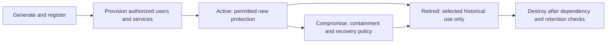
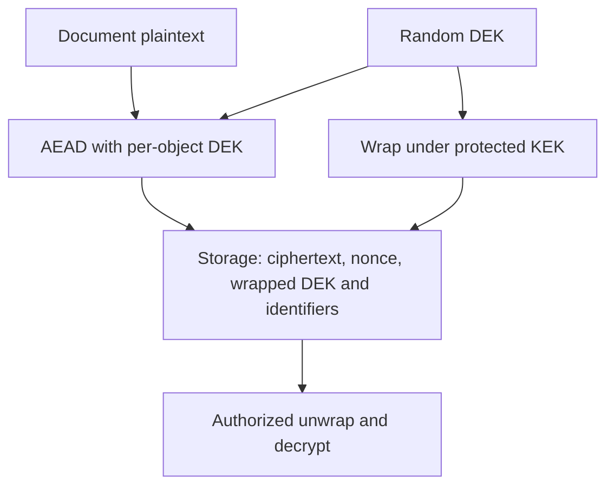
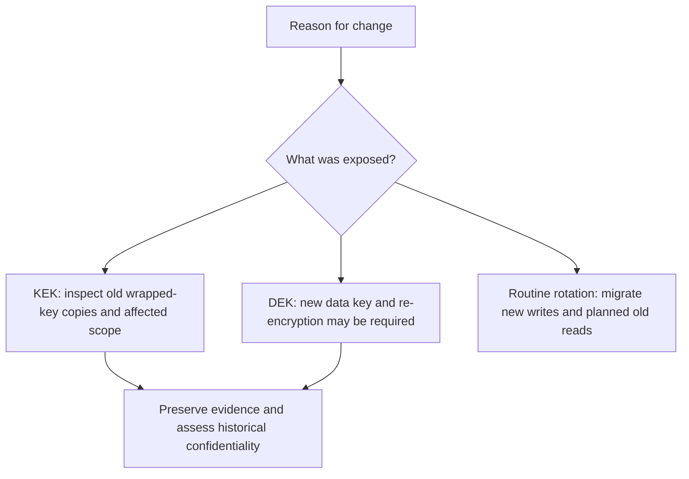

# Session 12: Cryptographic Key Management

**60 minutes taught · 90–120 minutes independently.** [Instructor](../teach/12-key-management.md) · [Notebook](../downloads/session-12-key-management.ipynb)

## Outcomes and setup

Design a key lifecycle, distinguish a data-encryption key (DEK) from a key-encryption key (KEK), demonstrate rewrapping, and explain what rotation does not repair. Review AEAD and the Day 2 threat model. Use the [Day 3 setup](../getting-started/day-3-setup.md); Python blocks run in order with disposable data.

Our running system stores highly confidential documents for twenty years. A well-funded adversary may steal storage, compromise a workload, misuse administrator access or retain old backups. The design must specify what happens after each event, not merely choose AES.

## A lifecycle is a set of permissions



Read the arrows as controlled transitions. A retired encryption key may remain necessary to read old data. A compromised signing key is not made trustworthy by renaming it retired. Define allowed operations, owners and evidence at each transition. Expiration, disabling use, revocation of trust and destruction are different actions.

| Decision | Record before deploying |
| --- | --- |
| Generation | Approved source of randomness or service, algorithm, purpose, identifier and owner |
| Distribution | Who receives raw material or permission to invoke operations, and through what authenticated path |
| Storage/use | Export policy, workload identity, tenant scope, operation limits and audit trail |
| Rotation | Trigger, new-write switch, old-read policy, migration progress and rollback constraints |
| Recovery | Which backups contain keys or wrapped keys, who can restore them, and tested recovery objectives |
| Destruction | All copies/dependencies, retention obligations, approval and evidence of removal |

Derivation can separate purposes, but compromise of a common parent can expose its descendants. Separate keys by purpose and appropriate tenant/data boundary; do not claim that many derived names provide independent custody.

## Envelope encryption

Encrypt each object with a DEK, then wrap that DEK using a KEK. Store the ciphertext and wrapped DEK with enough authenticated format/context information to recover them. A KMS may perform wrapping or unwrapping under access policy. Envelope encryption is a pattern, not proof that plaintext or DEKs never enter application memory.



We use AES Key Wrap from the library for a 32-byte DEK and AES-GCM for data. AES-KW supplies its own integrity mechanism and does not accept AAD in this API. We bind tenant/object context to the data with AEAD. This minimal envelope omits a production wire parser, authenticated routing metadata and remote KMS. See [NIST SP 800-38F](https://csrc.nist.gov/pubs/sp/800/38/f/final) and the [key-wrap API](https://cryptography.io/en/stable/hazmat/primitives/keywrap/).

```python
import secrets
from cryptography.hazmat.primitives.ciphers.aead import AESGCM
from cryptography.hazmat.primitives.keywrap import aes_key_wrap, aes_key_unwrap, InvalidUnwrap
from cryptography.exceptions import InvalidTag

def require_rejection(operation, exception):
    try:
        operation()
    except exception:
        return
    raise AssertionError('Expected rejection')

kek_old = secrets.token_bytes(32)
kek_new = secrets.token_bytes(32)
dek = secrets.token_bytes(32)
nonce = secrets.token_bytes(12)
context = b'archive:v1|tenant=acme|object=7'
plaintext = b'synthetic highly confidential archive document'
ciphertext = AESGCM(dek).encrypt(nonce, plaintext, context)
wrapped_old = aes_key_wrap(kek_old, dek)
recovered_dek = aes_key_unwrap(kek_old, wrapped_old)
assert AESGCM(recovered_dek).decrypt(nonce, ciphertext, context) == plaintext
require_rejection(lambda: aes_key_unwrap(kek_new, wrapped_old), InvalidUnwrap)
require_rejection(lambda: AESGCM(recovered_dek).decrypt(nonce, ciphertext, context + b'!'), InvalidTag)
print('PASS: envelope round trip; wrong KEK and changed context rejected')
```

The expected tenant/object context must come from the authorized request, not solely from attacker-controlled storage. In deployment, constrain key identifiers to an approved registry and bind meaningful metadata under the specified format. A copied record must not grant access just because its own AAD says another tenant.

## Rewrap is not re-encrypt

```python
wrapped_new = aes_key_wrap(kek_new, aes_key_unwrap(kek_old, wrapped_old))
assert aes_key_unwrap(kek_new, wrapped_new) == dek
assert AESGCM(aes_key_unwrap(kek_new, wrapped_new)).decrypt(nonce, ciphertext, context) == plaintext
# An attacker with the old KEK AND an old wrapped-DEK copy still recovers this DEK.
assert aes_key_unwrap(kek_old, wrapped_old) == dek
print('PASS: rewrap changes KEK protection, not the data ciphertext or historical copies')
```

Routine KEK rotation can rewrap DEKs without rewriting bulk data. If the DEK itself was exposed, generate a new DEK and re-encrypt the data with a new nonce. Even re-encryption cannot recall plaintext or ciphertext/key copies already held by the attacker.



Do not destroy the old KEK before all required retained data and backups are recoverable under the new design. Conversely, preserving every old key forever may preserve an adversary's recovery path. Recovery and destruction require a documented decision about retained information, not a universal fixed interval.

## Recovery and separation of duties

Test recovery from a clean environment using realistic key metadata and permissions, not only from a machine with cached credentials. Keep encrypted backups and their recovery authority separate enough to meet the threat model. Record recovery time and data-loss objectives, and verify actual restores against them.

Separate key administration, application use, security review and recovery approval where feasible. Two people sharing one unrestricted administrator account do not provide meaningful separation. Deleting a database row or a Python variable is not secure erasure; cryptographic erasure claims depend on eliminating all usable key copies and considering plaintext caches.

## Practice and answers

1. The KEK rotates, but a five-year-old backup still has the old wrapped DEK. What must remain available for authorized restore? What could a thief use?
2. Does wrapping a stolen DEK under a new KEK restore its secrecy?
3. Which role should approve destruction, and what dependency evidence should it demand?

<details><summary>Worked reasoning</summary><p>Restore needs a permitted path to unwrap the old DEK or a migrated backup. The thief can use an exposed old KEK plus that old wrapped copy. Rewrapping a stolen DEK does not remove the thief's knowledge. A designated data/key owner should approve destruction based on retention, complete key-copy inventory, migration and restore evidence, with independent review appropriate to the risk.</p></details>

Complete the [key-management checklist](../resources/key-management-checklist.md). Next: [protecting keys](13-protecting-keys.md).

## Sources

Reviewed 22 September 2026: [NIST SP 800-57 Part 1](https://csrc.nist.gov/pubs/sp/800/57/pt1/r5/final) for key-management concepts. The lifecycle and examples are teaching designs, not a production cryptoperiod policy or compliance claim.
