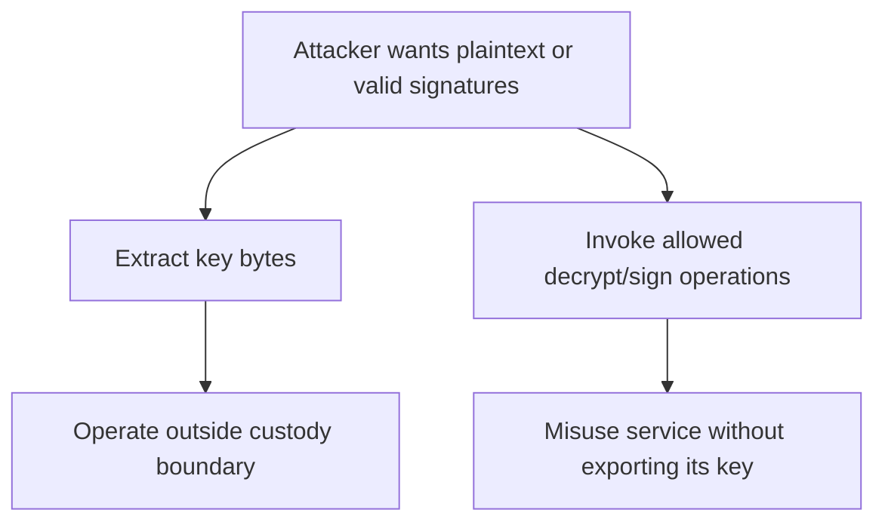
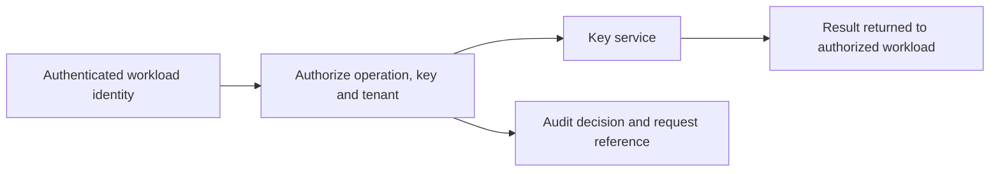

# Session 13: Protecting Cryptographic Keys

**45 minutes taught · 75–90 minutes independently.** [Instructor](../teach/13-protecting-keys.md) · [Notebook](../downloads/session-13-protecting-keys.ipynb)

## Outcomes and setup

Distinguish protecting key bytes from controlling key use; compare secrets managers, KMS, HSM, TPM and enclaves by the boundary each provides; and write a tenant-scoped authorization policy. Review Session 12 and use the [Day 3 setup](../getting-started/day-3-setup.md). The Python exercise is a policy simulation, not an HSM or identity-system implementation.

## Two ways to lose control



An unexportable key can still be misused by a compromised caller. Hardware may prevent extraction while a signing API authorizes a malicious release. Conversely, a tightly restricted API cannot rescue keys written to debug logs. Model both attack paths and the plaintext returned from legitimate operations.

## Choose a boundary, not a product label

| Mechanism | Useful role | Limit to analyze |
| --- | --- | --- |
| Environment variable | Deliver configuration to a process | Process compromise, dumps, child processes and diagnostics can expose values |
| Secrets manager | Centralize secret access, rotation and auditing | A caller authorized to retrieve a secret may copy it |
| KMS | Govern key lifecycle and operations through an API | Service policy, caller identity, regional/service availability and caching matter |
| HSM | Execute cryptography within a hardware protection boundary | Authorized misuse, administration and surrounding plaintext paths remain |
| TPM | Bind keys/measurements to a device and support platform trust uses | Attestation interpretation and policy are still required |
| Secure enclave / TEE | Isolate selected computation from parts of the host | Threat model, attestation, input/output paths and platform vulnerabilities matter |

These categories can overlap. Evaluate actual supported operations, export restrictions, tenancy, backups, assurance evidence and deployment model. A label alone does not prove resistance to the state actor. Not every application needs hardware, and hardware does not make every application trustworthy.

## Authorize a specific use



Identity must be established before the policy evaluation. Do not accept a request body's `principal` field as proof of who sent it. An encryption-context field or tenant label helps only when the service binds it to authenticated identity and the intended record.

```python
grants = {
    ('archive-reader', 'decrypt', 'tenant-acme'),
    ('archive-writer', 'encrypt', 'tenant-acme'),
    ('key-operator', 'rotate', 'tenant-acme'),
}
audit = []
def authorize(authenticated_principal, operation, tenant, request_id):
    allowed = (authenticated_principal, operation, tenant) in grants
    audit.append({'principal': authenticated_principal, 'operation': operation,
                  'tenant': tenant, 'request_id': request_id, 'allowed': allowed})
    return allowed

assert authorize('archive-reader', 'decrypt', 'tenant-acme', 'r1')
assert not authorize('archive-reader', 'decrypt', 'tenant-other', 'r2')
assert not authorize('key-operator', 'decrypt', 'tenant-acme', 'r3')
assert not authorize('unknown', 'decrypt', 'tenant-acme', 'r4')
assert all('plaintext' not in row and 'key_bytes' not in row for row in audit)
print('PASS: simulated policy separates tenant and operation permissions')
```

The simulation assumes its first argument is already authenticated. It has no network authentication, tamper-resistant logging, access control for the grants table or real key service. Never deploy it as a security boundary.

## The compromised authorized caller

```python
# The same approved identity is indistinguishable to this policy after host compromise.
assert authorize('archive-reader', 'decrypt', 'tenant-acme', 'attacker-request')
assert not authorize('archive-reader', 'rotate', 'tenant-acme', 'attacker-rotate')
print('PASS: authorized-use exposure remains, while operation scope limits other actions')
```

This is the central limitation: authorization checks do not magically know whether an allowed workload is now controlled by an attacker. Reduce blast radius through narrower key/data scope, short-lived credentials, constrained workflows, monitoring and isolation. Apply rate or volume controls where meaningful; do not claim that a low limit prevents targeted theft of a single valuable document.

Audit key identifier/version, authenticated actor, operation, decision, workload and trace reference. Avoid logging keys, tokens, plaintext and unnecessary sensitive context. Logs need their own confidentiality, integrity, retention and independent access controls; an application-local list is not an audit system.

## Outage, recovery and emergency access

Failing closed on a unavailable key service preserves one confidentiality boundary but can stop critical work. Define the service objective and recovery design rather than silently caching keys forever or bypassing checks. Caching introduces a new key-copy location and changes revocation latency. Document how long cached capabilities remain useful after access is withdrawn.

Emergency access must have a narrow scope, a named approver, expiry and independent review. A permanently unrestricted “break glass” credential in the same application is another everyday attack path. Test access revocation at the application, identity and key-service layers.

## Practice and answers

An HSM stores a release key, and the build service can request signatures over arbitrary bytes. The build service is compromised. Explain what the HSM may still protect and what it does not. Then propose evidence needed before a privileged administrator can decrypt another tenant's archive.

<details><summary>Worked reasoning</summary><p>The HSM may retain key custody while still returning valid signatures for attacker-chosen releases. Independent release authorization and constrained signing requests address a different boundary. Administrative status alone should not imply data-decrypt permission; require an authorized purpose, tenant-specific access, identity evidence, approvals and auditable expiry under the organization's policy.</p></details>

Exit check: name one extraction risk and one authorized-use risk for your architecture. Continue to [secure architecture](14-secure-architecture.md).

## Source and scope

Reviewed 22 September 2026: [NIST key-management guidance](https://csrc.nist.gov/pubs/sp/800/57/pt1/r5/final). This comparison is architectural; no vendor security certification or hardware resistance is asserted or tested.
