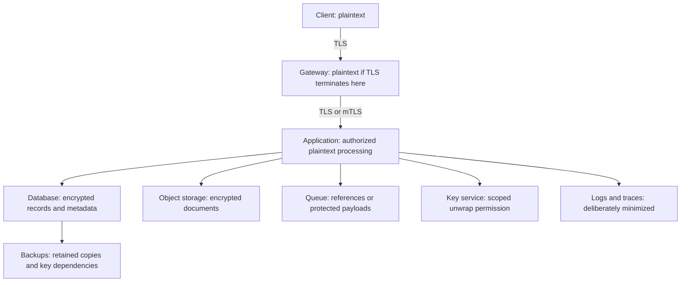
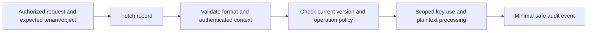

# Session 14: Cryptography in Secure Architecture

**60 minutes taught · 90–120 minutes independently.** [Instructor](../teach/14-secure-architecture.md) · [Notebook](../downloads/session-14-secure-architecture.ipynb)

## Outcomes and setup

Draw plaintext and trust boundaries, distinguish storage theft from application compromise, and specify controls for database, objects, queues, logs and backups. Review TLS termination and envelope encryption. Use the [Day 3 setup](../getting-started/day-3-setup.md). The notebook models explicit assumptions; it neither scans a real system nor proves its security.

## Follow the data after TLS ends



Read each arrow as a separate protection requirement. Re-encrypting a gateway-to-service hop does not hide content from the gateway. Disk encryption can protect a removed device but generally does not stop a database process from returning readable records to an authorized connection. Application encryption may protect copied storage while still exposing plaintext to an application that can decrypt.

If the requirement excludes server operators from reading content, consider client-side/end-to-end protection with keys outside that server boundary. That changes search, recovery, sharing, moderation and device enrollment. Do not promise those properties while keeping universal server-side recovery keys under the same operators.

## Describe surviving protection precisely

| Incident | What may survive | What may fail |
| --- | --- | --- |
| Database/object copy stolen, no keys or service credentials | Application AEAD confidentiality for covered records | Metadata privacy, completeness, availability and any plaintext columns |
| Application host compromised with unwrap rights | Isolation of other tenants/keys if truly scoped | Plaintext processed or decryptable by that identity |
| Backup set stolen | Encryption if usable key material is separately protected | Old wrapped keys plus later exposed KEKs; plaintext exports |
| Privileged key administrator malicious | Data separation if admin cannot invoke decrypt or grant it alone | Separation collapses if admin can silently rewrite use policy |
| Signing workflow compromised | Non-exportable private key custody may remain | Authentic signatures can still authorize malicious artifacts |

Write “under these assumptions” next to every survival claim. A state actor may combine incidents over years. A stolen old backup and a later KEK compromise are not independent stories if together they reveal the data.

## Notebook: enumerate authorized plaintext reach

This small model lists where each principal can receive plaintext in a proposed design. It is an architectural assertion to challenge, not a discovered fact. The gateway here processes an encrypted application payload, unlike the general diagram above; that changed assumption must be explicit.

```python
plaintext_access = {
    'client-acme': {'document-acme'},
    'worker-acme': {'document-acme'},
    'worker-other': {'document-other'},
    'storage-reader': set(),
    'gateway-operator': set(),
    'recovery-officer': {'document-acme', 'document-other'},
}
def exposed_after_compromise(principals, model):
    exposed = set()
    for principal in principals:
        if principal not in model:
            raise ValueError('Unknown principal: model evidence is missing')
        exposed.update(model[principal])
    return exposed
assert exposed_after_compromise(['storage-reader'], plaintext_access) == set()
assert exposed_after_compromise(['worker-acme'], plaintext_access) == {'document-acme'}
assert exposed_after_compromise(['recovery-officer'], plaintext_access) == {'document-acme', 'document-other'}
print('PASS: model makes recovery authority and tenant blast radius explicit')
```

An empty set means “we asserted no plaintext access through this model,” not “no security risk.” Storage readers may still learn sizes and access patterns, delete records or replay old versions. A worker may gain additional rights through escalation, which this model does not infer.

```python
broader_model = {principal: set(assets) for principal, assets in plaintext_access.items()}
broader_model['worker-acme'].add('document-other')
assert exposed_after_compromise(['worker-acme'], broader_model) != exposed_after_compromise(['worker-acme'], plaintext_access)
print('PASS: broadening unwrap/data permissions expands modeled exposure')
```

Use this difference as a review question: can the worker request another tenant's key, impersonate that tenant, change the policy or invoke a recovery path? A diagram's separate boxes are not evidence of enforced isolation.

## Bind records and control replay

Bind tenant, object identity, record purpose and relevant version into the specified authenticated context. Validate against an independently authorized request. AEAD does not inherently stop replay of an intact older record. A database rollback can return valid old ciphertext; current-version state or an authenticated higher-level protocol may be required.

Queues need explicit payload protection, producer/consumer authorization and duplicate handling. Prefer a reference to a protected object where appropriate, but analyze whether that reference leaks sensitive identifiers or becomes a bearer capability. Backups must preserve decryptability and metadata authenticity without quietly restoring revoked access.



Logs should record decisions and references rather than bodies, decrypted records or secrets. Trace systems, error reports, test fixtures, analytics and support exports are additional copies with separate retention and access paths.

## Recovery without bypass

Specify behavior when keys, identity services or storage are unavailable. Test a clean restore with trusted key metadata and updated policies. Availability pressure often creates bypasses: disabled TLS checks, globally shared recovery keys or unbounded plaintext caches. Document a safe service degradation mode rather than assuming the emergency operator will improvise it.

## Practice and answers

Draw two designs: one where the server must search plaintext, and one where server operators must never read document content. Identify at least two capabilities that become harder in the second. For each, decide who owns recovery and what happens after application compromise.

<details><summary>Worked reasoning</summary><p>A plaintext-searching server is inside the confidentiality boundary and must be trusted for that operation. Client-side protection can move that boundary but changes search, sharing, recovery and device enrollment. If the same server can unwrap every client key, the intended operator-exclusion claim is not achieved. Document the chosen tradeoff instead of labelling both designs end-to-end encrypted.</p></details>

Use the [architecture review checklist](../resources/architecture-review.md) and carry your diagram into the [capstone](../capstone/index.md).

## Sources

Reviewed 22 September 2026: [TLS 1.3](https://www.rfc-editor.org/rfc/rfc8446), [NIST key-management guidance](https://csrc.nist.gov/pubs/sp/800/57/pt1/r5/final). Compromise sets in this notebook are synthetic design assumptions, not quantitative risk estimates.
