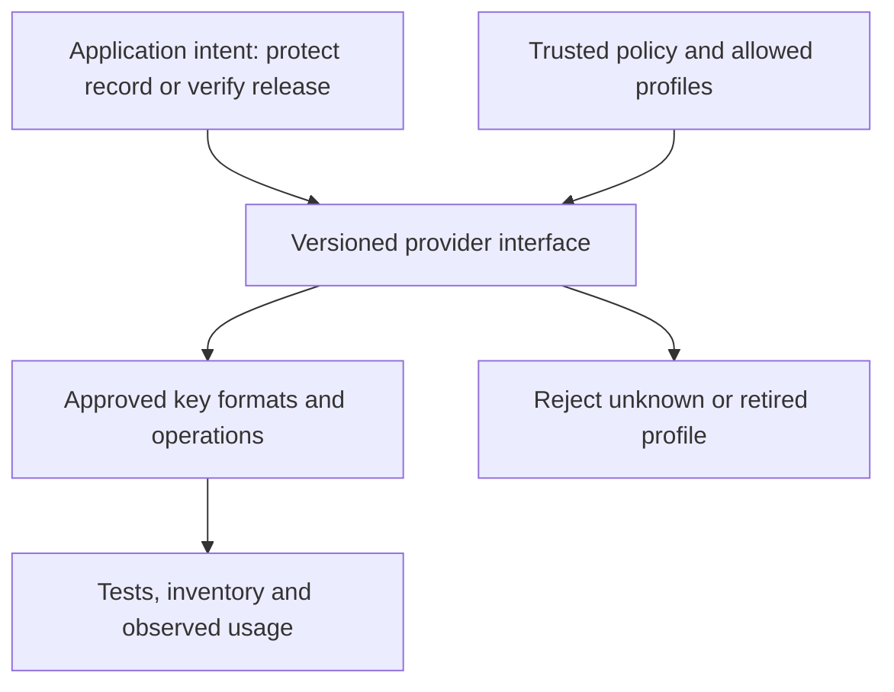
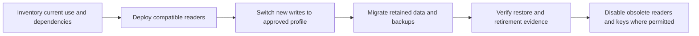

# Session 15: Crypto Agility

**60 minutes taught · 90–120 minutes independently.** [Instructor](../teach/15-crypto-agility.md) · [Notebook](../downloads/session-15-crypto-agility.ipynb)

## Outcomes and setup

Design a versioned cryptographic interface with controlled acceptance, plan old-read/new-write migration, and reject unsafe fallback. Review Sessions 10 and 12. Use the [Day 3 setup](../getting-started/day-3-setup.md). Examples simulate trusted deployment policy; they do not implement protocol negotiation or new encryption formats.

## Agility includes removal

An interface with a hundred algorithms is not necessarily agile. The system must discover dependencies, change approved mechanisms, retain required historical access, reject obsolete protection, test interoperability and observe actual use. Every extra accepted format can extend an attack surface and retirement deadline.



Specify complete profiles, not only algorithm names: parameters, encoding, context, key identifier rules and error behavior matter. A change to certificate algorithms may require parsers, CAs, trust anchors, signing hardware and clients to move together. An abstraction should expose meaningful differences instead of pretending a KEM and a signature have the same contract.

## Controlled format acceptance

The profile names below represent application format versions, not different security strengths. Trusted deployment configuration determines the policy. Untrusted record headers may select only among explicitly allowed readers and must be authenticated by the actual record format.

```python
profiles = {'record-v1': 'legacy-reader', 'record-v2': 'current-provider'}
policy = {'write': 'record-v2', 'read': frozenset({'record-v1', 'record-v2'})}
def select_profile(requested, operation, config):
    if requested not in profiles:
        raise ValueError('Unknown profile')
    if operation == 'write' and requested == config['write']:
        return profiles[requested]
    if operation == 'read' and requested in config['read']:
        return profiles[requested]
    raise ValueError('Profile or operation disallowed')

def expect_policy_rejection(operation):
    try:
        operation()
    except ValueError:
        return
    raise AssertionError('Policy unexpectedly accepted')

assert select_profile('record-v1', 'read', policy) == 'legacy-reader'
assert select_profile('record-v2', 'write', policy) == 'current-provider'
expect_policy_rejection(lambda: select_profile('record-v1', 'write', policy))
expect_policy_rejection(lambda: select_profile('none', 'read', policy))
expect_policy_rejection(lambda: select_profile('record-v2', 'decrypt-anything', policy))
print('PASS: old reads and new writes are distinct; unknown modes reject')
```

This checks policy only. It does not authenticate the selected profile, validate ciphertext or prove that the provider follows its contract. Those are separate tests. Do not route attacker-controlled names into arbitrary imports, key paths or dynamic code.

## Migration as a state transition



Readers generally need support before new writers emit a format. During the overlap, prevent new legacy writes while tracking remaining old records, offline clients and backups. A zero count in the live database is insufficient if disaster recovery still needs the retired reader.

```python
def can_retire(evidence):
    required = {'live_records_migrated', 'backups_recoverable', 'clients_ready',
                'restore_test_passed', 'owner_approved'}
    return set(evidence) == required and all(value is True for value in evidence.values())

evidence = dict.fromkeys(['live_records_migrated', 'backups_recoverable', 'clients_ready',
                          'restore_test_passed', 'owner_approved'], True)
assert can_retire(evidence)
assert not can_retire(dict(evidence, backups_recoverable=False))
assert not can_retire(dict(evidence, owner_approved='yes'))
retired_policy = {'write': 'record-v2', 'read': frozenset({'record-v2'})}
expect_policy_rejection(lambda: select_profile('record-v1', 'read', retired_policy))
print('PASS: retirement requires explicit evidence and removes legacy acceptance')
```

The Boolean fields are assertions requiring evidence, not proof from code. In real systems record the artifact, observer, time and approval behind each field. Policy changes themselves need access control and auditing.

## Downgrade and rollback

Negotiated capabilities must be authenticated under the protocol, and local minimum policy must reject unacceptable selections. Failure does not authorize trying an insecure option. An attacker can deliberately cause timeout or verification failure to trigger permissive fallback.

Rollback should specify the permitted software and profile floor, not simply “restore yesterday's configuration.” If a primitive or implementation is retired because it is compromised, rolling back into its use may violate the security objective. A safer rollback can pause writes, preserve readable data under constrained recovery policy, or revert application code while keeping the required cryptographic floor.

| Test | Evidence expected |
| --- | --- |
| Old/new compatibility matrix | Each permitted producer/consumer pair succeeds; forbidden combinations reject |
| Unknown version/parameter | Rejection without automatic fallback |
| Key/certificate format migration | Recovery of approved historical objects with authentic metadata |
| Downgrade manipulation | Authenticated negotiation and minimum policy stop weakening |
| Retirement | Live use, offline clients and restore paths are accounted for |
| Observability | Actual profile and key-version use visible without secret logs |

Pin and inventory library/backend dependencies, rehearse updates, monitor changes in parsing/error behavior, and keep an owner for the interface. An algorithm switch in YAML is not a complete migration plan.

## Practice and answers

A new profile is ready, but a disaster-recovery reader only accepts the old one. Can new writes begin? Can the old reader be deleted? What evidence would change your answer?

<details><summary>Worked reasoning</summary><p>New writes require a recovery path that can read them, so update or replace the recovery reader before relying on that format for retained data. Old-reader retirement additionally needs evidence for all old live and backup objects. Test a clean restore rather than inferring compatibility from the primary application. A documented exception must identify the risk owner and duration; it is not silent fallback.</p></details>

Use the [agility checklist](../resources/crypto-agility-checklist.md). Next: [migration architecture](16-pqc-migration.md).

## Sources

Reviewed 22 September 2026: [NCCoE migration project](https://www.nccoe.nist.gov/applied-cryptography/migration-to-pqc), [TLS 1.3](https://www.rfc-editor.org/rfc/rfc8446). The profile state machine is an illustrative application policy, not a standardized wire protocol.
