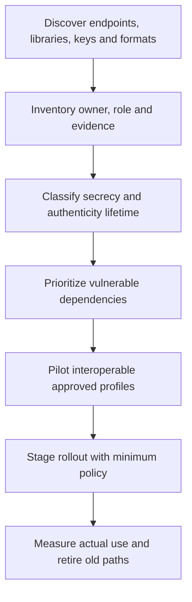
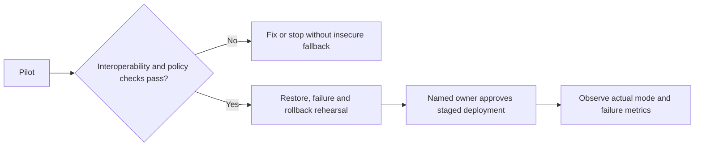

# Session 16: Post-Quantum Migration Architecture

**60 minutes taught · 90–120 minutes independently.** [Instructor](../teach/16-pqc-migration.md) · [Notebook](../downloads/session-16-pqc-migration.ipynb)

## Outcomes and preparation

Build a cryptographic inventory, prioritize by exposure and information lifetime, order dependencies, and define acceptance/rollback evidence. Review the Day 2 quantum, hybrid and signature lessons and Session 15's retirement policy. Use the [Day 3 setup](../getting-started/day-3-setup.md).

PQC migration changes public-key dependencies across transport, identity, certificates, key wrapping, software updates and archives. It does not require replacing every symmetric primitive with a public-key algorithm. The state actor's ability to collect now and exploit later makes long-lived confidentiality important, but signing and recovery dependencies can also determine sequencing.

## Discover actual use



An inventory entry should identify the asset/flow, primitive's role, exact implementation/profile, key/trust owner, exposure evidence, affected peers, upgrade route and retention. “Uses RSA” is too vague: signing updates, wrapping archived DEKs and authenticating a web server have different failure consequences.

| Asset | Exposure question | Migration dependency |
| --- | --- | --- |
| Web/API/VPN traffic | Can a recorder recover historical secrets later? | All termination hops and client populations |
| Archive/backups | What public-key protection shields retained key material? | Readers, metadata, restore tools and captured copies |
| Code/firmware signing | Who will verify future updates and historical evidence? | Bootloaders, trust anchors, hardware and signing format |
| PKI/identity | Which chains and credentials are accepted by which systems? | Issuers, verifiers, libraries, devices and policy |
| Messaging/IoT | How are offline participants upgraded and recovered? | Enrollment, long-lived devices and authenticated update paths |

Do not infer negotiated protection from a software package's feature list. Obtain connection evidence, object inspection, configuration and owner confirmation. Unknown use is a discovery task, not a safe default.

## Prioritize with explicit assumptions

Use lifetime, sensitivity, collection exposure and migration lead time. The Session 8 `L + M > H` heuristic helps expose long-lived risk but is not a probability score. A fast-to-upgrade public endpoint may not be the critical dependency if offline archive readers take years. Separate confidentiality and authenticity objectives and identify non-quantum risks that persist.

## Model a dependency plan

The durations below are invented months for a classroom exercise, not vendor commitments or a prediction about quantum computers. A node can start only after all its prerequisites finish. Independent work can proceed in parallel.

```python
from graphlib import TopologicalSorter, CycleError
dependencies = {
    'inventory': set(),
    'profile review': {'inventory'},
    'verifier upgrade': {'profile review'},
    'trust provisioning': {'verifier upgrade'},
    'transport pilot': {'profile review'},
    'restore rehearsal': {'trust provisioning'},
    'rollout': {'transport pilot', 'restore rehearsal'},
}
duration = {'inventory': 2, 'profile review': 1, 'verifier upgrade': 4,
            'trust provisioning': 2, 'transport pilot': 3,
            'restore rehearsal': 1, 'rollout': 2}
order = list(TopologicalSorter(dependencies).static_order())
finish = {}
for task in order:
    start = max((finish[parent] for parent in dependencies[task]), default=0)
    finish[task] = start + duration[task]
assert finish['rollout'] == 12
print('PASS: dependency plan computes a 12-month hypothetical completion path')
```

```python
import matplotlib.pyplot as plt
fig, ax = plt.subplots(figsize=(8, 4))
for index, task in enumerate(order):
    ax.barh(index, duration[task], left=finish[task] - duration[task])
ax.set_yticks(range(len(order)), order)
ax.invert_yaxis()
ax.set(xlabel='Months from project start — invented assumptions', title='Dependency-constrained teaching plan')
fig.tight_layout()
plt.show()
broken = {task: set(parents) for task, parents in dependencies.items()}
broken['inventory'].add('rollout')
try:
    list(TopologicalSorter(broken).static_order())
except CycleError:
    pass
else:
    raise AssertionError('Dependency cycle not detected')
print('PASS: plotted assumptions and rejected circular dependencies')
```

This model omits staffing conflicts, budget, external approvals and uncertainty. Ask which estimates need ranges and which tasks share scarce people. A graph ordering is not an approved migration schedule.

## Define gates before rollout



Specify success for protocol/profile compatibility, identity validation, message limits, performance distributions, failure handling, restore and safe rollback. Log negotiated modes and error categories without secrets. A successful happy-path microbenchmark is not deployment readiness.

NIST standardized ML-KEM, ML-DSA and SLH-DSA as different primitives. Select implementation and protocol profiles through current standards, ecosystem support and organizational assurance requirements. Do not equate a FIPS algorithm name with a FIPS-validated runtime or claim that a teaching combiner is a deployed hybrid protocol.

Captured history remains a limit. Rewrapping current archives or switching a transport does not remove an adversary's older ciphertext/key-material copies. Document residual exposure and avoid promising retrospective secrecy from a forward-looking upgrade.

## Practice and answers

An offline device verifies only classical update signatures and cannot parse larger objects. Which tasks must precede reliance on a PQ-signed update? What if the bootloader is immutable? Which owner accepts the remaining risk?

<details><summary>Worked reasoning</summary><p>Discover verifier capability, size limits and authentic update path; upgrade or replace the verifier and provision trust before relying on PQ signatures. An immutable incompatible bootloader may require hardware replacement or a constrained compensating architecture; a library upgrade on the server is insufficient. The device/product risk owner must explicitly accept a residual-risk or retirement plan, with evidence and a deadline.</p></details>

Complete the [migration worksheet](../resources/migration-worksheet.md), then undertake the [architecture capstone](../capstone/index.md).

## Sources

Reviewed 22 September 2026: [NCCoE migration project](https://www.nccoe.nist.gov/applied-cryptography/migration-to-pqc), [FIPS 203](https://csrc.nist.gov/pubs/fips/203/final), [FIPS 204](https://csrc.nist.gov/pubs/fips/204/final), [FIPS 205](https://csrc.nist.gov/pubs/fips/205/final). Recheck profiles, errata and implementation support before a real deployment; no universal migration deadline is asserted here.
