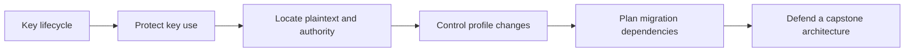

# Day 3: Architecture, Key Management and Migration

Day 3 turns cryptographic mechanisms into a defensible system design. We follow CedarArchive, a service protecting highly confidential documents for twenty years against a well-funded state actor. Each lesson has a self-study explanation, a separate timed instructor guide, diagrams, runnable Python experiments and worked reasoning.

Read the [setup instructions](../getting-started/day-3-setup.md) first. Complete Day 1's AEAD and trust foundations and Day 2's quantum-threat, key-establishment and signature lessons. The unfinished Labs 2–3 are not prerequisites.

| Session | Taught time | Experiment and outcome |
| --- | --- | --- |
| [Session 12: Key management](12-key-management.md) | 60 min | Encrypt and wrap a DEK; demonstrate why rewrapping does not repair historical exposure |
| [Session 13: Protecting keys](13-protecting-keys.md) | 45 min | Distinguish key extraction from misuse of authorized operations |
| [Session 14: Secure architecture](14-secure-architecture.md) | 60 min | Model plaintext exposure and tenant boundaries after compromise |
| [Session 15: Crypto agility](15-crypto-agility.md) | 60 min | Reject prohibited profiles and require evidence before retirement |
| [Session 16: PQC migration](16-pqc-migration.md) | 60 min | Order dependencies, plot a hypothetical schedule and detect cycles |
| [Architecture capstone](../capstone/index.md) | 135 min + 45 min review | Design, attack, revise and defend CedarArchive |

This is 7 hours 45 minutes of instruction and review before breaks. Split delivery across meetings if needed; independent study also requires time to pause, experiment and write decisions.

## Study independently

For each lesson, read the explanation, predict the Python output, run the notebook and change one input. Answer the practice questions before revealing the worked reasoning. Record assumptions and unresolved questions in the linked checklist. The models deliberately expose limits: an HSM does not automatically prevent malicious authorized use, and new encryption cannot recall old copies.

Then complete the [capstone worksheet](../capstone/worksheet.md), respond to the [incident injects](../capstone/incidents.md), and score your reasoning with the [rubric](../capstone/rubric.md). Consult the [worked architecture](../capstone/worked-architecture.md) after writing your first proposal.

## Teach from the website

Open the instructor link at the top of each lesson for timing, predictions, discussion prompts and exit tickets. Use the [capstone facilitation guide](../teach/capstone.md) to introduce incidents gradually. The worked answers are public teaching resources, not hidden examination material.

## Resources to retain

- [Key-management checklist](../resources/key-management-checklist.md)
- [Architecture review](../resources/architecture-review.md)
- [Crypto-agility checklist](../resources/crypto-agility-checklist.md)
- [Migration worksheet](../resources/migration-worksheet.md)

Notebook downloads include all required teaching code. Local execution checks do not replace a live Colab rehearsal or production validation.
