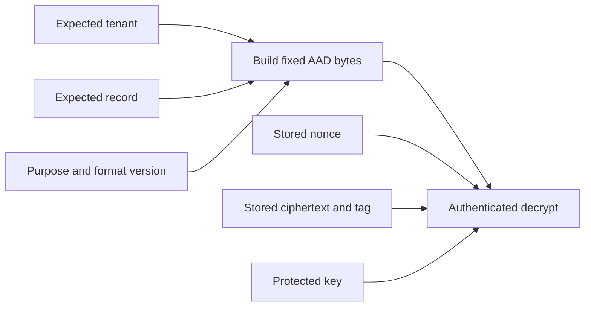

# Lab 1: Hints, solutions, and explanation

**Public self-study companion.** Attempt the [lab](lab-01-aead.md) before reading the implementation.

## Expected observations

| Experiment | Result | Reason |
| --- | --- | --- |
| Original record | Plaintext returned | All authenticated inputs agree |
| Changed ciphertext or tag | `InvalidTag` | The protected bytes no longer verify |
| Changed nonce or key | `InvalidTag` | Verification uses different cryptographic inputs |
| Changed AAD | `InvalidTag` | The expected context differs |
| Same record read twice | Both reads succeed | AEAD does not track freshness |
| Valid empty plaintext | `b""` | Empty content can still be authenticated |

`InvalidTag` does not identify the bad field. In the controlled experiment, the mutation tells us why the check failed.

## Staged hints

<details><summary>Hint 1: validate the format</summary><p>Use <code>len(nonce)</code>. Reject anything other than 12 bytes with <code>ValueError</code>. This is the lab's chosen record format.</p></details>
<details><summary>Hint 2: use the combined API</summary><p>Create <code>AESGCM(key)</code> and call <code>decrypt(nonce, ciphertext, expected_aad)</code>. The ciphertext argument already contains its tag.</p></details>
<details><summary>Hint 3: preserve the failure signal</summary><p>Return the library call directly. The helper does not need a try/except. The application boundary can turn the exception into a controlled rejection.</p></details>

## Reference implementation

```python
from cryptography.hazmat.primitives.ciphers.aead import AESGCM

def decrypt_verified(key, nonce, ciphertext, expected_aad):
    if len(nonce) != 12:
        raise ValueError("This lab format requires a 12-byte nonce.")
    return AESGCM(key).decrypt(nonce, ciphertext, expected_aad)
```

In the notebook, use the name `learner_decrypt_verified` for your implementation. In the local starter, use `decrypt_verified`. The same contract applies.

The function is short because the library handles the cryptography. Its application responsibility is to preserve the authenticated-decryption boundary. Catching every exception and returning `b""` would fail that responsibility and confuse a valid empty message with an error.

## How the complete record helper works

The shared reference implementation in `src/crypto_workshop/aead.py` adds a fresh random nonce on encryption and a fixed AAD encoding. Its identifiers are restricted to 1–64 ASCII letters, digits, underscores, and hyphens. This reduces encoding ambiguity for the exercise; it is not a universal rule for tenant identifiers or interoperable JSON.



The expected identifiers must come from an authorized request or another trusted source. The helper does not perform authorization itself. The reference deliberately does not add a replay database or production key-management system.

## Explain the extensions

**Collision graph:** repeated random selection does not guarantee uniqueness. Small toy spaces show the birthday effect; the 96-bit calculation illustrates scale, not a complete GCM usage policy.

**Nonce reuse:** repeating the same key/nonce repeats the encryption stream. XORing two ciphertext contents cancels it, exposing the XOR of the plaintexts. Knowing one plaintext reveals the other over the overlapping length. The authentication tags are excluded only for this algebraic demonstration. Tag forgery is outside this lab.

**ChaCha20-Poly1305:** the similar API helps compare engineering requirements. It still requires nonce uniqueness, matching context, protected keys, and authenticated failure handling.

## Model exit answers

1. Keep the key secret. The nonce, ciphertext, tag, and AAD can be public; AAD is not where secrets belong.
2. `InvalidTag` means verification failed. It does not identify the wrong input or prove a malicious cause.
3. The recipient reconstructs AAD from the independently expected tenant and record, causing copied records from another context to fail.
4. The old record remains cryptographically authentic; freshness needs additional trusted state or protocol rules.
5. Every new encryption under a key needs a new nonce, even if the plaintext repeats.

For further reading, use the [lesson's primary references](../day-1/02-symmetric-aead.md#references).
