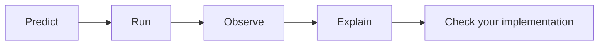
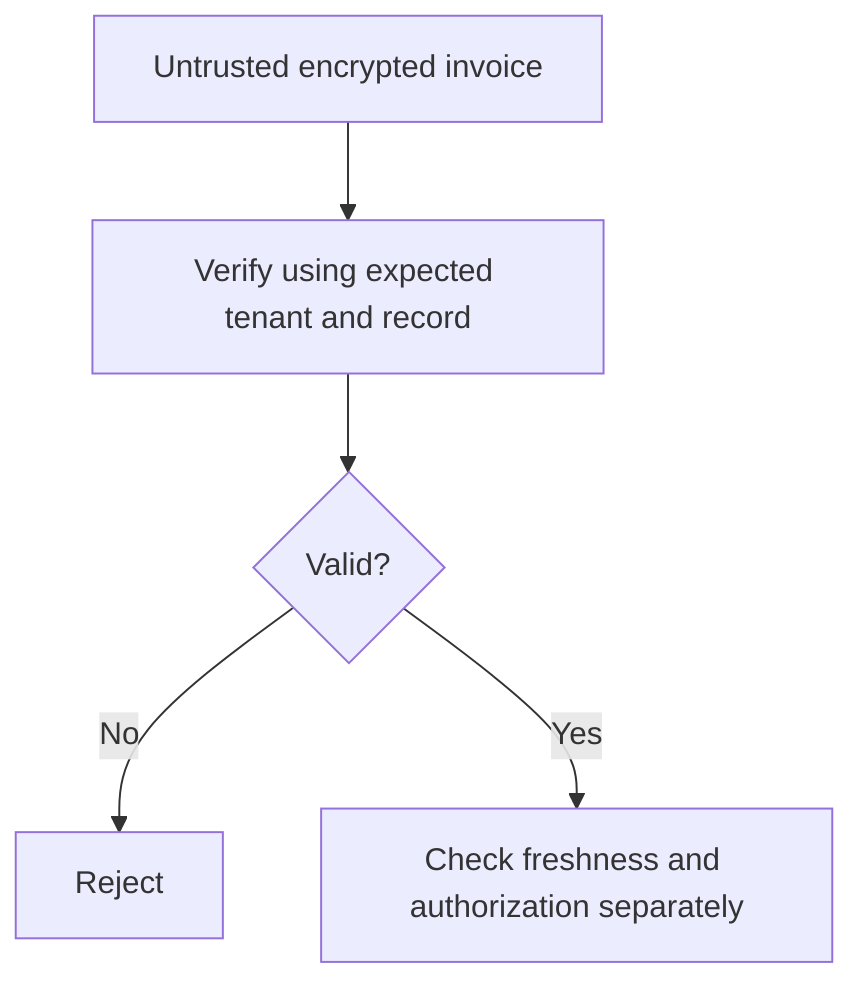

# Lab 1: Authenticated Encryption

**Student lab manual · 60-minute guided core · 90–120 minutes independently with extensions.**

[Self-study lesson](../day-1/02-symmetric-aead.md) · [Instructor lab guide](../teach/lab-01-aead.md) · [Hints and solution walkthrough](lab-01-aead-solutions.md)

## Your mission

Protect a synthetic invoice using AES-GCM, detect modifications before using plaintext, and bind the record to an expected tenant and invoice ID. Then explain which risks remain: replay, deletion, length leakage, and key compromise.

Complete the [AEAD lesson](../day-1/02-symmetric-aead.md) first. You need Python byte strings, functions, exceptions, and assertions. Use only generated lab keys and synthetic records.

## Open the notebook

1. [Download Lab 1](../downloads/lab-01-aead.ipynb).
2. Open [Google Colab](https://colab.research.google.com/), choose **File → Upload notebook**, and select the downloaded file.
3. Use a CPU runtime, save your own copy, and run setup. No GPU, repository clone, credentials, or external dataset is required.
4. Work sequentially. Stop at the learner exercise before opening the reference solution.

The notebook is self-contained and includes interactive controls plus plain-function alternatives. A direct GitHub-backed Colab button will be added when the course repository is published. Local Jupyter is also supported; see [setup](../getting-started/lab-setup.md).

## The experiment cycle



Keep a short observation table rather than copying every encrypted byte. Encrypted outputs vary across runs; behaviors and lengths should be consistent.

## Step 1 — establish the successful workflow

Run notebook Sections 1–2. Generate a 256-bit key and a 12-byte nonce, encode the invoice, and encrypt it with visible AAD. Verify that decrypting with the original inputs recovers the invoice.

**Record:** plaintext length, returned ciphertext/tag length, and nonce length. The returned value is 16 bytes longer than the plaintext. With the separately stored nonce, binary overhead is 28 bytes before AAD or serialization.

**Explain:** why is it acceptable to save the nonce alongside the encrypted bytes? Why would saving the key there undermine the stolen-database protection boundary?

## Step 2 — change one input at a time

Run Section 3. Use the dropdown or call `run_trial("ciphertext")`, `run_trial("tag")`, `run_trial("nonce")`, `run_trial("key")`, and `run_trial("aad")`.

| Trial | Your prediction | Observation | Explanation |
| --- | --- | --- | --- |
| Original inputs | | | |
| One ciphertext bit changed | | | |
| One tag bit changed | | | |
| Nonce changed | | | |
| Key changed | | | |
| Expected AAD changed | | | |

Expected behavior: only the unchanged record authenticates. Changed authentication inputs cause `InvalidTag`. The exception does not locate the bad input; you know it only because you chose the mutation.

## Step 3 — implement authenticated decryption

Complete `learner_decrypt_verified` in Section 4. It accepts `key`, `nonce`, `ciphertext`, and `expected_aad` as bytes.

The contract is:

- A nonce of a length other than 12 bytes raises `ValueError` for this lab format.
- Successful authenticated decryption returns exactly the original bytes.
- Modified authentication inputs and truncated encrypted data raise `InvalidTag`.
- A valid empty message returns `b""`.
- No failure path returns substitute plaintext or retries without verification.

Start with the staged hints if needed. Run Section 5 after each attempt. **NOT ATTEMPTED is not a pass.** A failing assertion means your implementation does not yet meet the contract. Read the supplied solution only after making an attempt.

### Equivalent local exercise

From the repository root, after installation:

```powershell
.\.venv\Scripts\python labs/lab-01-aead/starter.py
# Edit decrypt_verified in starter.py, then:
.\.venv\Scripts\python labs/lab-01-aead/check_exercise.py
```

The local checks intentionally fail until you implement the starter. On macOS/Linux, use `.venv/bin/python`.

## Step 4 — test context binding and replay

Run Sections 6–8. The reference helpers construct AAD from a fixed purpose/version, tenant, and record ID. They reject moving the record to another expected tenant or record. They accept decrypting the unchanged record twice.



**Write two explanations:** where expected tenant/record values must come from, and why authentication does not reject an old but valid copy. An application needs independent authorization and freshness rules; AAD does not implement those rules itself.

## Extensions — investigate the failure mechanisms

In Section 9A, change the toy nonce size and observe the collision curve. State why small-space intuition should not be confused with a production GCM usage limit.

In Section 9B, run the isolated, deliberately broken nonce-reuse demonstration. Explain how known plaintext and two ciphertexts reveal the second plaintext without the key. Do not copy that nonce allocation into your normal helper.

In Section 9C, compare ChaCha20-Poly1305's interface and failure behavior. Use its separately generated key; compare the API contract rather than claim a performance winner from one run.

## Completion checklist

- Your own function passes the learner acceptance checks.
- You filled the mutation table and can explain `InvalidTag`.
- You explain how AAD binds the invoice to trusted expected context.
- You distinguish nonce reuse during encryption from repeated decryption and replay.
- You answer the notebook's five exit questions without consulting the solution.

Keep the notebook with your code and written explanations. Clear outputs before sharing and delete the disposable runtime. A passing reference solution does not count as completing your exercise.

## Troubleshooting

| Problem | Action |
| --- | --- |
| An unchanged record suddenly fails | Re-run the setup/encryption sequence; a later run may have replaced the key or nonce |
| Dependency import fails | Run setup in a fresh runtime with internet access; restart after changing already-imported packages |
| Widget is missing | Call the same experiment function directly; all core checks run without widget interaction |
| The checker prints NOT ATTEMPTED | Implement the exercise cell, run that cell, then rerun its checker |
| Only the supplied solution passes | Keep working on the separate learner function; reference and learner results are distinct |

Use the [walkthrough](lab-01-aead-solutions.md) for explanations after your attempt. The [lesson references](../day-1/02-symmetric-aead.md#references) document the underlying APIs and security properties.
