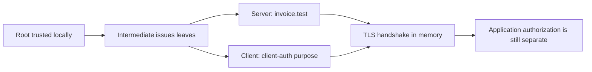

# Lab 4: Build and Use a Mini-PKI

**60 minutes guided · 90–120 minutes independently.** [Notebook](../downloads/lab-04-mini-pki.ipynb) · [Instructor](../teach/lab-04-mini-pki.md) · [Solutions](lab-04-mini-pki-solutions.md)

## Goal and preparation

Create a root, intermediate, server certificate and client certificate. Inspect SAN, validity, Basic Constraints and EKU. Configure trust for a real TLS handshake and prove that wrong identities and missing credentials fail. Complete Sessions 6–7 and the [setup](../getting-started/day-2-setup.md). Helpers are embedded below in the notebook; inspect their source before using them.

<!-- day2:helpers -->



The diagram separates issuing authority, handshake authentication and permissions. No system trust store is modified.

## Task one: create and inspect the hierarchy — 15 minutes

Open `make_pki` in the helper cell. Identify each `.sign` issuer key and the CA/path-length constraints. Predict which private key signs the server leaf and why the server should send the intermediate rather than expect it to become a trust anchor.

```python
keys, certs = make_pki()
for name, cert in certs.items():
    print(name, cert.subject.rfc4514_string(), cert.issuer.rfc4514_string())
    print('  CA:', cert.extensions.get_extension_for_class(x509.BasicConstraints).value.ca)
    print('  Valid until:', cert.not_valid_after_utc.isoformat())
assert certs['server'].issuer == certs['intermediate'].subject
print('PASS: generated and inspected four teaching certificates')
```

Record root and intermediate roles, leaf SAN, and client/server EKU. A subject-name match in this inspection is not chain validation; the next experiment uses the real verifier.

## Task two: predict success and failures — 15 minutes

```python
def observe_tls(case='valid'):
    settings = {
        'valid': {}, 'wrong SAN': {'hostname': 'other.test'},
        'unknown root': {'trust_root': False}, 'expired': {'expired': True},
        'missing intermediate': {'include_intermediate': False},
        'mTLS valid': {'mtls': True},
        'mTLS no client': {'mtls': True, 'send_client': False},
        'mTLS wrong purpose': {'mtls': True, 'client_wrong_eku': True},
    }
    try:
        result = tls_trial(**settings[case])
    except ssl.SSLError as error:
        return 'REJECTED: ' + str(error)
    return 'ACCEPTED: ' + str(result)

print(observe_tls('valid'))
for case in ('wrong SAN', 'unknown root', 'expired', 'missing intermediate',
             'mTLS no client', 'mTLS wrong purpose'):
    assert observe_tls(case).startswith('REJECTED:')
assert observe_tls('mTLS valid').startswith('ACCEPTED:')
print('PASS: six negative TLS cases rejected and mTLS succeeded')
```

Optional notebook control (the direct `observe_tls('wrong SAN')` call is equivalent):

```python
if 'get_ipython' in globals():
    import ipywidgets as widgets
    from IPython.display import display
    display(widgets.interactive(observe_tls, case=['valid', 'wrong SAN', 'unknown root',
        'expired', 'missing intermediate', 'mTLS valid', 'mTLS no client', 'mTLS wrong purpose']))
```

Write which requirement rejected each case. Do not “repair” the experiment by turning verification off.

## Task three: implement a verified connection wrapper — 20 minutes

Implement `learner_connect(hostname, require_client, client_present)` by calling `tls_trial` with matching arguments. Keep trust and hostname checks enabled. Return its result; let required failures raise `ssl.SSLError`. This is a wrapper exercise, not a new certificate validator.

```python
def learner_connect(hostname, require_client, client_present):
    raise NotImplementedError('Implement verified TLS/mTLS configuration')

def check_connection(candidate):
    result = candidate('invoice.test', False, False)
    assert result['version'] == 'TLSv1.3' and not result['client_authenticated']
    assert candidate('invoice.test', True, True)['client_authenticated']
    expect_rejection(lambda: candidate('wrong.test', False, False), ssl.SSLError)
    expect_rejection(lambda: candidate('invoice.test', True, False), ssl.SSLError)

try:
    check_connection(learner_connect)
except NotImplementedError:
    print('NOT ATTEMPTED: learner TLS wrapper')
else:
    print('PASS: learner TLS wrapper')
```

<details><summary>Hints</summary><p>The relevant arguments are hostname, mtls and send_client. Do not pass trust_root=False for a normal connection. Client authentication is required by server policy, not by whether the client happens to offer a certificate.</p></details>

## Reference and debrief — 10 minutes

Read after attempting the task. Reference success is not learner completion.

```python
def reference_connect(hostname, require_client, client_present):
    return tls_trial(hostname=hostname, mtls=require_client, send_client=client_present)
check_connection(reference_connect)
print('PASS: supplied Lab 4 reference checks')
```

Submit your wrapper, the failure table and a paragraph describing what the lab does **not** establish: online revocation, authorization, production key custody and PQ TLS negotiation. Explain why installing an arbitrary root is not a safe fix for an unknown issuer.

Extension: issue a client certificate for a second workload and sketch a mapping from its authenticated identity to allowed invoice operations. Keep that authorization decision distinct from certificate validity. See the [worked solution](lab-04-mini-pki-solutions.md).
