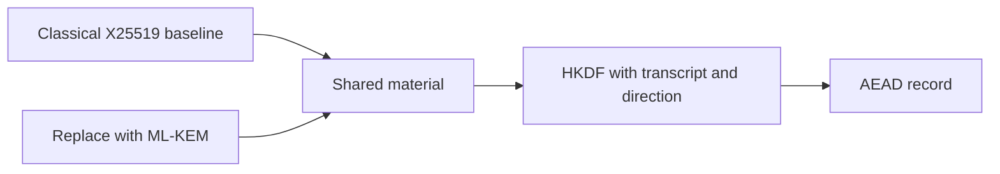

# Lab 5: Build an ML-KEM Secure Channel

**60 minutes guided · 90–120 minutes independently.** [Notebook](../downloads/lab-05-pqc-channel.ipynb) · [Instructor](../teach/lab-05-pqc-channel.md) · [Solutions](lab-05-pqc-channel-solutions.md)

## Goal and boundary

Replace the classical secret-establishment step with ML-KEM-768, then derive directional keys and protect a record with AES-GCM. Compare its public exchange sizes with X25519. Complete Sessions 4 and 9 and [Day 2 setup](../getting-started/day-2-setup.md). This notebook is self-contained and does not depend on the unfinished Day 1 Lab 2.

The title describes a teaching channel construction. Peer identity is assumed through a provisioned public key; we do not implement a complete authenticated transport, TLS profile, key confirmation, record sequencing or replay protection.

<!-- day2:helpers -->



Read the diagram as two alternative establishment experiments, not the hybrid combiner from Session 10.

## Task one: establish and measure — 15 minutes

```python
from cryptography.hazmat.primitives.asymmetric import x25519, mlkem
from cryptography.hazmat.primitives.ciphers.aead import AESGCM
from cryptography.exceptions import InvalidTag
import secrets
a, b = x25519.X25519PrivateKey.generate(), x25519.X25519PrivateKey.generate()
assert a.exchange(b.public_key()) == b.exchange(a.public_key())
bob = mlkem.MLKEM768PrivateKey.generate()
pk = bob.public_key().public_bytes_raw()
sender_secret, ct = bob.public_key().encapsulate()
receiver_secret = bob.decapsulate(ct)
assert sender_secret == receiver_secret
transcript = b'lab5:v1:ML-KEM-768|' + pk + ct
print('X25519 two public contributions:', 32 + 32)
print('ML-KEM-768 public key plus ciphertext:', len(pk) + len(ct))
print('PASS: classical baseline and real KEM agree on their respective secrets')
```

These are raw contribution lengths, not full handshake sizes or an equivalent-security benchmark. Add credentials, framing and retransmission costs in a deployment measurement.

## Task two: implement derivation — 20 minutes

Implement `learner_key(secret, transcript, direction)` to match the lesson's `derive_day2` teaching schedule. Return 32 bytes from HKDF-SHA-256, with `salt=None` and info consisting of `b'workshop-day2:v1|'`, SHA-256 of the transcript, `b'|'`, and the direction. Using the helper is allowed after you explain each field.

```python
def learner_key(secret, transcript, direction):
    raise NotImplementedError('Derive a context-bound directional traffic key')

def check_key(candidate):
    ab = candidate(sender_secret, transcript, b'alice-to-bob')
    assert ab == derive_day2(sender_secret, transcript, b'alice-to-bob')
    assert ab == candidate(receiver_secret, transcript, b'alice-to-bob')
    assert ab != candidate(sender_secret, transcript, b'bob-to-alice')
    assert ab != candidate(sender_secret, transcript + b'changed', b'alice-to-bob')
    nonce = secrets.token_bytes(12)
    record = AESGCM(ab).encrypt(nonce, b'synthetic invoice', b'tenant=acme')
    assert AESGCM(ab).decrypt(nonce, record, b'tenant=acme') == b'synthetic invoice'
    expect_rejection(lambda: AESGCM(ab).decrypt(nonce, record, b'tenant=other'), InvalidTag)

try:
    check_key(learner_key)
except NotImplementedError:
    print('NOT ATTEMPTED: learner KDF')
else:
    print('PASS: learner KDF')
```

<details><summary>Hints</summary><p>Use a new HKDF object for each call. Direction is the traffic direction, not the current caller's identity. Both peers need identical transcript bytes. Omitting the transcript or using the raw KEM secret should fail the checks.</p></details>

## Task three: predict rejection — 15 minutes

```python
def reference_key(secret, transcript, direction):
    return derive_day2(secret, transcript, direction)
check_key(reference_key)
print('PASS: supplied Lab 5 reference checks')

key = reference_key(sender_secret, transcript, b'alice-to-bob')
nonce = secrets.token_bytes(12)
aad = b'invoice=7|tenant=acme'
record = AESGCM(key).encrypt(nonce, b'lab5 confidential message', aad)
def observe_record(case='valid'):
    candidate_secret, candidate_aad, candidate_record = receiver_secret, aad, record
    if case == 'changed KEM ciphertext':
        altered = bytes([ct[0] ^ 1]) + ct[1:]
        candidate_secret = bob.decapsulate(altered)
    elif case == 'wrong recipient':
        candidate_secret = mlkem.MLKEM768PrivateKey.generate().decapsulate(ct)
    elif case == 'changed AAD':
        candidate_aad += b'!'
    elif case == 'changed record':
        candidate_record = bytes([record[0] ^ 1]) + record[1:]
    candidate_key = reference_key(candidate_secret, transcript, b'alice-to-bob')
    try:
        AESGCM(candidate_key).decrypt(nonce, candidate_record, candidate_aad)
    except InvalidTag:
        return 'REJECTED'
    return 'ACCEPTED'
assert observe_record() == 'ACCEPTED'
for case in ('changed KEM ciphertext', 'wrong recipient', 'changed AAD', 'changed record'):
    assert observe_record(case) == 'REJECTED'
expect_rejection(lambda: bob.decapsulate(ct[:-1]), ValueError)
print('PASS: KEM/record failures rejected at the appropriate boundary')
```

```python
if 'get_ipython' in globals():
    import ipywidgets as widgets
    from IPython.display import display
    display(widgets.interactive(observe_record, case=['valid', 'changed KEM ciphertext',
        'wrong recipient', 'changed AAD', 'changed record']))
```

The direct function call is the widget fallback. Same-length invalid KEM ciphertext can yield a fallback secret without an exception; AEAD then fails. Do not treat returned secret length as peer authentication.

## Debrief and submission — 10 minutes

Submit the learner KDF, measured byte counts, failure observations, and three missing protocol protections. Explain why replaying the unchanged record still passes this example and why retaining Bob's decapsulation key can expose recorded exchanges after compromise. State how Bob's public key would become trusted; merely sending it alongside the ciphertext does not solve identity.

Extension: benchmark repeated operations using monotonic timing and report distributions plus platform/version. Keep such measurements separate from algorithm security claims. See [solutions](lab-05-pqc-channel-solutions.md).
