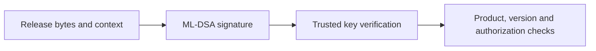

# Lab 6: ML-DSA Signatures

**30 minutes guided · 60–75 minutes independently.** [Notebook](../downloads/lab-06-pqc-signatures.ipynb) · [Instructor](../teach/lab-06-pqc-signatures.md) · [Solutions](lab-06-pqc-signatures-solutions.md)

## Goal and preparation

Implement fail-closed ML-DSA verification with a trusted key and purpose context. Measure signature size and distinguish signature validity from release authorization. Complete Sessions 5 and 11 and use [Day 2 setup](../getting-started/day-2-setup.md). Only synthetic release bytes are used; nothing is installed.

<!-- day2:helpers -->



Verification does not replace the final policy box.

## Task one: sign and measure — 5 minutes

```python
from cryptography.hazmat.primitives.asymmetric.mldsa import MLDSA65PrivateKey
from cryptography.exceptions import InvalidSignature
signer = MLDSA65PrivateKey.generate()
trusted_key = signer.public_key()
message = b'firmware:v1|product=training-device|version=9|digest=synthetic'
context = b'lab6-release'
signature = signer.sign(message, context)
trusted_key.verify(signature, message, context)
assert len(signature) == 3309
print('PASS: generated ML-DSA-65 signature; bytes:', len(signature))
```

## Task two: implement the verifier — 15 minutes

Implement the learner function to return `True` only on successful verification, and `False` on `InvalidSignature`. It receives an already trusted public key. Do not replace it with a key from the signed bundle, alter bytes, ignore context, or catch every exception as success.

```python
def learner_verify(public, message, signature, context):
    raise NotImplementedError('Verify exact bytes and context')

def check_verifier(candidate):
    assert candidate(trusted_key, message, signature, context) is True
    assert candidate(trusted_key, message + b'!', signature, context) is False
    assert candidate(trusted_key, message, signature, b'wrong-purpose') is False
    assert candidate(trusted_key, message, signature[:-1], context) is False
    other = MLDSA65PrivateKey.generate().public_key()
    assert candidate(other, message, signature, context) is False

try:
    check_verifier(learner_verify)
except NotImplementedError:
    print('NOT ATTEMPTED: learner ML-DSA verifier')
else:
    print('PASS: learner ML-DSA verifier')
```

<details><summary>Hints</summary><p>The library returns None on success and raises InvalidSignature for the expected cryptographic mismatch. Pass signature, message and context in that order. Return an explicit Boolean; do not rely on the truthiness of verify's return value.</p></details>

## Reference, controls and debrief — 10 minutes

```python
def reference_verify(public, message, signature, context):
    try:
        public.verify(signature, message, context)
    except InvalidSignature:
        return False
    return True
check_verifier(reference_verify)
print('PASS: supplied Lab 6 reference checks')

def observe_signature(case='valid'):
    if case == 'changed message':
        return reference_verify(trusted_key, message + b'!', signature, context)
    if case == 'changed context':
        return reference_verify(trusted_key, message, signature, b'other')
    if case == 'truncated':
        return reference_verify(trusted_key, message, signature[:-1], context)
    return reference_verify(trusted_key, message, signature, context)
assert observe_signature() and not observe_signature('changed context')
if 'get_ipython' in globals():
    import ipywidgets as widgets
    from IPython.display import display
    display(widgets.interactive(observe_signature, case=['valid', 'changed message', 'changed context', 'truncated']))
```

Use `observe_signature('changed message')` without widgets. Explain why a trusted signer can still sign the wrong product and why a replayed intact signature still verifies. Reuse Session 5's acceptance-policy reasoning; do not parse and install arbitrary signed bytes.

Submit your verifier, failure table, measured signature/public-key sizes, and a proposal for authenticating a replacement verification key to an offline device. Reference checks are not learner completion. Extension: test an AND versus OR acceptance policy for two signature families and describe the downgrade implications. See [solutions](lab-06-pqc-signatures-solutions.md).
