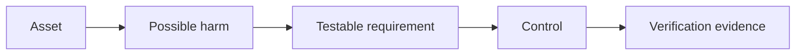
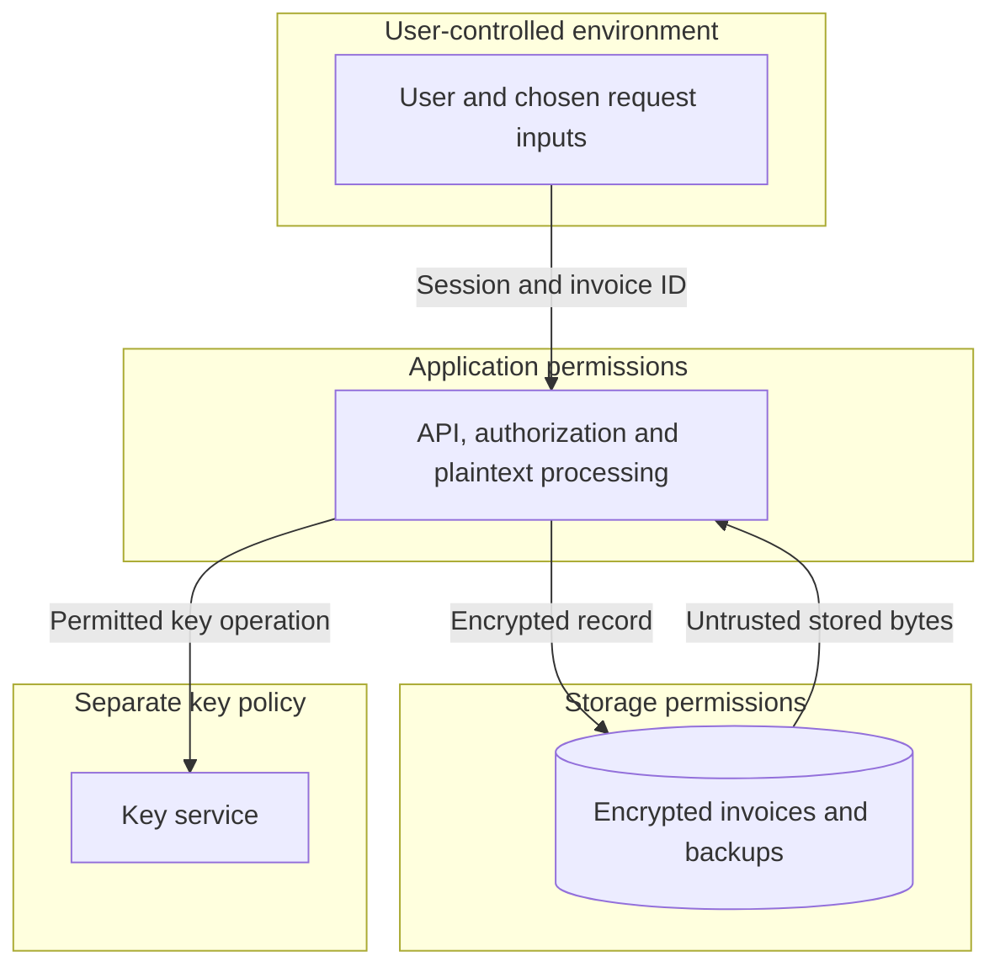
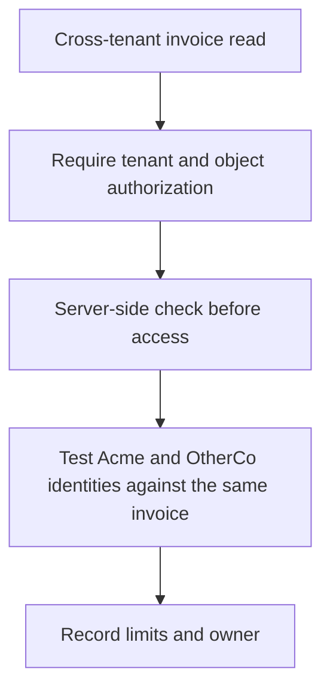
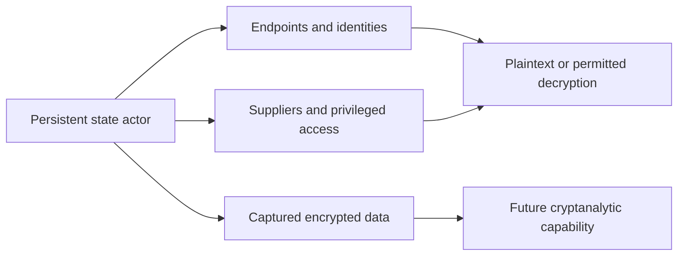

# Teaching Session 1: Security Requirements and Threat Models

**Instructor page · 40 minutes.** [Self-study lesson](../day-1/01-security-requirements.md) · [Worksheet](../resources/threat-model-worksheet.md) · [Next instructor page: AEAD](02-aead.md)

The outcome is a small, defensible threat model, not a list of algorithm names. Use the invoice service throughout so that Session 2 can implement one requirement from the same scenario.

## Prepare before class

Open the worksheet and the diagrams below. No Python environment is needed. Ask learners to work in pairs and choose one person to explain assumptions while the other records them. Keep the self-study worked answers closed until after their attempt.

Write this incomplete claim on the board: **“We use AES-256 and HTTPS, so our invoice service is secure.”** Return to it at the end.

## 0–5 minutes: turn a promise into a requirement

**Explain:** “Alice submits invoices for Acme, and Bob reviews them. OtherCo uses the same application. We need to decide who may read an invoice, what changes must be detected, and what remains protected if the database is stolen.”

Ask: **“Secure against whom, and with access to what?”** Encourage capabilities: an account in another tenant, a database snapshot, or control of the running application.

**Explain:** “AES is a mechanism choice. ‘An OtherCo account cannot read Acme's invoice even if it knows the ID’ is a requirement. We can design an authorization check and then test that claim.”

Ask a learner to rewrite “keep backups secure.” A useful answer states that a storage-only thief cannot recover invoice contents, explicitly assuming the keys are not included.

## 5–12 minutes: separate the properties

Use short prompts instead of reading every definition from the learner table:

| Prompt | Expected property and explanation |
| --- | --- |
| Another tenant reads the invoice | Confidentiality failure, often caused by missing authorization |
| A stored amount is changed without detection | Integrity failure |
| The service accepts a forged session | Authentication failure |
| An old valid invoice replaces the newest one | Freshness failure; authentication of bytes may still succeed |
| The only encryption key is lost | Availability/recoverability failure |

**Explain:** “Authentication asks which identity or credential is verified. Authorization asks what that actor may do. Being logged in is not permission to read every invoice.”

For non-repudiation, say: **“A signature can be part of evidence about an action. It does not independently prove a human's understanding or intent, and its attribution depends on who controlled the key. Shared-key tags do not distinguish which key holder authored a message.”** Defer signature mechanics to Session 5.

Check: **“Could an invoice be authentic but factually wrong?”** Yes. Cryptographic integrity does not replace business validation.

## 12–20 minutes: draw the system and its boundaries

Trace one invoice aloud: browser plaintext, protected transport, application plaintext, encrypted storage, backup copy. Ask: **“Where would a plaintext debug log fit?”** Add it to the application side and discuss its independent readers and retention.

**Explain:** “A trust boundary is where permissions, identity, administration, or assumptions change. Crossing one prompts a validation question. A private network is not proof of trust, and drawing a box does not enforce a policy.”

At the key-service arrow, distinguish **extracting a key** from **being allowed to request decryption**. Do not imply that every KMS exports keys; designs differ and are covered later.

## 20–24 minutes: model one threat completely

Ask for a concrete sentence using this structure: **actor + capability + action + harm**.

Example: “An OtherCo user with a valid session changes the invoice ID and reads an Acme invoice because the API does not check object ownership.”

**Explain:** “The diagram is not the finished model. The requirement, control, verification, owner, and remaining risk make it actionable.”

Use STRIDE briefly as a prompt: impersonation, changes, missing evidence, disclosure, denial of service, and greater privileges. Refer learners to the [self-study table](../day-1/01-security-requirements.md#step-d-write-concrete-threat-statements). Avoid spending the exercise filling every category mechanically.

Ask which threat they would address first and require a reason based on reachability and impact. Do not request invented numerical probabilities.

## 24–28 minutes: raise the stakes — a state actor

**Explain:** “Now these records include highly confidential strategic documents that must remain secret for 20 years. Our adversary is well funded, persistent, and interested in this organization. We must analyze more paths to keys and plaintext. That does not mean we assume they can magically break any algorithm.”

Ask: **“Which assumptions in our storage-only model are now too narrow?”** Expected answers include authorized devices, application permissions, insiders, suppliers, metadata, and long-lived copies. Ask learners to name a specific capability rather than use “state actor” as an explanation for everything.

**Explain:** “A key protected from export may still be usable by a compromised workload. Encryption at endpoints does not make compromised endpoints trustworthy. Future quantum risk concerns particular public-key mechanisms; it is not a claim that all encryption can already be broken.”

Point to the [extended self-study scenario](../day-1/01-security-requirements.md#6-stronger-adversary-a-well-funded-state-actor) for the requirement/control table and harvest-now-decrypt-later timeline. Keep algorithm selection and PQC implementation for their later sessions.

## 28–36 minutes: paired exercise and incident injection

Use the worksheet. Allocate five minutes to scope, three assets, two actors, and **two complete threat rows**, including one route relevant to the well-funded adversary. Independent learners can complete the third row and long-term collection extension after class.

At minute 33, announce: **“The application server is fully compromised. The key service is not.”** Give pairs a minute to revise one claim, then hear two responses.

Expected reasoning: the attacker may request decryption with the application's existing permissions and observe plaintext even when the raw key is non-exportable. Storage-only protection is not a promise about a compromised endpoint. Narrow permissions, separation, auditing, and response measures have specific benefits but do not undo access the compromised process legitimately has.

If learners say “the KMS solves it,” ask **“Can the application normally decrypt this invoice? What stops the attacker from making the same request?”** If they say “encryption is useless,” return to the storage-only attacker and show the narrower claim that still matters.

## 36–40 minutes: exit check and AEAD handoff

Ask learners to complete these statements:

1. “Our asset is ___, and the attacker can ___.”
2. “We require ___, and we will verify it by ___.”
3. “This protection assumes ___ and does not cover ___.”

Return to the opening AES/HTTPS claim. Learners should now identify missing authorization, freshness, endpoint assumptions, key handling, and recovery requirements.

**Bridge:** “Next, we protect one stored invoice against disclosure and modification by a storage-only attacker. AEAD will implement that part of the model. Keep the remaining requirements in view.”

## Formative assessment

| Evidence | Satisfactory response |
| --- | --- |
| Scope and assumptions | Names the modeled flow and at least one condition that limits the claim |
| Actors and boundaries | Distinguishes storage access from runtime access and labels a boundary-crossing flow |
| Threat and response | Connects a plausible actor/action to a testable requirement and control |
| Verification and limits | Proposes a meaningful check and states one residual risk |

Give one point per row as teaching feedback. This is not a separate graded exam or a change to the overall course assessment weights.

## Common misconceptions

| Statement | Follow-up explanation |
| --- | --- |
| “HTTPS prevents another tenant reading my data.” | Transport protection does not decide which authenticated user may access an object. |
| “Encrypted means never plaintext.” | Follow the data into application memory and the receiving endpoint. |
| “A valid signature proves the invoice is true.” | It concerns signed bytes and key use; truth and approval require additional evidence. |
| “The internal network is trusted.” | Ask which identities, permissions, and validation rules enforce that assumption. |
| “Threat modeling is a one-time diagram.” | New features, deployments, permissions, and incidents can change the analysis. |

Use the [self-study references](../day-1/01-security-requirements.md#references) for the underlying methods. Rehearse the 40-minute timing with the intended audience before delivery.
