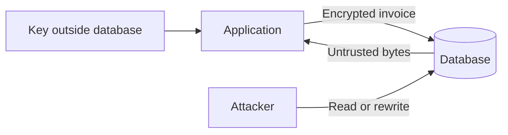
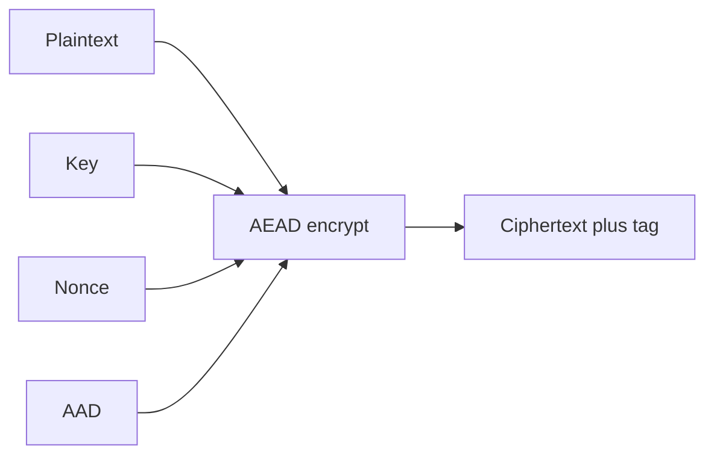
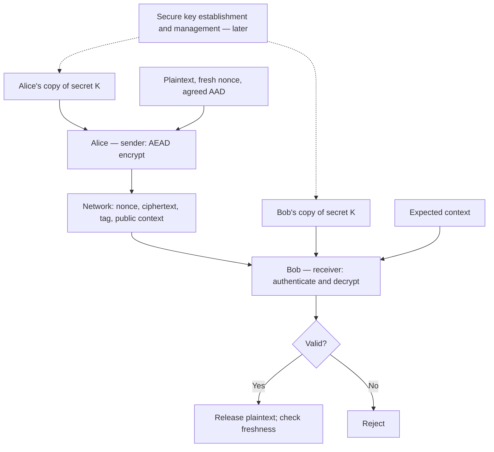
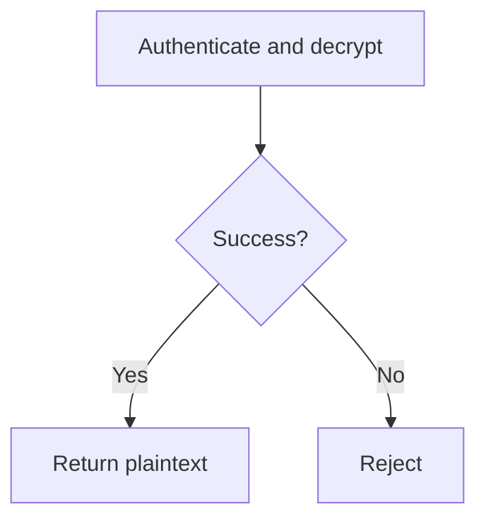
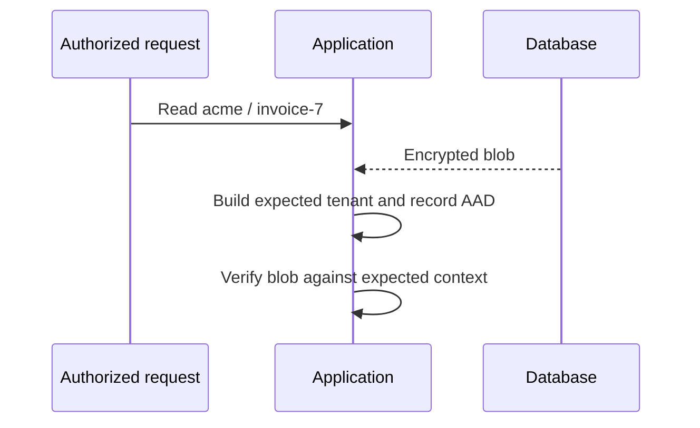
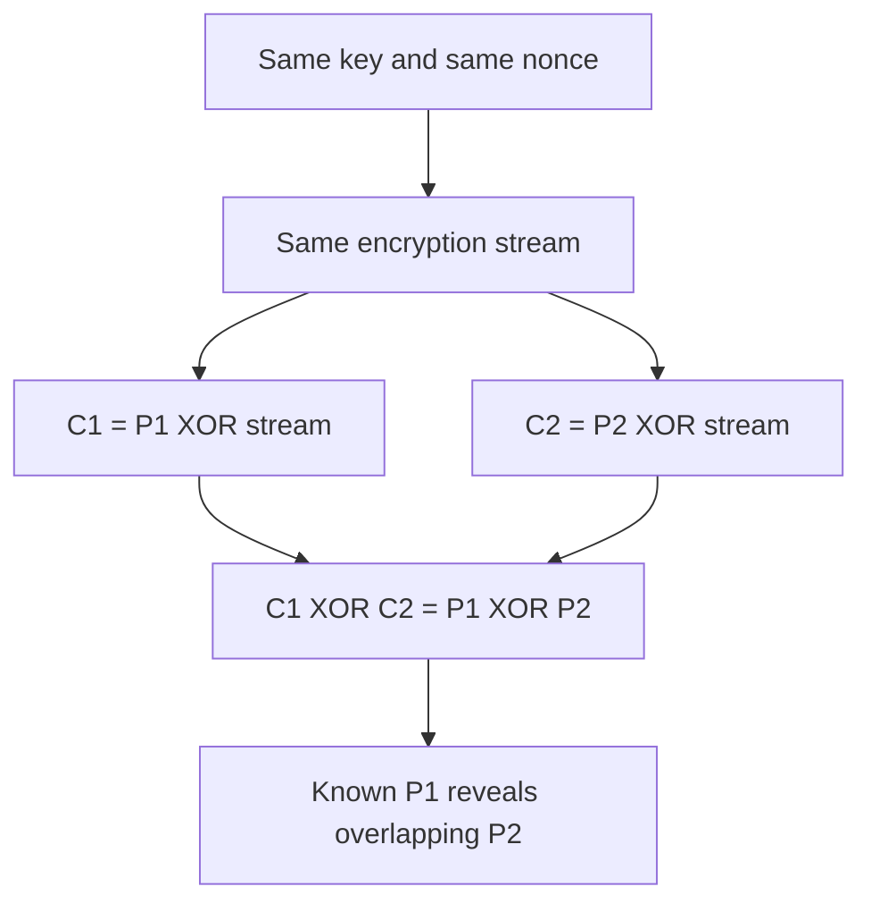

# Teaching Session 2: Symmetric Cryptography and AEAD

**Instructor page · 60 minutes.** [Learner lesson](../day-1/02-symmetric-aead.md) · [Lab facilitation](lab-01-aead.md)

This page is a teaching sequence you can use while explaining the topic. The learner page contains the full reading and answers. Keep the notebook ready for short demonstrations; do not spend the lesson installing software.

## Prepare before class

- Run the notebook from a fresh kernel with the pinned requirements.
- Check that the website renders the diagrams on the projector.
- Have a local copy of the lesson and notebook if internet access is unreliable.
- Use only the synthetic invoice and fresh keys. Do not paste organizational secrets into demonstrations.
- Ask learners to keep three columns in their notes: prediction, observation, explanation.

## 0–8 minutes: establish the protection boundary

**Explain:** “We store invoices for different companies. An attacker can read or rewrite the database. Our application holds a secret key outside that database. We need to hide invoice contents and reject records that are changed or placed in the wrong context.”

Point first to the attacker, then to the key. Ask: **“What changes if the attacker also controls the application?”** Expected answer: the attacker may obtain the key or plaintext; database encryption alone does not contain that compromise. This establishes the assumption before discussing algorithms.

Ask learners to name two separate requirements: hiding the amount and rejecting an altered amount. Introduce confidentiality and integrity/authenticity using their answers.

## 8–18 minutes: identify the five pieces

**Explain:** “Symmetric encryption uses a shared secret key. AES is a block cipher, so its name alone does not identify a complete message-protection scheme. AES-GCM is an authenticated-encryption construction. ChaCha20-Poly1305 fills a similar role using different building blocks.”

Draw the inputs one at a time:

**Explain:** “The key stays secret. The nonce selects a new encryption instance and must not repeat under this key. AAD names the visible context. The tag lets the receiver reject a mismatch. The nonce, ciphertext, tag, and public context can travel together; the key cannot.”

Ask learners to classify each item as secret or public. Correct the misconception that the nonce must be hidden. Then ask them to convert 256 bits to bytes. Establish **32-byte key, 12-byte nonce, 16-byte tag** for this lab, and stress that these numbers describe different parameters.

### Explain the same mechanism as Alice-to-Bob communication

Use this as the communication example within the same 8–18 minute segment. The [self-study communication section](../day-1/02-symmetric-aead.md#aead-in-communication-alice-sends-bob-receives) includes a fuller diagram and message sequence for learners to revisit.

**Explain:** “Alice is our sender and Bob is our receiver. Assume they already hold the same secret key, securely associated with the intended peer. Alice encrypts; Bob verifies and decrypts. The nonce and tag can travel over the network. The key does not travel with this message. How they establish, store, rotate, and revoke that key is for later lessons.”

Point at the dotted lines: **“These are a prerequisite, not an instruction to transmit the key openly.”** Ask learners to name the public items in the network message. Then ask: **“What happens when Bob replies?”** He becomes the sender and needs correct nonce allocation; established protocols commonly use separate directional traffic keys. Two counters starting at zero under the same key are unsafe.

Close with: **“A valid tag does not independently prove a person's identity or message freshness. The key's association with Alice and the rules against replay come from the surrounding protocol.”** Refer to later key-agreement, TLS, and key-management sessions without expanding this segment into those topics.

Avoid explaining AES rounds or GCM polynomial arithmetic here. They do not help learners decide which API to use or how to handle a failure.

## 18–28 minutes: demonstrate success and failure

Open the notebook's first encryption cell. Ask what `encrypt` returns and what must be saved to decrypt later. Run it; point out the 16-byte output-length difference. Keep the key off the screen.

Before running the tampering cell, ask for a prediction. Flip one ciphertext bit and show `InvalidTag`.

**Explain:** “We do not try to make sense of the changed plaintext. The authenticated API refuses to return it. The same exception can mean the wrong key, nonce, ciphertext, tag, or AAD. It is a rejection signal, not a forensic diagnosis.”

Check: **“Would catching the exception and returning an empty invoice be safe?”** No: that silently replaces a failure with application data. Also, an empty plaintext can be legitimate. A controlled error path must remain distinguishable from a successful result.

## 28–38 minutes: show why context matters

Use the notebook's AAD mutation. First change `invoice-7` to `invoice-8`; then change `acme` to another tenant. Ask why a valid ciphertext should fail in a different row.

**Explain:** “AAD binds the encrypted bytes to the application's expectation. If the attacker supplies both the blob and the only tenant label we use, we may validate a perfectly authentic record in the wrong place. The expected tenant comes from an authorized request, not from whichever blob arrived.”

Ask: **“Can we put a secret diagnosis in AAD?”** No; it stays visible. Ask: **“Will two JSON objects with different spacing always produce the same AAD?”** No; verification uses exact bytes. Point to the fixed encoding in the reference helper without turning this into a serialization lecture.

## 38–50 minutes: explain nonce reuse

**Explain:** “The uniqueness rule is about encryption calls under the same key. Repeating a decryption is allowed. The library does not remember every nonce ever used by your servers.”

For learners unfamiliar with XOR, explain that applying the same mask twice cancels it. The nonce-reuse notebook cell shows recovery of a synthetic second message. Explicitly identify this as an intentionally broken experiment, using a separate disposable key.

Show the toy nonce graph from the learner lesson or notebook. Ask: **“Does a random generator guarantee no repetition?”** No. Do not use the 8-bit demonstration space with AES-GCM or frame the 96-bit birthday estimate as a complete production key-lifetime policy.

Ask for operational failure examples: a counter resets on restart, cloned workers share a prefix, a backup restores old counter state. Bridge to later key-management sessions.

## 50–57 minutes: separate authentication from freshness

Run the replay experiment. Ask learners to predict before repeating the same decryption.

**Explain:** “The old invoice is still authentic. The algorithm has no knowledge of our latest expected version. To reject rollback, bind a version and compare it with trusted state. A timestamp does not enforce its own meaning.”

Also distinguish shared-key authenticity from a signature: everyone holding the same key can create valid records. We have not proven which individual authored the message.

## 57–60 minutes: exit check and lab handoff

Ask for one-sentence answers:

1. What must never repeat, and under which scope?
2. Where does the expected AAD come from?
3. What does `InvalidTag` allow the application to do?
4. Does a successful tag check prove this record is the latest one?

Expected answers: a nonce for a new encryption under one key; authorized application context; reject without using plaintext; no.

Send learners to the [Lab 1 manual](../labs/lab-01-aead.md). If answers are weak, repeat the relevant experiment rather than add more algorithms.

## Common misconceptions to listen for

| Learner statement | Correction |
| --- | --- |
| “The ciphertext looks random, so it is secure.” | Appearance is not a security test; we need a defined construction and correct usage. |
| “AAD is extra encrypted data.” | It is authenticated but visible. |
| “A longer key fixes a repeated nonce.” | Reuse repeats the stream under that key; length does not fix it. |
| “The tag proves Alice sent it.” | Anyone sharing the key can produce a valid tag. |
| “A valid tag stops replay.” | Freshness needs additional protocol or application state. |

The [self-study lesson references](../day-1/02-symmetric-aead.md#references) support the technical explanations on this page.
