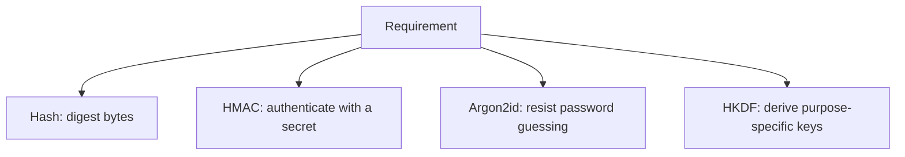
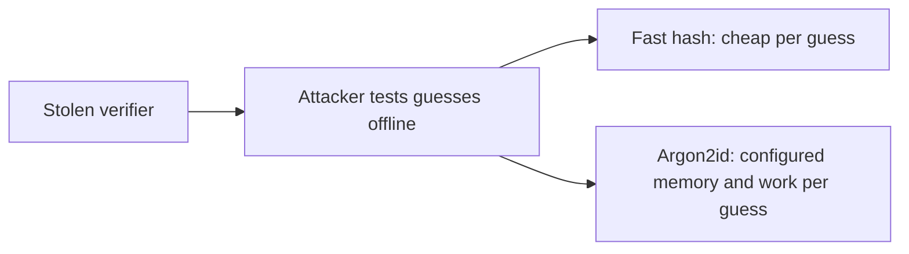
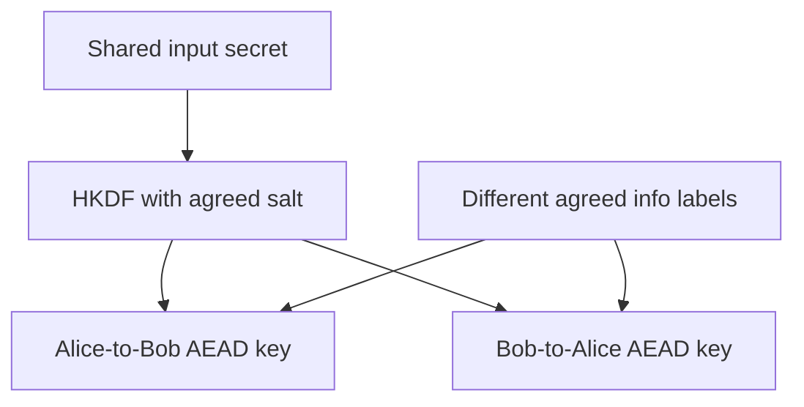

# Teaching Session 3: Hashes, MACs, Passwords and KDFs

**Instructor page · 60 minutes.** [Self-study lesson](../day-1/03-hashes-passwords-kdfs.md) · [Notebook](../downloads/session-03-hashes-passwords-kdfs.ipynb)

## Prepare before class

Run the notebook or `examples/session-03/demo.py` with the pinned requirements. The Argon2id example uses 64 MiB per operation; check the teaching runtime has capacity. Use the fabricated credentials, and do not replace them with a real password.

Ask learners to keep a four-row decision table: hash, HMAC, Argon2id, HKDF. For each, they should record the input, presence of a secret, purpose, and one limitation.

## 0–5 minutes: distinguish the four jobs

**Explain:** “Our invoice service needs file digests, authentic messages, password verifiers, and traffic keys. Similar-looking outputs do not make these tasks interchangeable.”

Ask: **“Which of these hides the invoice?”** None of these four by itself. Link back to AEAD. Establish that this lesson fills supporting roles instead of replacing authenticated encryption.

## 5–15 minutes: hash properties and the trusted digest

Run the first two experiments. Before the first, ask learners to predict the number of digest bytes and hex characters. Before the second, ask whether a malicious file can agree with a digest supplied by the attacker.

**Explain:** “A collision means two distinct inputs share the same digest. Replacing a file and publishing its newly computed digest is not a collision attack. The missing protection is trust in the expected digest.”

Use three verbal challenges: given a digest, find an input; given a message, find a different matching message; choose any two matching messages. Have learners identify preimage, second preimage, and collision. Avoid suggesting that a few printed samples establish security properties.

Check: **“Can we decrypt SHA-256?”** No. A successful dictionary guess is not decryption; a hash can be recomputed on candidates.

## 15–25 minutes: HMAC and Alice–Bob authentication

Use the [message sequence diagram](../day-1/03-hashes-passwords-kdfs.md#3-hmac-message-authentication-with-a-shared-secret). Assume a protected shared key and defer its distribution to later sessions.

Run the HMAC example. Ask learners to change the tenant or action. Show that the original tag fails. Point to `compare_digest` and explain that it addresses comparison behavior, not all possible timing channels in a service.

**Explain:** “HMAC authenticates the bytes you actually give it. It cannot protect an omitted tenant field or establish a person's identity independently of key ownership.”

Ask: **“What if we replay exactly the same approved event?”** It still authenticates. The application needs a defined event format and replay/idempotency handling. Ask: **“Could Bob forge a message attributed to Alice?”** If Bob holds the same MAC key, he can generate valid tags too.

## 25–40 minutes: passwords, offline guessing, and Argon2id

Run the three-item SHA-256 guessing example, then the Argon2id example. State that this is a controlled synthetic illustration, not a benchmark of real attacker throughput.

**Explain:** “A salt makes accounts' computations differ. Cost makes each guess more expensive. Neither supplies missing password entropy. Login throttling helps online attempts, but the stolen verifier can be checked elsewhere.”

Show that two calls to `hash` produce different records for the same password while both verify. Ask learners why `hash(candidate) == stored` is the wrong approach. Point out the encoded algorithm, salt, and parameters without displaying a real credential.

Discuss `check_needs_rehash`: verify successfully, then create and save a fresh record if policy has changed. Do not hash the old encoded record as a replacement for the original password.

Ask: **“What happens at 100 concurrent verification requests?”** Resource demand scales with concurrency. The 64 MiB setting is per operation; evaluate capacity and abuse controls. Avoid telling learners to select the largest number that worked once on their laptop.

Tie back to the state-actor scenario: offline cost is useful, but does not fix stolen sessions, compromised devices, or a weak account-recovery process.

## 40–53 minutes: HKDF and key separation

**Explain:** “This time our input is already secret key material with sufficient entropy. We need keys with explicit roles. HKDF extracts and expands efficiently; it is not a password-hardening function.”

Run the derivation example and ask learners to predict four outcomes: identical inputs, changed label, changed salt, stolen input secret. Expected answers: same key, different output, different output, and ability to derive all children with known public inputs.

Run the AEAD continuation. Using the opposite-direction key fails authentication. Explain that the separate salt, context label, AAD, and nonce have different roles. The toy labels demonstrate purpose separation; they are not a complete interoperable secure-channel specification.

## 53–57 minutes: randomness and public inputs

Use the learner comparison table. Ask the group to classify each item: password salt, HKDF salt, info, AEAD nonce, and encryption key. Emphasize that public values can still require correct generation, agreement, or validation.

**Explain:** “Use `secrets` or a library key-generation API for secrets. Hashing a timestamp does not make it unpredictable. Random generation does not remove the separate nonce-management requirement.”

## 57–60 minutes: exit check

Ask each learner to match one requirement to a mechanism and give one limitation. Use these prompts if needed:

| Prompt | Expected answer |
| --- | --- |
| An attacker replaces a file and its digest | A plain digest from the same untrusted source does not authenticate the file |
| We store `SHA256(password)` | Use a dedicated salted password verifier with tuned cost |
| Alice and Bob need separate direction keys | Use the established protocol's KDF and agreed labels; HKDF illustrates this |
| We pass a short password directly into HKDF | Efficient derivation does not add entropy or password-hardening cost |
| Our MAC-verified event is processed twice | Authentication alone does not prevent replay |

Assign the four self-study exercises as follow-up. Successful demo assertions show the supplied examples behave as intended; learners must still explain the mechanism choices.

## Misconceptions and corrections

| Statement | Correction |
| --- | --- |
| “A hash is encrypted data.” | No decryption operation or key exists for a general hash. |
| “A 256-bit hash makes any password strong.” | An attacker can enumerate likely inputs. |
| “The salt must be hidden.” | Password salts are stored with the verifier; a pepper is a different, optional secret. |
| “HKDF is a stronger password hash.” | HKDF is efficient derivation for suitable key material, not expensive password verification. |
| “A new key label proves the peer's identity.” | Labels separate purposes; identity depends on the surrounding authenticated protocol. |

The [lesson references](../day-1/03-hashes-passwords-kdfs.md#references) support the technical material. Local notebook verification does not replace a fresh Colab check and timing rehearsal before class.
