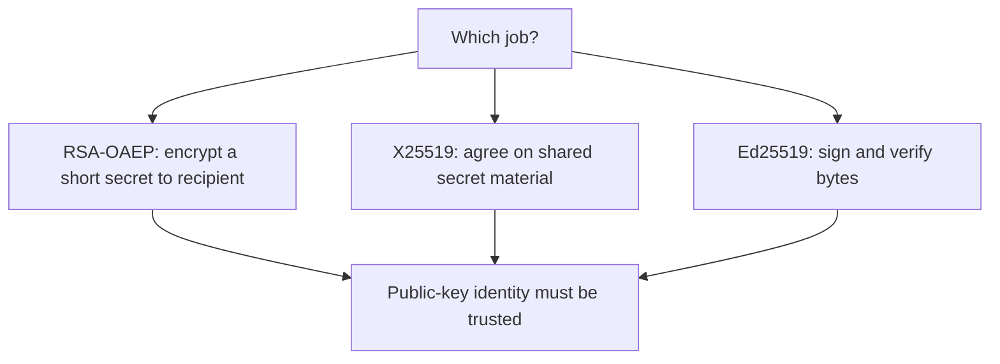
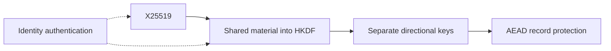
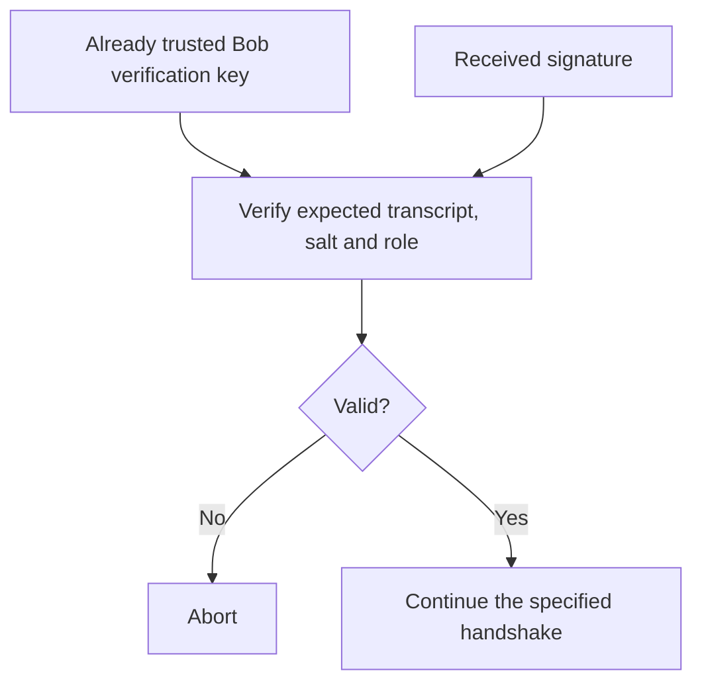

# Teaching Session 4: Classical Public-Key Cryptography

**Instructor page · 60 minutes.** [Self-study lesson](../day-1/04-classical-public-key.md) · [Notebook](../downloads/session-04-classical-public-key.ipynb)

## Prepare before class

Run the notebook from a fresh runtime, or run `examples/session-04/demo.py` after installing `requirements-session04.txt`. Keep the self-study page open for its full diagrams and code. Use synthetic data only. The demonstrations simulate endpoints in memory; they are not a network service or a complete authenticated handshake.

Learners should already understand AEAD, nonce uniqueness, HKDF context, and the distinction between authentication and authorization. Ask them to keep three columns on paper: **public**, **private**, and **trusted through what mechanism?** Add each new key to those columns as it appears.

By the end, learners should explain why successful decryption does not establish Bob's identity and why ephemeral key agreement and identity signing keys have different lifetimes.

## Minutes 0–8: three different public-key jobs

**Explain:** “A public key may be shared, but that does not tell us whose key we received. First choose the operation, then establish trust in the appropriate public key.”

**Ask:** “Which of these directly encrypts a large invoice?” Expected answer: the application normally uses AEAD for bulk content; public-key mechanisms establish or protect its key. Ed25519 is not encryption, and X25519 is not a signature.

Use the lesson's role table to correct “a signature is encryption with the private key.” Explain RSA and elliptic curves at the operation level; learners do not need to implement arithmetic. Avoid comparing key sizes as though RSA modulus bits and symmetric-key bits were equivalent.

## Minutes 8–15: RSA key transport

Show the envelope-encryption diagram. Ask learners to name the private key used by the recipient and whether Alice needs a private key to encrypt to Bob.

Run the first code cell after setup. Predict randomized ciphertext and rejection of a 319-byte OAEP input. Explain the `318`-byte bound from the selected modulus and hash. A 32-byte content key fits; a whole document should go through AEAD.

**Ask:** “Does Bob know Alice sent it because only he can decrypt it?” Expected answer: no; anyone with Bob's public key can produce a ciphertext. Also, Bob's public key must already be authentic for Alice to trust the destination.

Keep detailed RSA signature padding for Session 5. The objective here is a correct distinction between key transport, agreement, and signing.

## Minutes 15–28: X25519, then HKDF, then AEAD

Walk through the self-study Alice–Bob sequence. Have learners point to `a`, `A`, `b`, and `B`. Ask which values an eavesdropper receives. Then run the shared-secret and invalid-contribution cells.

**Explain:** “The private key stays local. Each endpoint uses its private key and the other public contribution. Equality of the resulting bytes establishes a mathematical relationship, not a person's identity.”

**Read the diagram aloud:** the upper path establishes record-protection keys; the separate authentication requirement must bind the exchange to the intended participants.

Run the directional-key example. Ask why Bob uses the `alice-to-bob` label to receive from Alice. Expected answer: direction labels describe the traffic, not the local caller's name. Both endpoints must use identical role ordering and context bytes.

On invalid input or `InvalidTag`, stop acceptance. Never demonstrate “recovery” by substituting a constant key or ignoring a failure. If an honest example fails, inspect transcript order, salt, direction, nonce, and AAD before changing algorithms.

## Minutes 28–40: substitution attack

Before running the Mallory cell, ask everyone to predict whether Bob will see a tag error. Show the self-study attack sequence, then run the simulation.

**Explain the observed result:** Mallory knows two different shared secrets. She decrypts on one leg, alters the invoice, and encrypts on the other. Both tags are valid for their respective keys. The primitives work as designed; identity authentication is missing.

Ask learners to identify exactly what Mallory must control: the unauthenticated exchange messages. She does not need Alice's or Bob's private keys and does not solve the curve problem.

**Diagnostic question:** “Would including all public contributions in HKDF stop this?” Expected answer: no. Mallory participates in two different transcripts and can derive each corresponding key. Transcript binding is useful but does not supply a trust anchor.

Clarify that PASS in this cell reports a successful **attack demonstration**. The simulation reuses objects for comparison; a real new handshake needs fresh ephemeral keys.

## Minutes 40–49: a trusted signature preview

Run the Ed25519 cell. Identify the simulated trusted provisioning line before discussing signature verification. Ask learners to predict the modified-transcript and impostor-signature failures.

**Ask:** “What if the same untrusted packet tells Alice which verification key to use?” Expected answer: Mallory can supply her own key and sign her own statement. The mathematical verification may succeed while the identity claim is false.

State the limits: this authenticates a particular Bob statement under a pretrusted key. It does not authenticate Alice to Bob, supply authorization, confirm matching traffic keys, or specify a complete protocol. This is a bridge to Session 5 and PKI, not a new production handshake design.

## Minutes 49–57: forward secrecy and the state actor

Use the lesson's timeline and compromise table. Keep three time points visible: record traffic, erase ephemeral/session secrets, later steal the long-term identity key.

**Ask:** “Which stolen key lets the attacker decrypt our recorded RSA-OAEP key transport?” Expected answer: the retained RSA decryption key. Contrast it with the long-term signing key used to authenticate a fresh ephemeral exchange.

Run the final cell. Explain that different session secrets are an observation, not a proof of forward secrecy. The notebook keeps secrets alive and Python deletion is not a secure-erasure guarantee.

Return to the highly confidential, twenty-year state-actor scenario. Ask learners to name one risk forward secrecy addresses and two it does not. Expected examples: later theft of an identity key versus endpoint compromise, logged keys, compromised trust provisioning, or future quantum recovery of classical exchanges.

Avoid forecasting a quantum arrival date. Establish why the course later needs PQC even when a classical protocol provides forward secrecy against classical attackers.

## Minutes 57–60: exit check

Require short answers before showing this table.

| Prompt | Expected reasoning |
| --- | --- |
| X25519 completed and AEAD decrypted. Is this Bob? | Not established without authenticating the exchange against trusted identity information. |
| Why are X25519 and Ed25519 keys separate? | Agreement and signing are different mechanisms and roles with different lifetimes. |
| Does signing a transcript complete a secure channel? | No; trust, authorization, freshness, key confirmation, framing, and lifecycle remain. |
| Does classical forward secrecy solve harvest-now-decrypt-later quantum risk? | No; future recovery of the classical exchange secret is a different threat. |

Assign the four guided practice tasks on the self-study page. Learners should explain both the failure and its security meaning. Continue to the completed [Session 5 instructor guide](05-digital-signatures.md). Lab 2 remains a scaffold and should not be presented as a completed assignment.

## Misconceptions to listen for

| Learner statement | Correction to give |
| --- | --- |
| “Public means anyone can replace it.” | It need not be secret, but authenticity is essential. |
| “HKDF authenticates Bob because his name is in info.” | A label supplies context, not evidence of identity. |
| “The AEAD library failed because Mallory changed the invoice.” | Mallory knew the keys on both legs; authentication of the exchange was absent. |
| “We changed the label, so we have forward secrecy.” | Fresh ephemeral secrets and their lifecycle matter; labels do not replace them. |
| “A valid signature means this action is allowed.” | Authorization still requires policy and context. |

For references, exact API behavior, and runnable code, use the [self-study lesson](../day-1/04-classical-public-key.md).
