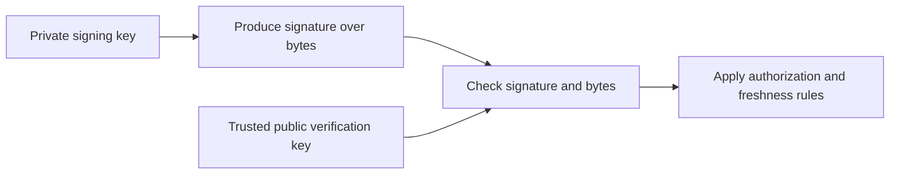
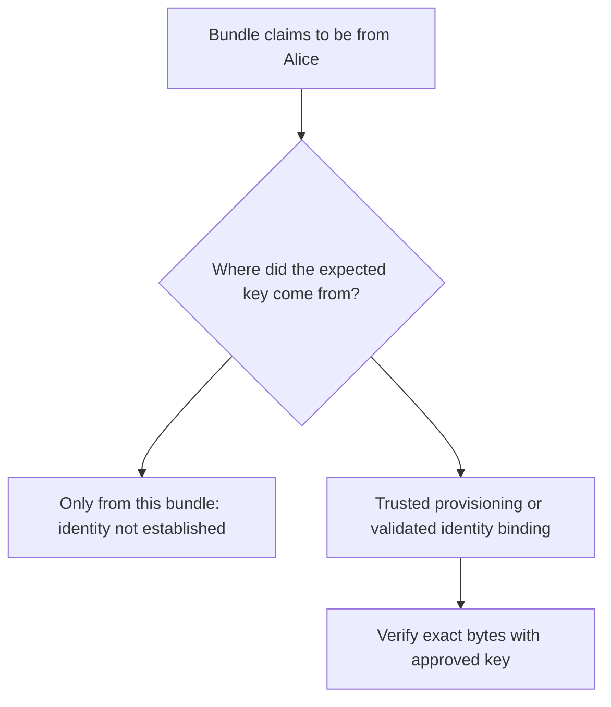
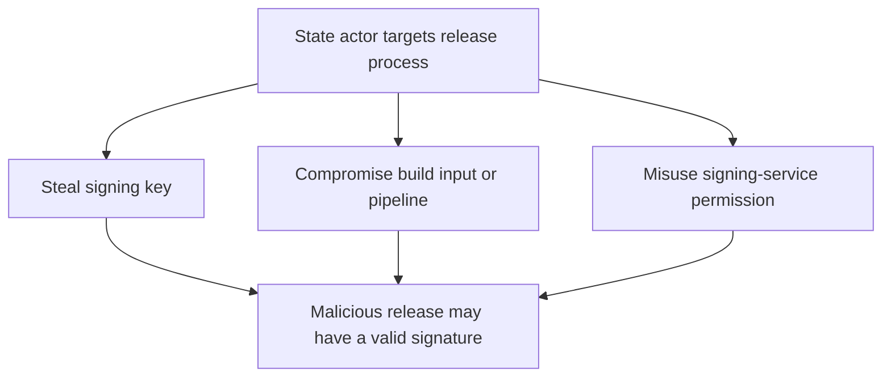

# Teaching Session 5: Digital Signatures

**Instructor page · 45 minutes.** [Self-study lesson](../day-1/05-digital-signatures.md) · [Notebook](../downloads/session-05-digital-signatures.ipynb)

## Preparation and outcomes

Run the notebook from a fresh runtime before class. Alternatively install `requirements-session05.txt` and run `examples/session-05/demo.py`. Use only the supplied synthetic data. The firmware example decides whether to accept bytes; it installs nothing.

Learners should understand hashing, HMAC, public-key trust, and Session 4's signature preview. Keep three questions visible throughout: **Which exact bytes? Which trusted key? Which permitted action?** Learners should finish able to separate mathematical verification from trust, authorization, and freshness.

## Minutes 0–6: signatures, MACs, and encryption

**Explain:** “A signature is publicly verifiable relative to a public key. HMAC verifiers hold the same secret that produces tags. Neither mechanism hides the message.” Use the lesson's comparison table and Alice–Bob sequence.

**Ask:** “Does a recipient need Alice's private key to verify?” Expected: no. “Does the signature prove Alice personally clicked approve?” Expected: not by itself; control of the key and signing workflow matters.

Correct “signing is encrypting with the private key.” Avoid presenting non-repudiation as an unconditional API guarantee.

## Minutes 6–15: Ed25519 and failure cases

Run the first two experiments. Have learners predict the return value before revealing that successful `verify` returns `None`. Ask them to identify each rejection: changed bytes, changed signature, wrong public key, and truncation.

**Explain:** “Failure must stop acceptance. We catch the expected signature exception to return an explicit Boolean; unexpected errors must not become success.” Do not demonstrate permissive fallbacks or catching every exception and continuing.

Run the JSON experiment. The objects parse to the same values, but their byte encodings differ. Ask why a verifier must know the exact signed representation. Sorting keys here is an example convention, not a universal canonicalization standard.

**Quick check:** “If the action is signed but the tenant is outside the signed bytes, what protects the tenant?” Expected: nothing in that signature. Bind all interpretation-relevant context and validate it against the intended request.

## Minutes 15–23: the origin of trust

Run the Mallory-key experiment. Both assertions are expected: Mallory's key verifies her signature, but Alice's trusted key rejects it.

**Explain:** “The math has no knowledge of the label Alice. The application brings the trusted association.” A key ID or fingerprint copied from the same untrusted bundle does not solve this.

Ask learners to name a trust path: secure provisioning, a fingerprint compared through a trusted channel, or a validated certificate chain. Defer certificate mechanics to Session 6. State that algorithm and key-type acceptance must also follow trusted policy.

## Minutes 23–34: signed firmware and policy rejection

Show the lesson's release flowchart. Run the manifest and acceptance-policy experiments. Before running, ask whether a valid release signature guarantees that every device should install that release.

Use these cases for discussion:

| Case | Expected outcome | Why |
| --- | --- | --- |
| Correct artifact, product and allowed version | Accept in this teaching policy | All demonstrated checks pass |
| Artifact changed after manifest signing | Reject | Digest/length no longer match |
| Trusted signer, wrong product | Reject | Signature validity is insufficient for this target |
| Version 8 when local minimum is 9 | Reject | Authentic release violates rollback policy |
| Untrusted signing key | Reject | Signature fails under the trusted release key |
| Authentically signed malformed schema | Reject | Signed bytes are not necessarily meaningful valid metadata |

**Ask:** “Who sets minimum version?” Expected: protected local state or other trusted policy, not the untrusted package. Explain that atomic installation, recovery, expiry, durable rollback state, and secure update delivery remain outside the demonstration.

**Connect to invoices:** replayed approvals still verify. The application needs authenticated transaction identifiers and state to prevent executing the same action twice.

## Minutes 34–39: other signature families

Use the comparison table for Ed25519, ECDSA, and RSA-PSS. Run the final cell if time permits; otherwise assign it independently.

Emphasize three points: use the specified scheme and encoding; let the library manage ECDSA's per-signature secret; agree on RSA-PSS hash, MGF, and salt-length parameters. Separate signing keys from encryption/agreement keys.

Do not manually hash before ordinary Ed25519 unless the signed format explicitly requires a digest. Ordinary Ed25519 over a digest is not Ed25519ph. Signature equality and signature length are not verification procedures.

## Minutes 39–43: powerful adversaries and signing authority

**Read the diagram:** key extraction is not the only path to valid malicious signatures. Hardware protection may stop export without stopping misuse of the signing service. Ask for controls at each branch: restricted access, independent release approval, trusted build provenance, auditing, and recovery planning.

Explain that a compromised key complicates past and future trust. Key rotation must reach verifiers through an authenticated trust update. Classical signatures are not post-quantum; long-lived authenticity requirements also need a migration plan.

## Minutes 43–45: exit check

Ask for one-sentence answers before displaying the expected reasoning.

| Question | Expected reasoning |
| --- | --- |
| A signature verifies with the bundled key. Is the claimed publisher authenticated? | Only if the key-to-publisher binding is independently trusted. |
| An old firmware image has a valid signature. Must it be accepted? | No; enforce target, version, and other release policies. |
| Why did adding a newline break verification? | Signatures cover exact bytes. |
| Can a validly signed update be malicious? | Yes; signing authority or its surrounding workflow can be compromised. |

Assign the five practice questions in the self-study page. Require learners to name whether each rejection is cryptographic or policy based. Lab 3 remains forthcoming; do not assign its scaffold as a completed exercise.

## Troubleshooting and misconceptions

If an intended verification fails, compare message bytes, encoding, public key, scheme, and parameters. Do not “repair” failures by accepting a new untrusted key or switching algorithms automatically.

| Statement to correct | Explanation |
| --- | --- |
| “The signature encrypts the invoice.” | The signed content stays visible unless separately encrypted. |
| “The signed digest proves this download is correct.” | Recompute the digest of the actual artifact and compare it. |
| “Valid means safe.” | Verification does not analyze behavior or vulnerabilities. |
| “A timestamp prevents replay.” | A signed timestamp still needs enforced time and replay policy. |
| “An HSM prevents every signing attack.” | A protected key may still be misused through an authorized interface. |

Use the [self-study lesson](../day-1/05-digital-signatures.md) for code, expanded explanations, and references.
