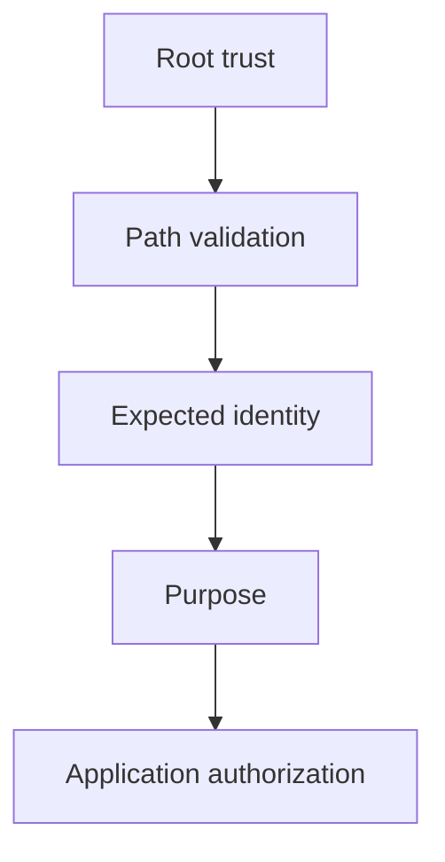

# Teaching Session 6: PKI and Certificates

**60 minutes.** [Self-study](../day-2/06-pki-certificates.md) · [Notebook](../downloads/session-06-pki-certificates.ipynb)

## Before class

Run the notebook from a clean kernel using the [Day 2 setup](../getting-started/day-2-setup.md). Use synthetic data and preserve verification failures as teaching results. Rehearse the timing; independent learners have the longer self-study treatment and worked answers. Optional extensions can be assigned after class.

## Board diagram

Use this diagram to elicit the requirement at each transition, then use the detailed diagrams in the lesson for the actual protocol or decision flow.

## Minutes 0–10: where trust starts

Draw root, intermediate and leaf. Ask why a self-signed root is trusted. Expected: local provisioning and policy, not the self-signature. Distinguish certificate parsing from path validation.

Ask for a prediction before executing code. After the observation, require learners to state what was checked and what remains an assumption.

## Minutes 10–25: inspect the hierarchy

Run make_pki and inspect SAN, Basic Constraints, path length and EKU. Ask which private key issued the leaf and whether an ordinary leaf may issue other certificates. Point to the intermediate CA constraint.

Ask for a prediction before executing code. After the observation, require learners to state what was checked and what remains an assumption.

## Minutes 25–40: observe validation failures

Predict and run wrong-hostname, unknown-root, expired and missing-intermediate cases. Keep verification enabled. Explain why cached intermediates can make broken chain delivery appear to work elsewhere.

Ask for a prediction before executing code. After the observation, require learners to state what was checked and what remains an assumption.

## Minutes 40–52: clients and revocation

Run mTLS success, missing-client and wrong-EKU cases. Ask what permission the authenticated client gets. Expected: none automatically. Explain CRL/OCSP freshness and availability policy; the helper does not check online revocation.

Ask for a prediction before executing code. After the observation, require learners to state what was checked and what remains an assumption.

## Minutes 52–60: exit and Lab 4 handoff

Have each learner name the trust source, expected identity and purpose. Ask how a state actor might misuse issuance credentials. Assign the lab failure table and reject proposals to install arbitrary roots as a repair.

Ask for a prediction before executing code. After the observation, require learners to state what was checked and what remains an assumption.

## Assessment and corrections

| Prompt | Expected reasoning |
| --- | --- |
| An in-date certificate names another host. Accept? | No; identity matching is separate from path and time checks. |
| What does the demonstration leave unimplemented? | Name the relevant identity, lifecycle, deployment or policy assumptions stated in the lesson; do not claim a production protocol from primitive tests. |

If a prerequisite is missing, revisit the corresponding Day 1 distinction rather than adding an insecure fallback. Record uncertainty and runtime failures separately from cryptographic rejection. The [self-study page](../day-2/06-pki-certificates.md) supplies practice questions, explanations and primary references. Continue with [lab 04 mini pki](../labs/lab-04-mini-pki.md).

