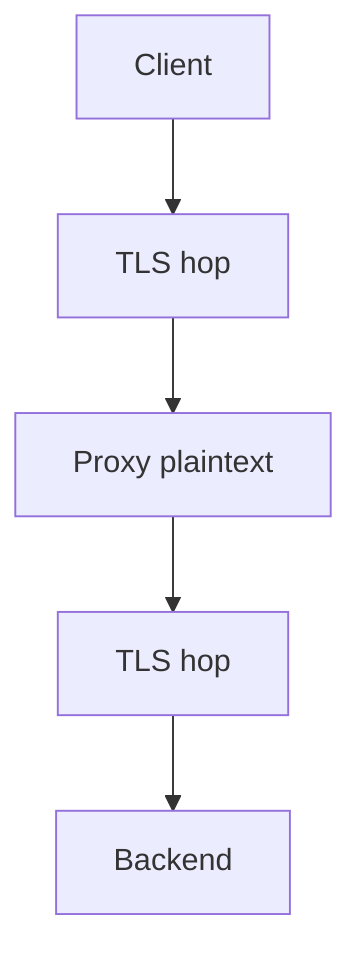

# Teaching Session 7: TLS 1.3

**45 minutes.** [Self-study](../day-2/07-tls.md) · [Notebook](../downloads/session-07-tls.ipynb)

## Before class

Run the notebook from a clean kernel using the [Day 2 setup](../getting-started/day-2-setup.md). Use synthetic data and preserve verification failures as teaching results. Rehearse the timing; independent learners have the longer self-study treatment and worked answers. Optional extensions can be assigned after class.

## Board diagram

Use this diagram to elicit the requirement at each transition, then use the detailed diagrams in the lesson for the actual protocol or decision flow.

## Minutes 0–10: reconstruct the handshake

Use the lesson sequence to connect key establishment, CertificateVerify and Finished. Ask whether receiving a certificate proves possession. Expected: the peer must authenticate the handshake with the associated key.

Ask for a prediction before executing code. After the observation, require learners to state what was checked and what remains an assumption.

## Minutes 10–20: real TLS without network setup

Run tls_trial and inspect version and cipher. Explain MemoryBIO and the separate ssl versus cryptography backends. An AES cipher name does not identify the key-establishment group.

Ask for a prediction before executing code. After the observation, require learners to state what was checked and what remains an assumption.

## Minutes 20–30: terminate and re-encrypt

Draw client, proxy and backend. Mark plaintext at each termination. Ask whether the proxy is outside the confidentiality boundary merely because both hops use TLS. Expected: it sees plaintext.

Ask for a prediction before executing code. After the observation, require learners to state what was checked and what remains an assumption.

## Minutes 30–40: mTLS and resumption

Run missing-client rejection. Separate client identity from authorization. Discuss PSK resumption and 0-RTT replay; do not assume early invoice approval is replay safe.

Ask for a prediction before executing code. After the observation, require learners to state what was checked and what remains an assumption.

## Minutes 40–45: exit

Require a sentence distinguishing transport protection from endpoint protection. Ask what observable evidence would establish PQ negotiation. Hand off to Lab 4.

Ask for a prediction before executing code. After the observation, require learners to state what was checked and what remains an assumption.

## Assessment and corrections

| Prompt | Expected reasoning |
| --- | --- |
| Does mTLS authorize every client action? | No; map the validated identity to permissions. |
| What does the demonstration leave unimplemented? | Name the relevant identity, lifecycle, deployment or policy assumptions stated in the lesson; do not claim a production protocol from primitive tests. |

If a prerequisite is missing, revisit the corresponding Day 1 distinction rather than adding an insecure fallback. Record uncertainty and runtime failures separately from cryptographic rejection. The [self-study page](../day-2/07-tls.md) supplies practice questions, explanations and primary references. Continue with [lab 04 mini pki](../labs/lab-04-mini-pki.md).

