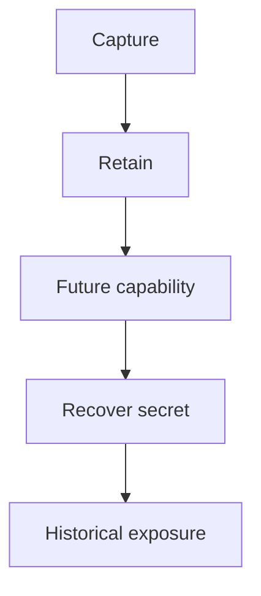

# Teaching Session 8: The Quantum Threat

**60 minutes.** [Self-study](../day-2/08-quantum-threat.md) · [Notebook](../downloads/session-08-quantum-threat.ipynb)

## Before class

Run the notebook from a clean kernel using the [Day 2 setup](../getting-started/day-2-setup.md). Use synthetic data and preserve verification failures as teaching results. Rehearse the timing; independent learners have the longer self-study treatment and worked answers. Optional extensions can be assigned after class.

## Board diagram

Use this diagram to elicit the requirement at each transition, then use the detailed diagrams in the lesson for the actual protocol or decision flow.

## Minutes 0–12: distinct quantum effects

Compare Shor's impact on RSA/ECC with Grover's ideal search improvement. Do not claim existing small machines break current keys or that all security bits simply halve.

Ask for a prediction before executing code. After the observation, require learners to state what was checked and what remains an assumption.

## Minutes 12–25: capture today

Draw the HNDL timeline. Ask why later migration cannot recall an adversary recording. Contrast later signing-key theft with future recovery of the classical exchange secret.

Ask for a prediction before executing code. After the observation, require learners to state what was checked and what remains an assumption.

## Minutes 25–40: sensitivity model

Run the lifetime/migration/horizon examples and graph. Have learners change one assumption at a time. The x-axis is hypothetical, not a forecast. A negative gap does not prove safety.

Ask for a prediction before executing code. After the observation, require learners to state what was checked and what remains an assumption.

## Minutes 40–52: inventory exercise

Split the long-lived archive into transport, stored-key wrapping, readers and signed updates. Require an owner and upgrade path for each. Ask why upgrading a gateway alone leaves other exposure.

Ask for a prediction before executing code. After the observation, require learners to state what was checked and what remains an assumption.

## Minutes 52–60: exit

Ask for one classical vulnerability, one remaining symmetric role and one non-quantum state-actor risk. Collect a prioritized inventory entry with explicit assumptions.

Ask for a prediction before executing code. After the observation, require learners to state what was checked and what remains an assumption.

## Assessment and corrections

| Prompt | Expected reasoning |
| --- | --- |
| Does AES-256 alone resolve HNDL? | No; recovered exchange material can expose its traffic key. |
| What does the demonstration leave unimplemented? | Name the relevant identity, lifecycle, deployment or policy assumptions stated in the lesson; do not claim a production protocol from primitive tests. |

If a prerequisite is missing, revisit the corresponding Day 1 distinction rather than adding an insecure fallback. Record uncertainty and runtime failures separately from cryptographic rejection. The [self-study page](../day-2/08-quantum-threat.md) supplies practice questions, explanations and primary references.

