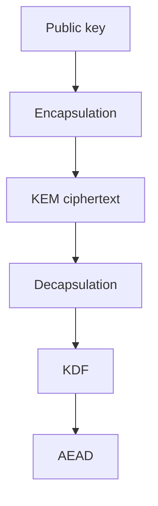

# Teaching Session 9: Post-Quantum Key Establishment

**45 minutes.** [Self-study](../day-2/09-ml-kem.md) · [Notebook](../downloads/session-09-ml-kem.ipynb)

## Before class

Run the notebook from a clean kernel using the [Day 2 setup](../getting-started/day-2-setup.md). Use synthetic data and preserve verification failures as teaching results. Rehearse the timing; independent learners have the longer self-study treatment and worked answers. Optional extensions can be assigned after class.

## Board diagram

Use this diagram to elicit the requirement at each transition, then use the detailed diagrams in the lesson for the actual protocol or decision flow.

## Minutes 0–10: identify the objects

Draw Bob KeyGen, Alice Encapsulate, Bob Decapsulate. Ask which object contains the invoice. Expected: neither public key nor KEM ciphertext; the invoice is protected later by AEAD.

Ask for a prediction before executing code. After the observation, require learners to state what was checked and what remains an assumption.

## Minutes 10–20: run real ML-KEM

Inspect shared-secret equality and measured 1184/1088/32-byte outputs. Emphasize the library tuple order. Do not serialize private keys to estimate wire costs.

Ask for a prediction before executing code. After the observation, require learners to state what was checked and what remains an assumption.

## Minutes 20–30: KDF and record

Run the invoice round trip and changed-AAD rejection. Ask where Bob's identity was established. Expected: it is an external provisioning/protocol assumption, not a KEM result.

Ask for a prediction before executing code. After the observation, require learners to state what was checked and what remains an assumption.

## Minutes 30–40: implicit rejection

Compare truncated ciphertext with same-length corruption and wrong recipient. Returning 32 bytes is not an authenticity signal. Trace why AEAD rejects the resulting wrong key.

Ask for a prediction before executing code. After the observation, require learners to state what was checked and what remains an assumption.

## Minutes 40–45: exit and lab

Ask whether retaining Bob's decapsulation key supplies forward secrecy. Expected: no automatic guarantee. Hand off to Lab 5 with identity and replay boundaries explicit.

Ask for a prediction before executing code. After the observation, require learners to state what was checked and what remains an assumption.

## Assessment and corrections

| Prompt | Expected reasoning |
| --- | --- |
| Is a KEM a signature or an invoice-encryption API? | Neither; it establishes secret material. |
| What does the demonstration leave unimplemented? | Name the relevant identity, lifecycle, deployment or policy assumptions stated in the lesson; do not claim a production protocol from primitive tests. |

If a prerequisite is missing, revisit the corresponding Day 1 distinction rather than adding an insecure fallback. Record uncertainty and runtime failures separately from cryptographic rejection. The [self-study page](../day-2/09-ml-kem.md) supplies practice questions, explanations and primary references. Continue with [lab 05 pqc channel](../labs/lab-05-pqc-channel.md).

