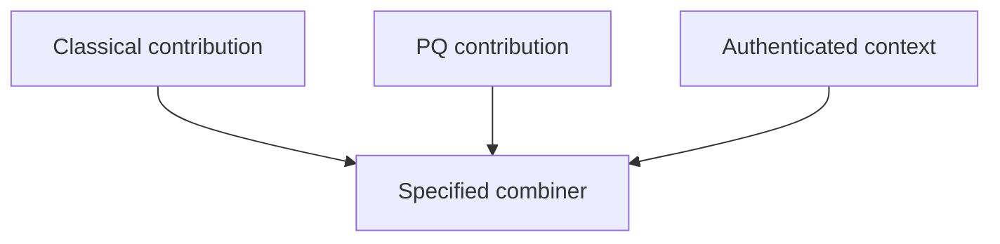

# Teaching Session 10: Hybrid Key Establishment

**45 minutes.** [Self-study](../day-2/10-hybrid-key-establishment.md) · [Notebook](../downloads/session-10-hybrid-key-establishment.ipynb)

## Before class

Run the notebook from a clean kernel using the [Day 2 setup](../getting-started/day-2-setup.md). Use synthetic data and preserve verification failures as teaching results. Rehearse the timing; independent learners have the longer self-study treatment and worked answers. Optional extensions can be assigned after class.

## Board diagram

Use this diagram to elicit the requirement at each transition, then use the detailed diagrams in the lesson for the actual protocol or decision flow.

## Minutes 0–10: motivation and assumptions

Discuss migration uncertainty and quantum exposure. State the desired one-component-survives property as an aim requiring a specified construction and analysis, not a slogan.

Ask for a prediction before executing code. After the observation, require learners to state what was checked and what remains an assumption.

## Minutes 10–23: teaching combiner

Run the fixed-length X25519 and ML-KEM combination. Change each input and context. These observations show functional dependence, not a robust-combiner proof. The code is not a standardized TLS group.

Ask for a prediction before executing code. After the observation, require learners to state what was checked and what remains an assumption.

## Minutes 23–33: downgrade

Walk through an attacker stripping capabilities. Run the local policy example. Distinguish authenticated negotiation from independent minimum policy. A Python allowlist does not authenticate network messages.

Ask for a prediction before executing code. After the observation, require learners to state what was checked and what remains an assumption.

## Minutes 33–41: deployment review

Have learners list clients, proxies, authentication algorithms, message limits and negotiated-mode telemetry. Discuss why automatic fallback on errors can undo the intended requirement.

Ask for a prediction before executing code. After the observation, require learners to state what was checked and what remains an assumption.

## Minutes 41–45: exit

Ask for the exact evidence needed before calling a service hybrid. Expected: actual specified profile, interoperable negotiated mode, authenticated policy and measured behavior.

Ask for a prediction before executing code. After the observation, require learners to state what was checked and what remains an assumption.

## Assessment and corrections

| Prompt | Expected reasoning |
| --- | --- |
| Does different output after one input changes prove hybrid security? | No; it is a functional dependency check. |
| What does the demonstration leave unimplemented? | Name the relevant identity, lifecycle, deployment or policy assumptions stated in the lesson; do not claim a production protocol from primitive tests. |

If a prerequisite is missing, revisit the corresponding Day 1 distinction rather than adding an insecure fallback. Record uncertainty and runtime failures separately from cryptographic rejection. The [self-study page](../day-2/10-hybrid-key-establishment.md) supplies practice questions, explanations and primary references.
