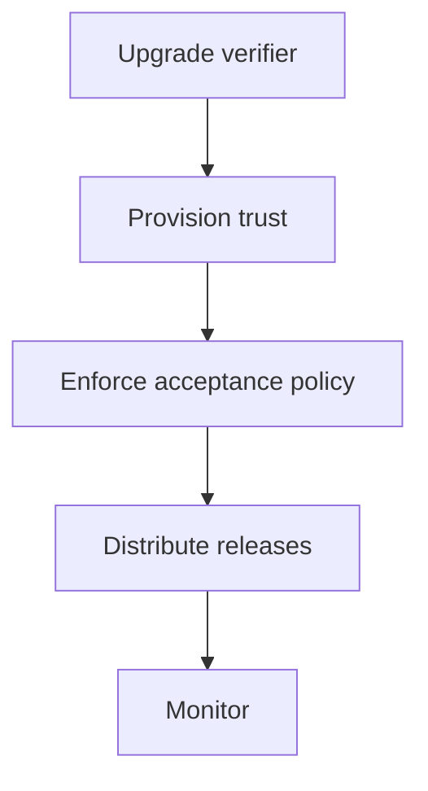

# Teaching Session 11: Post-Quantum Digital Signatures

**45 minutes.** [Self-study](../day-2/11-ml-dsa.md) · [Notebook](../downloads/session-11-ml-dsa.ipynb)

## Before class

Run the notebook from a clean kernel using the [Day 2 setup](../getting-started/day-2-setup.md). Use synthetic data and preserve verification failures as teaching results. Rehearse the timing; independent learners have the longer self-study treatment and worked answers. Optional extensions can be assigned after class.

## Board diagram

Use this diagram to elicit the requirement at each transition, then use the detailed diagrams in the lesson for the actual protocol or decision flow.

## Minutes 0–10: carry forward Session 5

Ask what stays unchanged when replacing Ed25519. Expected: exact bytes, authentic public key, purpose, authorization and freshness. Introduce ML-DSA and conceptual SLH-DSA.

Ask for a prediction before executing code. After the observation, require learners to state what was checked and what remains an assumption.

## Minutes 10–22: verify and reject

Run ML-DSA-65 success, altered message/context/key and truncation cases. Explain context agreement and why manually prehashing is not an interchangeable variant.

Ask for a prediction before executing code. After the observation, require learners to state what was checked and what remains an assumption.

## Minutes 22–30: size graph

Compare measured signature lengths. This is not equal-security or speed benchmarking. Ask which certificate, bootloader or transport object limit may fail first.

Ask for a prediction before executing code. After the observation, require learners to state what was checked and what remains an assumption.

## Minutes 30–40: migrate verifiers

Draw verifier upgrade, authentic trust provisioning, signing policy and rollout. Compare AND/OR dual-signature policies. Valid PQ signatures can still come from a compromised signing service.

Ask for a prediction before executing code. After the observation, require learners to state what was checked and what remains an assumption.

## Minutes 40–45: exit and lab

Ask why a classical-only bootloader cannot simply consume an ML-DSA release. Hand off to Lab 6 and require a trustworthy recovery-key story.

Ask for a prediction before executing code. After the observation, require learners to state what was checked and what remains an assumption.

## Assessment and corrections

| Prompt | Expected reasoning |
| --- | --- |
| Does valid ML-DSA authorize rollback? | No; release and device policy remain separate. |
| What does the demonstration leave unimplemented? | Name the relevant identity, lifecycle, deployment or policy assumptions stated in the lesson; do not claim a production protocol from primitive tests. |

If a prerequisite is missing, revisit the corresponding Day 1 distinction rather than adding an insecure fallback. Record uncertainty and runtime failures separately from cryptographic rejection. The [self-study page](../day-2/11-ml-dsa.md) supplies practice questions, explanations and primary references. Continue with [lab 06 pqc signatures](../labs/lab-06-pqc-signatures.md).

