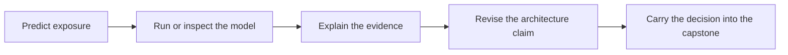

# Teach Session 12: Key management

**60 minutes.** [Self-study lesson](../day-3/12-key-management.md) · [Notebook](../downloads/session-12-key-management.ipynb) · [Setup](../getting-started/day-3-setup.md)

## Prepare and frame the lesson

Read the full self-study page and execute the notebook in advance. Use synthetic data only. Open the diagrams before teaching and keep a local notebook available if connectivity fails. Learners should understand AEAD, authenticated public keys and the distinction between a primitive and a protocol from Days 1–2.

State the running problem: CedarArchive holds highly confidential documents for twenty years against a well-funded state actor. Ask learners to identify exactly which compromise each control addresses. Do not accept “encrypted” as a complete security argument.

## Teaching sequence

| Minutes | Instructor action | Evidence of learning |
| --- | --- | --- |
| 0–15 | Draw an envelope and label every copy. Ask learners to name the DEK, KEK, ciphertext, nonce and context before running the first example. Have one learner play storage and another the unwrap authority. | Learners label the relevant assets and authority. |
| 15–36 | Run rewrapping while keeping the old wrapped DEK. Ask whether an attacker with the old KEK loses access. Expected answer: no, the historical pair still recovers the same DEK. Pause before execution for a written prediction. | A prediction, observed result and explanation of any difference. |
| 36–50 | Pair exercise: A backup needs an old KEK, but incident response wants that KEK disabled. Require a proposed isolated recovery path, named approver and tested restore evidence. | One annotated boundary diagram and one explicit residual risk. |
| 50–60 | Compare proposals, correct overclaims and collect the exit ticket below. | A defensible claim tied to an assumption and a check. |

## Facilitation prompts and expected reasoning

**Opening question:** Which adversary capability is this mechanism intended to constrain? Ask for a concrete stolen artifact or compromised identity. Encourage learners to distinguish offline analysis of copied data from online access using an authorized account.

**Demonstration question:** What did the code actually establish? Require the precise assertion and its assumptions. Local policy dictionaries and dependency graphs are models; they do not implement a KMS, identity provider or enterprise migration program. Session 12's encryption and wrapping operations are real cryptographic operations.

**Discussion question:** Why does DEK compromise require a different response from routine KEK rotation?

Expected reasoning: The compromised DEK is already known; rewrapping cannot hide it. New data protection may require a fresh DEK and re-encryption, without recovering historical secrecy.

**Stretch question:** Which evidence would convince an independent reviewer? Good answers name a reproducible failure case, an owner and a record of results. “We use a modern algorithm” gives no evidence about access policy or retained copies.

## Guided practice and feedback

Have pairs complete the relevant rows in the [review worksheet](../resources/key-management-checklist.md). One learner proposes a design and the other plays the attacker. Switch roles halfway through. Require each pair to write an assumption that, if false, invalidates its strongest claim.

If a learner is stuck, first ask where plaintext or operation authority exists; next point to the matching lesson diagram; finally reveal the worked reasoning under the lesson's practice questions. Avoid giving the final answer before they have made a prediction.

During the debrief, compare two plausible designs by their functionality and exposure. A design can be internally coherent yet fail the product requirement. Record that difference instead of ranking designs solely by how many cryptographic components they contain.

## Exit ticket and assessment

Ask for three short answers:

1. Why does DEK compromise require a different response from routine KEK rotation?
2. Give a concrete compromise this lesson's design still permits.
3. Name one test or evidence item required before deployment.

Award one formative point per answer: correct distinction, concrete residual risk, and relevant evidence. Revisit the lesson if fewer than two points are demonstrated. This is a teaching checkpoint, not the capstone grade.

## Independent-study adaptation

A solo learner should write predictions before running the notebook, complete the worksheet without viewing worked answers, and then revise the design in a different color or a separate paragraph. Use the self-study answers for feedback and bring unresolved assumptions to the [capstone](../capstone/index.md).

