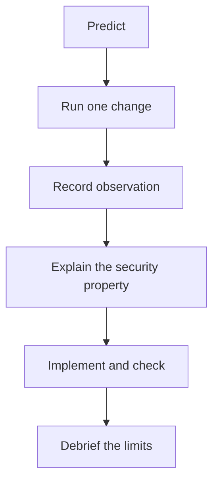

# Facilitating Lab 1: Authenticated Encryption

**Instructor page · 60-minute core lab.** [Student manual](../labs/lab-01-aead.md) · [Public walkthrough](../labs/lab-01-aead-solutions.md)

## Before learners begin

Have learners open their own notebook copy and run setup. Put the manual on screen, not the solution. Explain that notebook “Run all” includes the later reference solution, but does not complete the learner's exercise for them. An untouched exercise is reported as **NOT ATTEMPTED**.

Pair learners when experience differs: one predicts and explains, the other operates the notebook; swap halfway through.

## Core teaching sequence

| Minutes | Learner work | Instructor action and evidence |
| --- | --- | --- |
| 0–5 | Setup and runtime check | Verify imports; resolve installation failures before discussing crypto |
| 5–15 | Encrypt/decrypt invoice; inspect lengths | Ask where the nonce and key are stored; expect a 16-byte API overhead |
| 15–25 | Tampering control and result table | Require predictions; all five changed authentication inputs must be rejected |
| 25–40 | Implement `decrypt_verified`; run checks | Watch for swallowed exceptions and failure to return authenticated empty bytes |
| 40–50 | Context binding and replay | Ask what expected context is trusted, then explain why replay still succeeds |
| 50–60 | Debrief and exit questions | Collect the implementation and short explanations; assign extensions |

The nonce-collision graph, nonce-reuse attack, and ChaCha20-Poly1305 comparison are supported extensions. If they were not demonstrated in the lesson, allocate additional time or assign them after class. Independent learners should use the full notebook at their own pace.

## Explain the exercise without giving it away

“Your helper is the boundary between untrusted encrypted bytes and application data. It must enforce the lab's nonce format and return only authenticated plaintext. The library already implements AES-GCM; your job is to call it correctly and preserve the failure signal.”

Give hints in order:

1. “How many bytes is the nonce in our record format?”
2. “Which object exposes the authenticated `decrypt` method?”
3. “Which arguments must match the encryption call?”
4. “Do you need to catch `InvalidTag` inside this helper?”

After their attempt, point to the public walkthrough. Accept a different implementation if it satisfies the same contract; do not require identical variable names or style.

## Diagnose common failures

| Symptom | Likely cause / next step |
| --- | --- |
| Original record fails authentication | Re-run encryption and decryption together; notebook variables may contain a new key or old nonce |
| Only AAD checks fail unexpectedly | Compare the exact bytes and their encoding; inspect spacing and field values |
| Tag mutation succeeds | Verify the learner called authenticated decryption and did not catch/ignore `InvalidTag` |
| Empty plaintext is treated as failure | Replace truthiness checks with the API's exception semantics |
| Widget does not appear | Use `run_trial("tag")` and the other text calls; the widget is optional |
| Learner check says NOT ATTEMPTED | The exercise still raises `NotImplementedError`; this is not a pass |
| All reference checks pass | This verifies the supplied solution, not the learner's separate implementation |

## Assess understanding

Score the implementation out of four: valid round trip, altered input rejection, correct nonce-length handling, and valid empty-message handling. Score the explanation out of four: AAD visibility, trusted context, nonce uniqueness, and replay limitations. Use this as formative feedback; the full-course assessment weights remain separate.

Before finishing, ask each pair to state one claim they can make about the encrypted invoice and one claim they cannot make. A strong response is: “Under our key/nonce assumptions, unauthorized edits are rejected; we have not shown that this authentic invoice is the latest version.”

## Delivery notes

The module is tested locally; a live Google Colab delivery check remains a release task. Test network/package installation and widgets in the actual teaching environment before class. Keep the public reference solution available for independent learners after the exercise.
